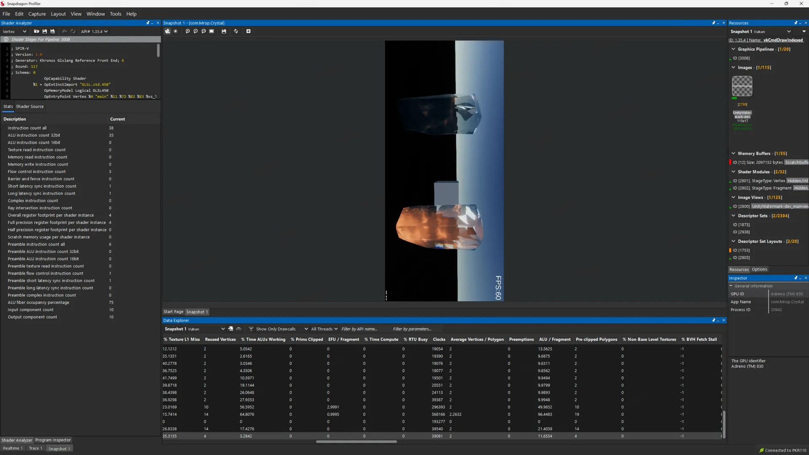
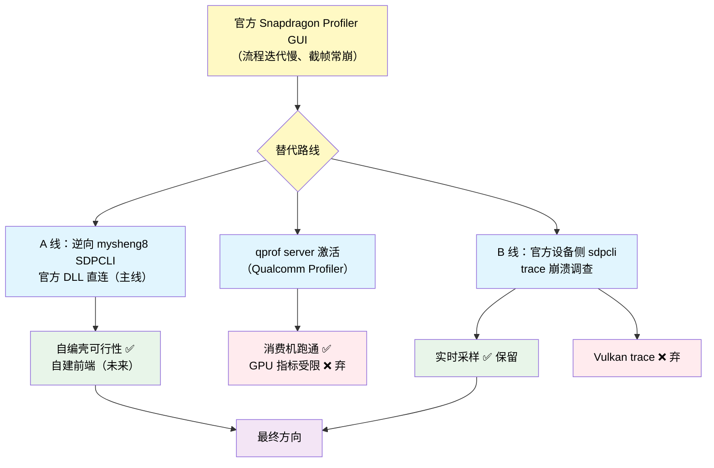
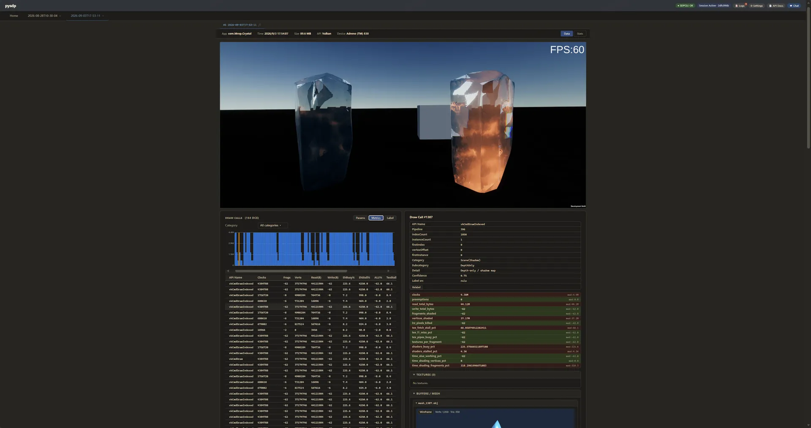
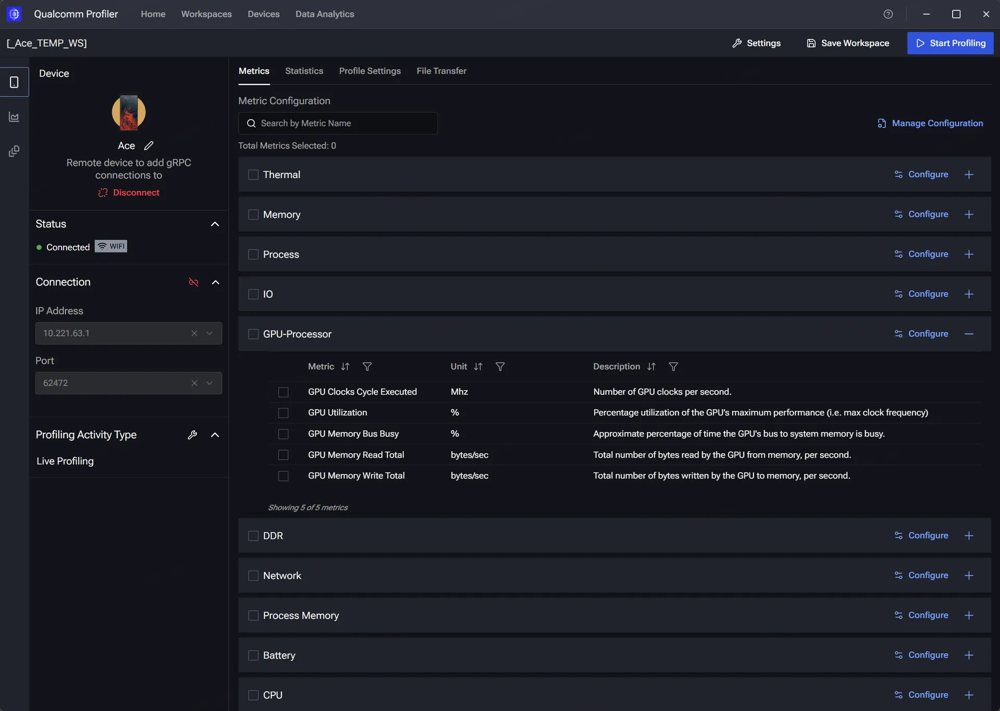
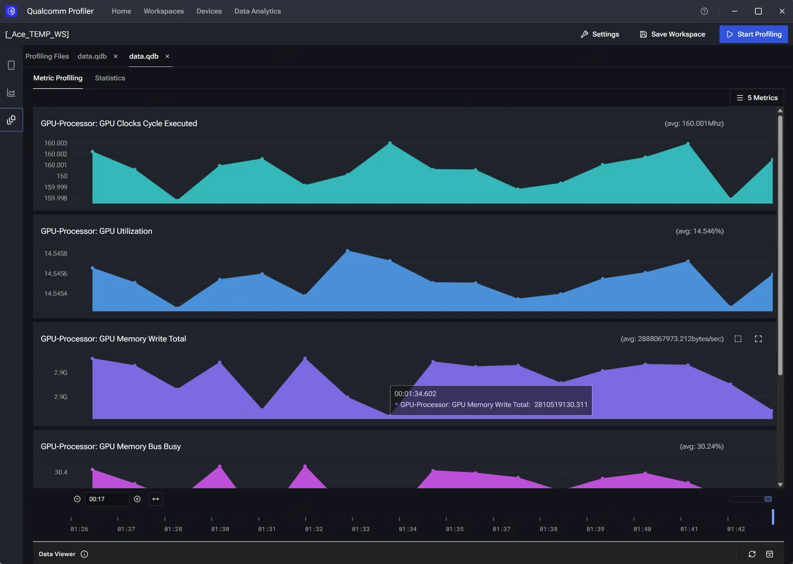

+++
date = '2026-09-03T17:00:00+08:00'
draft = false
title = 'Snapdragon Profiler 太难用？高通 Adreno GPU 分析工具链调研与替代之路'
tags = ['Android', 'GPU', '性能', 'CLI', 'Adreno', 'Qualcomm', 'SnapdragonProfiler', '逆向']
categories = ['图形渲染']
+++

## 1 缘起：为什么 Snapdragon Profiler 不够用

调研的源头是**官方 Snapdragon Profiler（桌面 GUI）的体验太差**。它本身是高通官方针对 Adreno GPU 的图形分析工具，能逐帧截取 Draw Call 参数、GPU 硬件计数器、Shader、纹理与 Mesh，[官方产品页](https://www.qualcomm.com/developer/software/snapdragon-profiler) 描述的能力很强，但实际用起来主要卡在两个点上：

| 痛点 | 具体表现 |
|---|---|
| **流程迭代慢** | 一次"连设备 → 启动应用 → 截帧 → 等导出 → 人工看结果"全靠 GUI 点按，每轮优化的往返周期太长；想换一组指标或换一帧又得从头来 |
| **截帧经常崩溃** | 截帧/trace 过程不稳定，经常采着采着就崩或录空，白跑一趟、返工率高，久而久之不敢拿它做日常 |

次要问题同样真实存在：

| 痛点 | 表现 |
|---|---|
| 只能"查看"，不能"分析" | 工具把原始数据摆出来，但不告诉你瓶颈在哪、哪些 DC 有问题 |
| 手工逐 DC 分析不现实 | 一帧几百上千个 Draw Call，靠人肉逐个查不现实 |
| GPU 架构知识门槛高 | Adreno 的 metrics 含义需要专业背景才读得懂 |
| GUI 流程重、难自动化 | 导出、整理、批量跑都难脚本化，和 CI 无缘 |

于是调研方向很自然地收敛成一个问题：**在 Adreno 上做 GPU 分析，有没有比官方 GUI 更快、更稳、还能自动化的替代？** 更理想的是：截帧数据能拿到手、提取自动化、流程能按自己的习惯编排。调研初期的设想里曾包含"分析用规则和 AI 自动完成"，后来被修正（详见 4.4）——最终主线是数据接入与控制权，而不是 AI 分析。本文按"调研全过程"还原：动机、路径、关键结论与踩坑。



## 2 调研全景与结论速览

替代方向并非单一工具，而是**A 线（mysheng8 SDPCLI → 官方 DLL 直连）+ qprof 尝试 + B 线（官方 sdpcli）**三条线并行（pysdp 是 A 线调研期的实验平台，非最终形态）：



一句话结论：

- **主线（A 线）**：官方 GUI 只是"官方 .NET 接入层（`SDPClientFramework`/`SDPCoreWrapper` → 原生 `SDPCore.dll`）的一个壳"，mysheng8 SDPCLI 只是"官方 DLL + 自写 CLI 壳"。因此替代方向收敛为：**官方 DLL 直接从安装目录引用 + 自编壳 + 自建前端**——手机侧零改动；经典 `PROFILER_Trace` 层链路截帧可用、稳定不崩；
- **qprof（Qualcomm Profiler 新生态）**：消费机上激活成本高（root hack 三连），且可用 GPU 指标受限（基础几项），**弃用**，仅记录激活路径供参考；
- **B 线（官方设备侧 sdpcli 2026.6）**：`r l/r c` 实时采样稳定可用（127 项指标，不经 Vulkan 层）；**Vulkan trace 不可用**——注入层 22 次同栈崩溃（层内数据缓冲生命周期竞态 UAF），已投递 QDN 论坛提问区。

### 2.1 工具全景（含官方下载/来源链接）

| 工具（下载/来源） | 类型 | 优点 | 缺点 | 状态 |
|---|---|---|---|---|
| [Snapdragon Profiler GUI](https://softwarecenter.qualcomm.com/catalog/item/Snapdragon_Profiler) | 官方 GUI | 经典层 trace 稳定、能逐 DC/逐帧、带分析与资源导出 | GUI 无敌难用、迭代慢、截帧常崩、无法脚本化 | 长久以来的默认解法 → 调研替代对象 |
| [Qualcomm Profiler](https://softwarecenter.qualcomm.com/catalog/item/Qualcomm_Profiler) | 官方新一代 GUI 生态 | 官方新一代、有用户指南（80-54323-2） | 消费机需 root hack（shm 垫片 + overlay + FTP）才起 server；GPU 指标极少（基础几项） | 弃（激活跑通，指标受限） |
| [官方设备侧 sdpcli（B 线 2026.6）](https://softwarecenter.qualcomm.com/catalog/item/SnapdragonProfilerCLIAndroid?type=Tool) | 官方设备侧 CLI | realtime 127 指标、走驱动计数器、不经 Vulkan 层 | Vulkan trace 层 22 次同栈必崩（UAF，已投 QDN） | trace 弃 / realtime 留 |
| [pysdp](https://github.com/mysheng8/pysdp) + [自编 SDPCLI 壳](https://github.com/mysheng8/sdpcli-releases) | 自研 | 验证了"CLI 截帧 → 数据管线"全流程可行；DuckDB 等组件可复用；把官方 API 变成 CLI / HTTP server；经典层能 trace | WebUI + 数据分析没被有效利用 | 从中学习怎么和 SDP 安卓端交互（壳为未来时） |

## 3 调研时间线（按档案还原）

整个调研从 2026-05 延续到 2026-09，Git 记录与文档档案可以还原出如下主线：

| 时间 | 事件 |
|---|---|
| 2026-05 ~ 07 | pysdp 分析平台开发期（路径处理、metrics 展示、AI 提示词定制等节点，见其 docs/context 档案） |
| 2026-06-26 | 先行的《安卓 Shader 性能测试工具调研》成文（离线编译器/PMU/系统追踪的 CLI 工具盘点） |
| 2026-07-27 | 上游第三方 CLI `SDPCLI v0.1.4` 发布（mysheng8/sdpcli-releases），成为逆向对象 |
| 2026-08-27 | 在骁龙 8 Elite 消费机（OPPO Ace 5 Pro）上激活新版 Qualcomm Profiler 的 qprof server（gRPC 62472 监听成功）+ FTP 通道 + GPU 计数器解锁 |
| 2026-08-27 ~ 28 | SDPCLI 逆向建档：通信架构全图、3 个 bug 定位与修复、自编 exe 构建 |
| 2026-08-31 | 官方 sdpcli 探索封装（SdpCliExplorer）起步；同日首现 Vulkan trace 带崩应用 |
| 2026-09-01 | 崩溃调查归档：真机复现 × 反汇编 × 三代层对照 |
| 2026-09-02 | 触发模型双轨修正（22 次同栈普查）、最小复现、QDN 发布件投递 |

## 4 路线一（主线）：逆向 mysheng8 SDPCLI → 官方 DLL 直连

### 4.1 SDPCLI 是什么、为什么要逆向它

调研中发现的可用替代品之一是 mysheng8 开源的 **Snapdragon Profiler CLI（`SDPCLI.exe`，v0.1.4，非高通官方）**（[发布仓库](https://github.com/mysheng8/sdpcli-releases)）。它把官方 Snapdragon Profiler 的"截帧 + 提取"能力搬到了命令行：连设备、启动应用、截帧、导出 DrawCall/Shader/纹理/Mesh。

但直接用它有 3 个实际问题：帧级分析结果被截断、资源提取并发一高就原生崩溃、发布包缺 DLL 导致 Vulkan 截帧起不来（详见 4.3）。要"改 bug 改成自己的版本"，就必须先完全逆向它的通信机制。目标定为：**可编译的自编工程 + 修复后的行为等价版**。

### 4.2 逆向的最大收获：官方本来就有可编程接入层

用 ilspycmd 反编译托管层（19.4k 行、14 个命名空间、0 混淆），再配合运行期观测（`adb forward/reverse` 列表、设备端 netstat、层内 socket），把"PC CLI ↔ 手机 SDP service"的链路画了出来：

```text
PC 托管层  SDPCLI.exe（jobs 编排：dumpsys/pm list/pidof/logcat 轻活）
  └→ SDPCoreWrapper.dll（SWIG 自动生成，CSharp_* P/Invoke）
       └→ 原生 SDPCore.dll + libDCAP.dll（Qualcomm 官方 SDP Core SDK）
            ├─ adb reverse tcp:6500   （命令通道）
            ├─ adb forward tcp:6504-6525（24 条数据通道）
            └─ 设备侧 sdpservice / SnapshotPlayer(-port 9600)
                 └─ Vulkan 层 libVkLayer_PROFILER_Snapshot.so → GFXR socket
```

**比通信架构更重要的结论**：mysheng8 的壳不是唯一出路——官方安装目录（`C:\Program Files\Qualcomm\Snapdragon Profiler`）本身就带全套接入层：

| 官方文件 | 性质（已用程序集元数据验证） |
|---|---|
| `SnapdragonProfiler.exe` | .NET 程序（官方 GUI 本身就是壳） |
| `SDPClientFramework.dll` | .NET 托管客户端框架 |
| `SDPCoreWrapper.dll` | .NET SWIG 绑定层 |
| `SDPCore.dll` / `libDCAP.dll` | 原生 C++ 实现 |

也就是说：**官方 GUI 只是"官方托管 API 的一个壳"，mysheng8 只是"官方 DLL + 自写壳"**——两者都直接引用同一套官方组件（同源、版本不同：mysheng8 打包的是旧版，官方目录是最新版）。因此后续方向收敛为：**官方 DLL 直接从安装目录引用 + 自编壳 + 自建前端**，而不是去自己实现协议。手机侧保持全官方组件、零改动。

### 4.3 修掉的 3 个 bug（v0.1.4 均存在）

| Bug | 症状 | 根因（反编译定位） | 修复 |
|---|---|---|---|
| 1 | dc.json 只有 5 个 DC 且全是阴影 pass | `AnalysisCmdBufferIndex=0 (AUTO)` 取"DC 最多的 command buffer"，对 Unity 这种一帧挂上百个 cb 的结构选错 | `AnalysisCmdBufferIndex=-1`（全部 cb） |
| 2 | 资源提取阶段进程无异常消失，`0xc0000374` 堆损坏 | `TextureExtractionDegree=8` 默认 8 线程并发调原生 Qonvert，作者注释自己都写"Keep at 4 unless you confirm Qonvert is thread-safe" | `TextureExtractionDegree=4`、`MeshExtractionDegree=4` |
| 3 | 启动即缺 `GLibSharp` 等程序集，Vulkan 截帧 API 数据端起不来 | 发布包漏打包 5 个 GtkSharp DLL | 从 NuGet 补齐并修 config |

修复后 `dotnet build` 即出自编 `SDPCLI.exe`（自带全量运行时）——**自编壳的可行性已验证**（当前仍是"修复版 v0.1.4"，编排改造是后续工作）。

### 4.4 中间产物 pysdp（实验平台，形态未沿用）

调研期在 A 线之上做过一个分析平台 pysdp（[GitHub](https://github.com/mysheng8/pysdp)），把截帧数据接入 DuckDB 并尝试自动化分析：

```text
截帧(.sdp) → C# 提取(SDPCLI) → DuckDB 入库 → 分析 → WebUI 可视化
```

它的定位后来被修正：**LLM 分析不是需求，WebUI 形态也不符合使用习惯**，所以 pysdp 作为产品形态不保留（DuckDB 数据层等思路可吸收进自建前端）。真正的主线始终是 4.2 的结论：官方 DLL + 自编壳 + 自建前端。



## 5 路线二：新版 Qualcomm Profiler 激活到消费机

### 5.1 背景与两个根因

高通新一代桌面工具 **Qualcomm Profiler**（官方用户指南文档号 80-54323-2，[在线版](https://docs.qualcomm.com/doc/80-54323-2)）需要设备端跑 `qmonitor-grpc-server`（gRPC 62472）才能连。官方文档只支持 LA 厂商 build，消费机上跑不起来，卡在两个运行时问题——都用反汇编 + 实测定过性，不是猜的：

1. **`ASharedMemory_create` 返回 ashmem fd，不支持 `ftruncate`（errno 22）**：`QOsal::shm_open` 整函数只有两条指令（`mov w1,#0x8` → `b ASharedMemory_create`），后续 `QIMonitorNamedMutex::init` 对它 `ftruncate`。LA 开发机返回的是 memfd 所以没事，消费机返回 ashmem 直接 EINVAL。
2. **`libQualcommProfilerCore.so` 硬编码 `/vendor/qprof/...` 路径**：核心不读 `QMONITOR_FRONTEND_LIB_PATH` 环境变量，只认 `/vendor/qprof`。

### 5.2 解法与踩坑（消费机 root）

| 问题 | 解法 | 备注 |
|---|---|---|
| ashmem 不支持 ftruncate | `LD_PRELOAD` 垫片：劫持 `ASharedMemory_create` → 改走 `memfd_create + ftruncate` | 实测错误消失，推进到下一错误 |
| 硬编码 `/vendor/qprof` | tmpfs + overlay：`lowerdir=/vendor`，upper/work 放 tmpfs（/data 是 FBE 加密的 f2fs，不能当 overlay upperdir） | overlay 内建软链被 SELinux 拦，改为直接写底层 upper 目录再叠第二层 overlay |
| GUI 的 File Management 缺传输通道 | Magisk 自带 busybox 的 `tcpsvd + ftpd` 起匿名 FTP（chroot /data） | 消费机无 sshd/ftpd，零安装方案；受信 LAN 上够用 |
| GPU 计数器只有基础几项 | `echo 1 > /sys/class/kgsl/kgsl-3d0/perfcounter` | Adreno 硬件计数器默认受限，需 root 开启（社区佐证：[AGI issue #1113](https://github.com/google/agi/issues/1113)）；重启手机后要重开 |

结果：**qprof server 在消费机上跑通、gRPC 62472 监听成功**，PC `Test-NetConnection` 通过。重启手机即全部还原（tmpfs 蒸发、overlay 消失、server 进程退出），是设计好的安全网；配套了 `qprof_start.sh` / `qprof_restore.bat` / `ftp_restore.bat` 一键重拉。

> 社区对"root + overlayfs 在非 LA build 上跑官方 server"有讨论但给的多是高危 Magisk 模块法（参考 [mllm issue #215](https://github.com/UbiquitousLearning/mllm/issues/215)）；本文方案全部走运行时 overlay + 惰性文件，无模块、无自启钩子。





### 5.3 结论：弃用（作为"此路不通"记录）

跑通 ≠ 可用：qprof 是另一套官方优先的备选，接入它本想看它能不能拿到比 SDP GUI 更好的指标，但**消费机上可用 GPU 指标受限（只有基础几项，硬件计数器被 kgsl 限制）**，不足以支撑逐 DC / 计数器级分析。因此**方向弃用**，保留激活路径与踩坑记录——价值在于把"换新版官方 GUI"这个选项从决策树上永久删除，后续不必再为它投入。

## 6 路线三：官方 sdpcli 探索 → Vulkan trace 层崩溃调查

### 6.1 sdpcli 与探索器

官方新一代设备侧 CLI **sdpcli**（随 SnapdragonProfilerCLI 的 Android Core 包 2026.6 发布，本机留存二进制 + 层 APK + Doxygen 文档）提供 `r l/r c`（实时采样）、`t l/t s/t c`（trace）与 Perfetto 导出。为了好用，先用 Python 把它封装成带 GUI 的 **SdpCliExplorer**（指标树勾选即采、trace 值填回树、RDC 风格日志），并逐项实测能力边界：

| 能力 | 实测 |
|---|---|
| `r l` / `r c` 实时采样 | ✅ 127 指标、范围语法、CSV 输出；走驱动硬件计数器，不经 Vulkan 层 |
| `t l` / `t s` / `t c` | ✅ 机制通（59 渲染指标；trace 能采到 surface） |
| `t c -o` → Perfetto JSON | ⚠️ 结构正常但内容常空——因为被测应用被层带崩 |
| 无逐 DC / DC 级 shader | ⚠️ 边界：逐 DC 分析走 A 线（经典层链路，自编 SDPCLI） |

### 6.2 崩溃现象：22 次同栈

`t c`（Vulkan trace）启动后 5 s ~ 282 s 内，被测应用进程必死。设备端 tombstone 全量普查（2026-09-02）命中 **22 次完全同栈的层崩溃**，覆盖 Unity 内部测试工程与自研最小 Vulkan 提交器；崩溃线程是注入层 `libVkLayer_ADRENO_qprofiler.so`（2026.6.0，BuildId `dd594679…`）的 fence 监控线程 `QPrf/VkFencePl`：

```text
#00 libc.so        __memmove_aarch64_nt+676        ← SIGSEGV，fault 是 4K 对齐高位、每次不同
#01 vulkan.adreno.so  匿名驱动函数（符号剥离）
#02 libVkLayer_ADRENO_qprofiler.so  CollectOneCmdMonitor+208
#03 ReturnReadyCmdMonitors+36 → #04 OnCommandBufferCompleted+104
#05 SendQueueSubmitData+224 → #06 WaitForActiveFences+276 → #07 ThreadFunc+140
```

### 6.3 三代 Vulkan 层对照（关键排除）

崩溃只发生在 sdpcli 这条新注入路径上；同一设备同一批应用，走另两代层都稳：

| 层 | 用途 | 结果 |
|---|---|---|
| 经典 `PROFILER_Trace`（Snapdragon Profiler 8.0 GUI / A 线 SDPCLI） | 日常 trace | ✅ 不崩（实测） |
| vendor 内置 `ADRENO_qprofiler`（固件自带） | 驱动钩子经典属性路径 | 未测（推测无 2026.6 增量） |
| **APK 层 `ADRENO_qprofiler` 2026.6.0（sdpcli 注入）** | sdpcli `t c` | ❌ 崩（22 次同栈） |

符号差集显示 2026.6 新层相对经典层加了**时间戳收集链**（`QglQueries`，`OnVkQueueCompleted/OnCommandBufferCompleted` 签名扩了 `unsigned long` 参数，另有 "no timestamp support" 提示串）——正是崩溃链所在区间的改动面。这也是上报高通的头号嫌疑。

### 6.4 触发模型与反汇编定位（含一次自我推翻）

- **反汇编结论（定稿）**：`CollectOneCmdMonitor` 通过 `blr x8` **合法调用**驱动函数（x8 是有效指针，不是野指针）；崩点在驱动内 `memmove`——它读的源缓冲 `x1 = fault-0x40` 已经失效/越界（缓冲贴页末、拷贝越页到已释放页）。层对 cmd-buffer 记账有三处防御，但对**数据缓冲生命周期零防御**；fence 线程处理循环无锁（唯一 mutex 只包 `UpdateFenceList`）。
- **早期误判已修正**：先曾推断"触发因子 = 并发 pending fence 数量"（v1 空提交不崩 / v3 四 fence 崩），并据此设计过双会话规避；**2026-09-02 控制实验推翻该模型**——12/16 fence 风暴单会话 118 s+ 零崩。现行**双轨模型**：

| 负载 | 首会话单次 `t c` | 同进程第二次 `t c` |
|---|---|---|
| 自研最小 Vulkan 提交器（简单提交） | ✅ 零崩（20+ 次） | ❌ 必崩（5/5 控制实验） |
| Unity（复杂提交引擎） | ❌ **首会话即崩**（8~42 s） | ❌ |

统一机制是同一条竞态（层 fence 线程读失效 monitor 缓冲）；Unity 的提交强度首会话就撞窗，简单提交器要靠跨会话状态叠加才撞窗。**与方法论有关的教训**：早期用"双会话 + 重启规避"推断 Unity 也安全是错的——任何复现结论必须先上真实目标复核。

### 6.5 最小复现与上报

最小复现不依赖游戏引擎：一个 100 行纯 Vulkan 的 NativeActivity 提交器（`vktest`，无 shader 无 surface 渲染），按"双会话 SOP"即可在 ~40 s 内稳定复现同栈崩溃（已 2/2 验证），完整源码与矩阵计划留在调查档案里。

绕过路径全部试过、均无效：`-m lo` 低开销模式一样崩（fence 线程结构不变）；层无时间戳链开关；sdpcli 二进制硬编码自家层包名（`com.qualcomm.adreno.profilinglayer.` + `am gpu_debug_layers`），换不出层。

交付物状态：

| 件 | 状态 |
|---|---|
| QDN 论坛发布件（崩溃普查 + 复现 + 反汇编证据） | ✅ 已投递 2026-09-02 |
| Qualcomm 支持门户/邮件崩溃报告（英文） | 草稿（未投） |
| GitHub issue 草稿 | 草稿（备选渠道） |

## 7 最终工作流建议

调研收敛出的方向（截至 2026-09）：

1. **主线：官方 DLL + 自编壳 + 自建前端**——官方 GUI 只是官方托管 API 的一个壳，mysheng8 只是"官方 DLL + 自写壳"；因此自建工具直接引用官方安装目录的 `SDPClientFramework/SDPCoreWrapper/SDPCore.dll`（手机侧保持全官方、零改动），把截帧/提取/导出流程按自己的习惯编排，摆脱 GUI 的迭代慢与不稳定；
2. **Vulkan/GLES 截帧（现状可用）**：经典 `PROFILER_Trace` 层链路（A 线）稳定不崩——日常 trace 用它；自编 SDPCLI（修复版）已验证可作为引擎；
3. **无侵入实时采样**：官方设备侧 `sdpcli r l / r c`（或 SdpCliExplorer GUI）——不经 Vulkan 层、127 项指标，稳定可用，作为 trace 之外的第二数据通道保留；
4. **不要走的路（均有实证）**：官方 SDP GUI（慢/崩/迭代慢）；qprof 消费机路径（指标受限，已弃）；官方 sdpcli 的 Vulkan trace（2026.6 注入层 22 次同栈崩溃，等高通修复，已投 QDN）；
5. **桌面 GUI 与 sdpcli 互斥**：Snapdragon Profiler 连着设备时，sdpcli trace 会 `Failed to connect to the application`（`debug.vulkan.profiler.*` 属性占用驱动钩子）——自建链路与官方 GUI 不要同时连。

## 8 参考

- [Snapdragon Profiler — Qualcomm 官方产品页](https://www.qualcomm.com/developer/software/snapdragon-profiler)
- [Snapdragon Profiler — Qualcomm Software Center 下载页](https://softwarecenter.qualcomm.com/catalog/item/Snapdragon_Profiler)
- [Qualcomm Profiler — Qualcomm Software Center 下载页](https://softwarecenter.qualcomm.com/catalog/item/Qualcomm_Profiler)
- [Qualcomm Profiler 用户指南（文档号 80-54323-2）](https://docs.qualcomm.com/doc/80-54323-2)
- [Snapdragon Profiler CLI Android（sdpcli）— Qualcomm Software Center 下载页](https://softwarecenter.qualcomm.com/catalog/item/SnapdragonProfilerCLIAndroid?type=Tool)
- [pysdp — GitHub（调研期实验平台，DuckDB 数据层思路已吸收）](https://github.com/mysheng8/pysdp)
- [mysheng8/sdpcli-releases — 第三方 Snapdragon Profiler CLI 发布仓库](https://github.com/mysheng8/sdpcli-releases)
- [google/agi issue #1113 — Qualcomm GPU 计数器需 root 的社区佐证](https://github.com/google/agi/issues/1113)
- [UbiquitousLearning/mllm issue #215 — root/overlayfs 相关社区讨论](https://github.com/UbiquitousLearning/mllm/issues/215)
