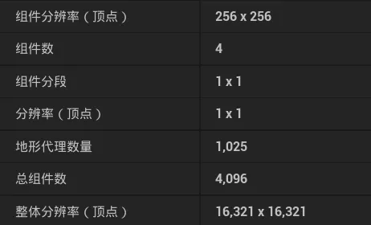

+++
date = '2026-05-20T15:00:00+08:00'
draft = false
title = 'UE5 Landscape 层级结构速查'
tags = ['UE', 'Landscape']
categories = ['图形渲染']
+++

## UE5 Landscape 层级结构（常见配置举例）

设定：`SubsectionSizeQuads=63` · `NumSubsections=2×2` · `ComponentSizeQuads=126` · 每 Proxy 含 2×2 Comp · 4×4 Proxy 网格

UE5 Landscape 原点在**左上角**，X 轴向右，Y 轴向下。

---

### ① 整体 Landscape — 4×4 StreamingProxy，共 1,008×1,008 quads

**类**：每个格子是一个 `ALandscapeStreamingProxy`（继承自抽象基类 `ALandscapeProxy`）；整张地形有且仅有一个主 Actor `ALandscape`（同样继承 `ALandscapeProxy`），持有共享的材质、LOD 等配置。跨 Proxy 的逻辑聚合由 `ULandscapeInfo`（Transient UObject，通过 `LandscapeGuid` 串联所有 Proxy）负责。

```
          → X comp
          0          2          4          6
     ↓    ╔══════════╦══════════╦══════════╦══════════╗  ─┐
Y    0    ║  _0_0    ║  _2_0    ║  _4_0    ║  _6_0    ║   │
comp      ╠══════════╬══════════╬══════════╬══════════╣   │
     2    ║  _0_2    ║  _2_2    ║  _4_2 ★  ║  _6_2    ║   1,008
          ╠══════════╬══════════╬══════════╬══════════╣  quads
     4    ║  _0_4    ║  _2_4    ║  _4_4    ║  _6_4    ║   │
          ╠══════════╬══════════╬══════════╬══════════╣   │
     6    ║  _0_6    ║  _2_6    ║  _4_6    ║  _6_6    ║   │
          ╚══════════╩══════════╩══════════╩══════════╝  ─┘
          ←──────────── 1,008 quads ────────────→
```

- **名称格式**：`LandscapeStreamingProxy_{CX}_{CY}_0`
  - `CX` / `CY` = 该 Proxy 左上角第一个 Component 的网格索引
  - 末尾 `_0` 为同坐标消歧索引，通常恒为 0
- 每 Proxy = 2×2 Components = 252×252 quads
- 每 Proxy = 独立 `.uasset`（OFPA），独立流送加载 / 卸载

---

### ② 放大 Proxy `_4_2` ★ — 内含 2×2 Component，252×252 quads

**类**：每个格子是一个 `ULandscapeComponent`（继承 `UPrimitiveComponent`），作为 `ALandscapeProxy` 的子对象存储。

```
          → X comp
          4              5              6
     ↓    ┌──────────────┬──────────────┐  ─┐
Y    2    │  Comp[4,2]   │  Comp[5,2]   │   │
comp      │  126×126 q   │  126×126 q   │   252q
     3    ├──────────────┼──────────────┤   │
          │  Comp[4,3]   │  Comp[5,3]   │   │
          │  126×126 q   │  126×126 q   │   │
          └──────────────┴──────────────┘  ─┘
          ↑CompBaseX=4
```

纹理分辨率公式：`(SubsectionSizeQuads + 1) × NumSubsections = (63+1) × 2 = 128`

| 纹理 | 类型 | 分辨率 | 说明 |
|---|---|---|---|
| `HeightmapTexture` | `UTexture2D`（RGBA8，RG 存高度，BA 存法线） | 128×128（每 Component） | 可与相邻 Component 共享同一张更大的纹理，各自通过 `HeightmapScaleBias` 的 ZW 分量偏移定位自己的区域 |
| `WeightmapTextures[i]` | `UTexture2D`（BGRA8） | 128×128（每 Component 独占） | 每张 4 通道，每通道存一个 Layer 的权重；超过 4 层追加第二张 |

**顶点与像素的对应关系**：顶点 `(i, j)` 精确落在第 `(i, j)` 个 texel 的**中心**，两者一一对应。半像素偏移的加入位置不同，但效果等价：

- Heightmap：`HeightmapScaleBias.zw` 不含 0.5，shader 里手动补 `+ 0.5 × ScaleBias.xy`（`LandscapeVertexFactory.ush`）
- Weightmap：C++ 初始化时直接将 0.5 烘入 `WeightmapScaleBias.zw = 0.5 / Size`（`LandscapeEdit.cpp`），shader 直接使用

- 是材质实例（MIC）绑定与 `ValidateCombinationMaterial` 的最小单位
- 引擎日志 `missing layer Grass` 就是逐 Component 报的

---

### ③ 放大 `Comp[4,2]` — 内含 2×2 Subsection，126×126 quads

**类**：Subsection 和 Quad 均无独立类。Subsection 的划分参数存于 `ALandscapeProxy` 的 `NumSubsections`（每边 Subsection 数）和 `SubsectionSizeQuads`（每 Subsection 的 quad 数，此处为 63）字段。

```
          → X quad
          0             63             126
     ↓    ╔═════════════╦═════════════╗  ─┐
Y    0    ║ Sub[0,0]    ║ Sub[1,0]    ║   │
quad      ║  63×63 q    ║  63×63 q    ║   126q
    63    ╠═════════════╬═════════════╣   │
          ║ Sub[0,1]    ║ Sub[1,1]    ║   │
          ║  63×63 q    ║  63×63 q    ║   │
   126    ╚═════════════╩═════════════╝  ─┘
```

- Subsection = LOD 裁剪 / 计算的最小单位，可独立切 LOD 级别
- Quad = 最小格子（四顶点围成），即 1×1 单位

---

### 创建面板字段对照

UE5 Landscape 创建面板中各字段与上述层级的对应关系：

> **（顶点）说明**：面板中带"（顶点）"后缀的字段，计量单位是**顶点数**而非 quad 数，两者相差 1（顶点数 = quads + 1）。面板混用了两种单位——"组件分段"填的是格子划分数，"组件分辨率"填的是顶点数，括号是 Epic 加的消歧标注。



| 面板字段 | 引擎变量 | 所在类 | 计算公式 | 截图值 | 本文示例值 |
|---|---|---|---|---|---|
| 组件分辨率（顶点） | `ComponentSizeQuads` + 1 | `ALandscapeProxy`（`ULandscapeComponent` 有副本） | `SubsectionSizeQuads × NumSubsections` + 1 | 256（= 255q + 1） | 127（= 126q + 1） |
| （`ComponentSizeQuads`） | `ComponentSizeQuads` | 同上 | `SubsectionSizeQuads × NumSubsections` | 255（= 255×1） | 126（= 63×2） |
| 组件数 | `LandscapeComponents.Num()` | `ALandscapeProxy` | — | 4（2×2） | 4（2×2） |
| 组件分段 | `NumSubsections`（每边） | `ALandscapeProxy`（`ULandscapeComponent` 有副本） | — | 1×1 | 2×2 |
| 分辨率（顶点） | `GetRootComponent()->GetRelativeScale3D().X / .Y` | `USceneComponent` | 每 quad 对应的世界空间距离（cm）；默认 100 即 1 quad = 1 m | 1×1 | 1×1 |
| 地形代理数量 | `GetSortedStreamingProxies().Num()` + 1 | `ULandscapeInfo` | 总 Component 数 ÷ 每 Proxy Component 数 + 1（`ALandscape` 本身） | 1,025（= 32×32 + 1） | 17（= 4×4 + 1） |
| 总组件数 | `XYtoComponentMap.Num()` | `ULandscapeInfo`（仅 Editor） | 边长 Proxy 数 × 每 Proxy 边长 Component 数，再平方 | 4,096（= 64×64，64 = 32×2） | 64（= 8×8，8 = 4×2） |
| 整体分辨率（顶点） | 无单一变量，派生值 | — | 边长 Component 数 × `ComponentSizeQuads` + 1 | 16,321（= 64×255+1） | 1,009（= 8×126+1） |

---

### 汇总

| 层级 | 类名 | 数量 | 每格尺寸（quads） | 职责 |
|---|---|---|---|---|
| Landscape | `ALandscape`（继承 `ALandscapeProxy`） | 1 | 1,008×1,008 | 主 Actor，持有共享配置；逻辑整体由 `ULandscapeInfo`（Transient）聚合所有 Proxy |
| StreamingProxy | `ALandscapeStreamingProxy`（继承 `ALandscapeProxy`） | 4×4 = 16 | 252×252 | 独立 Actor / uasset（OFPA），流送加载 / 卸载单位 |
| Component | `ULandscapeComponent`（继承 `UPrimitiveComponent`） | 8×8 = 64 | 126×126 | 渲染 & 材质绑定单位，持有 HeightmapTexture / WeightmapTextures |
| Subsection | 无独立类（参数：`ALandscapeProxy::NumSubsections` / `SubsectionSizeQuads`） | 16×16 = 256 | 63×63 | LOD 裁剪单位 |
| Quad | 无独立类 | 1,008×1,008 | 1×1 | 最小格，高度 / 权重采样间距 |
