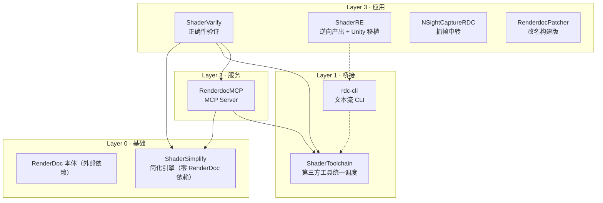
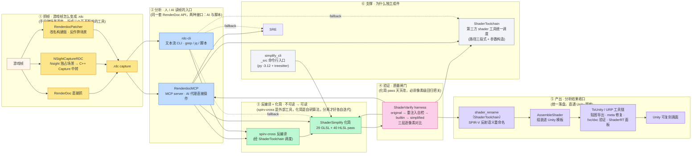

+++
title = 'RenderDoc 逆向分析工具链盘点'
date = '2026-08-12T10:00:00+08:00'
tags = ['RenderDoc', 'Shader', '逆向', '工具链']
+++

> 从"抓到一帧"到"Unity 里复刻出同样的画面"，中间隔着一整套工具链。这篇文章盘点我日常用的 RenderDoc 生态工具：它们各自解决什么问题、怎么协作、典型工作流长什么样。

## 为什么会有这一堆工具

RenderDoc 本身只能做一件事：抓帧 + 查看。但"逆向分析一个游戏画面"要做的事远不止这些：

- **反编译的 shader 不可读** — SPIR-V 反编译出来的 HLSL/GLSL 又臭又长（编译器产物），需要自动化简
- **第三方工具散落各处** — spirv-cross、glslang、dxc、fxc、spirv-dis 路径和参数各不一样，需要统一调度
- **人操作太慢** — 打开 capture、找 draw、看管线状态、导出贴图，重复劳动要自动化（MCP / CLI）
- **改完东西没把握** — 化简 pass 有没有改变渲染结果？必须逐像素对比验证
- **某些游戏抓不到帧** — 带反作弊的游戏直接附加 RenderDoc 会被拦；Nsight 独占的 API 场景需要中转

整套工具（RDC 仓库）按依赖分成四层，自底向上：



> 图例：实线 = code import（solid）；虚线 = runtime / fallback 依赖。依赖关系以 [`_doc/dependency-chain.md`](../../../../_doc/dependency-chain.md) 为校验真理源（由 `gen_dep_matrix.py` 自动生成），本图仅供阅读。

| 层 | 工具 | 一句话用途 |
|---|---|---|
| 0 基础 | ShaderSimplify | 反编译 shader 的自动化简引擎 |
| 1 桥接 | ShaderToolchain | spirv-cross / dxc / fxc 等工具统一调度 |
| 1 桥接 | rdc-cli | 把 .rdc 变成 grep 友好的文本流 |
| 2 服务 | RenderdocMCP | 让 AI 通过 MCP 协议操作 RenderDoc |
| 3 应用 | ShaderVarify | 化简正确性的像素级验证 harness |
| 3 应用 | ShaderRE | 逆向产出 + 移植到 Unity 的完整流水线 |
| 3 应用 | NSightCaptureRDC | Nsight C++ Capture → .rdc 中转 |
| 3 应用 | RenderdocPatcher | 改名编译版 RenderDoc（反作弊场景） |

## 端到端一图流

把整条链"串起来"看——从游戏帧到 Unity 可复刻画面，共六个阶段。实线是数据/工作流，虚线是依赖关系：



> 图例：实线 = code import（solid）；虚线 = runtime / fallback 依赖。依赖关系以 [`_doc/dependency-chain.md`](../../../../_doc/dependency-chain.md) 为校验真理源，本图仅供阅读。

### 为什么这么组织

- **① 抓帧拆成三个工具**：抓帧手段因场景而变——普通游戏 RenderDoc 直抓；Nsight 独占 API 的游戏要 C++ Capture 中转；带反作弊的游戏要用改名构建版。三件事互不干扰，拆开各自维护。
- **② 分析双入口**：MCP（给 AI 代理）和 CLI（给人 / 脚本）操作的是同一套 RenderDoc API，只是接口形态不同。AI 适合交互式探索，CLI 适合可复现的批处理，两条线并存。
- **③ 反编译与化简分离**：spirv-cross 是外部工具，能力边界固定；化简是自研算法，迭代频繁。混在一起的话，每次升级 spirv-cross 都会拖累化简逻辑。
- **④ 验证独立成质量闸门**：化简 pass 是整套工具链中改动最频繁的部分，每改一个 pass 都可能悄悄改变渲染结果。像素级对比必须独立成闸门，谁改谁负责过闸。
- **⑤ 产出收口**：分析结果（重命名 shader、贴图、导入设置）统一由 ShaderRE 落盘，并直通 Unity 移植——避免每次逆向完都要手写一遍搬运代码。
- **⑥ 支撑件独立**：ShaderToolchain 把 spirv-cross/dxc/fxc 等第三方工具的路径与参数统一管理，消费者不用各自写一遍；simplify_cli 是给插件侧走 subprocess 的桥（py -3.12 + treesitter），不独立的话插件侧无法复用化简引擎。

## Layer 0 · 基础

### ShaderSimplify — shader 化简引擎

**用途**：把 spirv-cross 反编译出来的"机器风格"shader 化简成可读代码。这是整个逆向工作流的地基——看不懂化简后的 shader，后面的一切（抄算法、移植）都无从谈起。

**核心能力**：

- 纯 Python 算法引擎，**零 RenderDoc 依赖**，GLSL + HLSL 双语言
- 29 个 GLSL pass + 40 个 HLSL pass 全量启用（`simplify_cli --list-passes` 实测 2026-08-12），tree-sitter AST 后端
- 覆盖 constant folding、inline、dead-store 消除、swizzle 清理、outline 重复块、normalize / lerp / smoothstep 逆向还原等
- pass 间无耦合，统一收敛循环跑全部 pass，每轮比字节，不变则退出
- 典型效果（历史单例实测）：753 行函数体 inline 后从 1099 行降到 872 行

**被谁用**：ShaderVarify / RenderdocMCP 走 `ShaderSimplify/api.py::simplify_source`（进程内标准入口，2026-08 起统一）；qrenderdoc 插件（内嵌 3.6 无法 import 引擎，经 simplify_cli subprocess 调用）。

**配套 CLI**（仓库根 `_src/simplify_cli.py`）：stdin JSON 协议输入源码 + 配置，stdout 输出化简结果。插件侧（qrenderdoc 嵌入环境无法直接 import 引擎）经 `ShaderToolchain/simplify_subprocess.py`（`gen_hlsl` 等）走 subprocess 调 `py -3.12` 跑这个 CLI（treesitter 后端）。**simplify_subprocess 与 simplify_cli 是同一 subprocess 通道的两个视角**：前者是 ShaderToolchain 的封装入口（反编译 + 化简 + 写文件），后者是 `_src` 的纯命令行（stdin JSON → stdout 源码）。

## Layer 1 · 桥接

### ShaderToolchain — 第三方 shader 工具统一调度

**用途**：统一管理第三方 shader 工具（spirv-cross、dxc、fxc 等）的路径解析和调用，避免每个项目各自写一遍。

| 工具 | 用途 |
|---|---|
| spirv-cross | SPIR-V → HLSL / GLSL / JSON 反射反编译 |
| shader_rename | 反射级重命名：基于 RenderDoc reflection 把 spirv-cross 变量名改回可读名（2026-08 归一，ShaderVarify / MCP / ShaderRE 共用） |
| simplify_subprocess | ShaderSimplify 的 subprocess 通道：反编译 → 化简 → 写文件（内部调 `_src/simplify_cli.py`；供无法 import 引擎的插件/rdc-cli，2026-08 由 shader_gen 改名） |
| glslangValidator | GLSL/HLSL → SPIR-V 编译 |
| dxc | HLSL → SPIR-V 编译（DXC 后端） |
| spirv-dis | SPIR-V 反汇编 |
| fxc | HLSL → DXBC 编译（D3D11 SM5.0，手写 shader 本地验证链） |
| dxbc2dxil / dxil-spirv | DXBC ↔ DXIL 转换 |

路径解析统一三段式：`环境变量 → PATH → 默认路径`（spirv-dis 额外查 Vulkan SDK，dxc 额外查 LOCALAPPDATA，fxc 默认 Windows Kits 最新版）。环境变量沿用旧命名（`SPIRV_CROSS_PATH`、`GLS_VALIDATOR_PATH`、`DXC_PATH` 等）；统一 `SHADERTOOL_*` 前缀仍在规划中，未在代码实现。

零 ShaderSimplify 依赖（只有标准库），被 ShaderVarify 和 RenderdocMCP 直接 import。

### rdc-cli — 把 .rdc 变成文本流

**用途**：上游项目（BANANASJIM/rdc-cli）的口号是"Turn RenderDoc captures into Unix text streams"——让 .rdc 内容可以被 grep / awk / sort / jq 和 AI agent 消费。本地的 fork 在此基础上把 RenderdocMCP 的差异化能力移植成 CLI 形态。

**架构**：Click CLI + JSON-RPC over TCP daemon，daemon 持有 ReplayController。一条命令 = 一个 JSON-RPC 调用，输出 TSV/JSON。

**本地方案在 fork 上新增的能力**：

- `manifest-export` — 按 manifest JSON 批量导出贴图
- `decompile-shader` — SPIR-V → HLSL/GLSL + 化简（走 ShaderToolchain）
- `assemble-shader` — VS+PS → Unity .shader
- validation 套件（6 个）— event / pixel / resource / vertex-output / cbuffer / capture 双路径交叉验证
- `debug compare <eid_a> <eid_b> X Y` — 两个 draw 同像素的执行 trace 逐值对比（daemon 侧读寄存器状态，不会像 stdout TSV 那样错位）
- `debug pixel --trace` — 单 draw 完整执行 trace
- `rdc script` — escape hatch：exec 无沙箱脚本，直接访问 controller，快速原型用

**典型调试场景**：手写 shader 移植自 ShaderGraph，用 `rdc shader-eids` 找 draw → `rdc rt` 导出渲染目标 → `rdc debug compare` 逐值对比找首个分歧 → `rdc shader <eid> ps --target DXBC` 反汇编对比结构。

## Layer 2 · 服务

### RenderdocMCP — 让 AI 操作 RenderDoc

**用途**：FastMCP 实现的 MCP server（fork 自 Linkingooo/renderdoc-mcp），让 Claude 等 AI 代理通过 MCP 协议直接操作 .rdc capture：开帧、列 draw、读管线状态、导出贴图、反编译 shader、像素历史、性能分析。

**工具分组**（11 个模块，53 个工具）：

- session — 开/关/列 capture（fork 新增**多 capture 并发**，上游只有单例）
- event — draw 列表 / 搜索 / 定位
- pipeline — 管线状态 / 绑定 / 输入布局 / draw 状态
- resource — 纹理 / buffer / 资源列表
- data — 保存贴图 / buffer / 导出 mesh / 读像素
- shader — 反汇编 / 反射 / cbuffer 内容
- shader_export — decompile_shader / 贴图导出规范化 / manifest 批量导出
- advanced — pixel history / post-VS / draw diff / debug pixel
- validation — event / pixel / resource / vertex-output / cbuffer / capture 双路径交叉验证（rdc-cli validation 套件即移植自此）
- performance — pass timing / overdraw / bandwidth / state changes
- diagnostic — negative / precision / 反射 / mobile 风险

**fork 差异化能力**：

- `decompile_shader` — DXBC / DXIL / SPIR-V → HLSL/GLSL + 化简（路径经 ShaderToolchain 统一管理，大 shader 支持分段查看）
- 贴图导出规范化 — 自动 sidecar JSON 元数据、`flip_y` 选项、cubemap/array/3D 全切片导出到一个 DDS
- `export_textures_from_manifest` — 按 manifest 批量导出
- 修复了上游 4 个 PipeState API 调用 bug（blend / depth / stencil / rasterizer 全丢）

**配套 skills**：`analyze-rdc-all`（全量分析）、`analyze-rdc-overview`（管线总览 + GBuffer 布局 + Mermaid 流程图）、`analyze-rdc-feature`（单渲染特性深挖 + shader 落盘）、`analyze-rdc-performance`（性能报告 + 风险分级）、`simplify-shader-rule`（开发新化简规则的交互循环）、`simplify-bug-diagnose`（定位哪个 pass 引入像素差异）。

## Layer 3 · 应用

### ShaderVarify — 化简正确性的像素级验证

**用途**：验证"shader 经过全部化简 pass 后，渲染结果是否逐像素一致"——这是化简引擎的质检站，也是整个工具链最硬核的部分。

**三层 ground-truth 设计**（2026-07-31 起）：

```
RenderDoc Capture (.rdc)
  ├─ original.png        未注入的原始渲染（绝对基准）
  ├─ orig_injected.png   重注入原始字节码，必须 == original（注入机制自检）
  └─ SPIR-V ─spirv-cross→ builtin ────→ simplified
              builtin.png ←—— 逐像素对比 ——→ simplified.png
```

`builtin vs simplified` 只是相对对比，可能两边一起错，所以强制渲染未注入的 original 基准，并重注入原始字节码自检注入机制：

| 结果 | 含义 |
|---|---|
| `INJECT_ERROR` / `INJECT_MISMATCH` | 注入机制坏了（不该发生） |
| `DECOMPILE_MISMATCH` | 反编译/重编译保真度问题（pass 无关） |
| `COMPARE_FAIL` | 某个化简 pass 引入了差异 |
| `PASS` | 三层全过 |

**三种运行模式**：

- `texture` — 默认，输出 PNG 留痕（PNG 大小差本身也是诊断信号，>10KB = 语义错误）
- `pixel` — PickPixel API 快验，~6 倍速、无磁盘 I/O，迭代算法时用
- `debug` — 全部 pass 逐跑，~80s 出 per-pass 差异表格，定位是哪个 pass 引入的

**Tolerance = 4**：atan2 多项式 vs GPU 内置函数、normalize 的 1-ULP 精度差异是已知噪声源。单个 pass 单独产生 >4 的偏差说明它语义有 bug，不是精度问题。

**附带工具**：`pixel_debug`（渲染不一致的逐像素 trace 对比 + DebugPixel 历史）、`verify_bindings`（GLSL 绑定 vs HLSL register 映射诊断）、`dx_input_layout` / `dx_for_increment` / `dx_buffer_layout` / `dx_loop_idiom`（四个 Native-DX 反编译修复）。

### ShaderRE — 逆向产出 + Unity 移植

**用途**：从 RenderDoc capture 出发，最终产出一份**可进 RenderDoc 的语义重命名 HLSL**，再进一步移植成 Unity shader。这是"分析完以后"的终点管线。

```
_ src/ShaderToolchain/shader_rename.py  ← SPIR-V 反射 → 语义重命名（2026-08 归一，原在 ToRDC/）
_ src/ToUnity/AssembleShader.py ← 按 $FRAG_FUNC_START 等标记组装进 Unity 模板
_ src/ToUnity/URP/              ← URP 移植工具链
proj/                           ← 项目产出（每游戏一目录）
```

**ToUnity / URP 工具链**（2026 年中逐步沉淀）：

- `export_textures.py` — 截帧数据驱动导出贴图
- `fix_texture_meta.py` — 直改 .meta 精确设纹理格式（BC7 / BC6H）
- `gen_unity_shader.py` — 生成 Unity shader
- `urp_verify_fxc.py` / `urp_verify_dxc.py` — fxc / dxc 编译验证（D3D11 SM5.0）
- Unity 侧 ShaderRT 面板 — Odin 弹窗，`TA/ShaderRE/ShaderRT` 统一入口，自动创建材质 + 按截帧清单自动赋值贴图

**项目产出**：终末地 EID 3443（半透明 forward）、EID 3435（deferred lighting）、原神 EID 2922（场景苍穹玻璃 FirmamentGlass_Far）、原神 EID 5999（2026.07.30 build 同 shader 双版本适配）——每项目双版本交付（同 shader 新 build 差异适配）。

### NSightCaptureRDC — 抓帧中转站

**用途**：有些游戏只能用 Nsight Graphics 捕获，但 Nsight 的分析能力不如 RenderDoc。通过 Nsight C++ Capture 中转让，生成 RenderDoc 可分析的 .rdc 文件。

**要点**：

- Vulkan 项目需在编译前修改 `VulkanReplay.cpp`（VMA 条件判断），D3D12 不需要
- Generate C++ Capture 必须用与 capture 相同版本的 Nsight，否则回放失败
- Nsight 2026.1.0 已废弃 D3D12 C++ Capture 导出，D3D12 需用 2025.5.0

### RenderdocPatcher — 改名编译版 RenderDoc

**用途**：部分游戏的反作弊会拦截 RenderDoc 附加。把 RenderDoc 源码整体改名编译（`renderdoc` → `rendertest`），用于分析这类场景的渲染。这是渲染技术分析的常规做法——**仅用于研究学习，切勿用于破坏公平竞技的游戏**。

**技术要点**：

- 174 条字符串规则 + 3 条块替换规则，把源码中所有 "renderdoc" 特征改掉
- `--patch-binary` 后处理编译产物里 `__FILE__` 宏残留的字符串（等长替换，不破坏 PE）
- 全流程 bat 化：`0_build-*.bat`（编译）→ `4_patch-binary.bat`（二进制后处理）→ `5_check.bat`（残留检查）→ `1_revert.bat`（还原源码）

## 根目录的胶水

- `_src/gen_dep_matrix.py` — 从代码 import 自动扫描生成依赖矩阵，pre-commit hook 校验，防依赖漂移
- `_src/bootstrap.py` — 仓库根的 sys.path 锚点
- `_doc/dependency-chain.md` — 依赖链文档（校验真理源，Mermaid 图仅供阅读）

## 典型工作流

### 工作流 A：验证化简正确性（日常迭代）

```
抓帧 → decompile（spirv-cross）→ simplify（全部 pass）
     → compile（glslang/dxc）→ 注入 → 渲染
     → pixel 快验 → texture 出 PNG → debug 定位哪个 pass 引入差异
```

### 工作流 B：完整逆向 + Unity 移植

```
抓帧（RenderDoc / Nsight 中转 / 改名版）
  → RenderdocMCP / rdc-cli 分析（管线总览 → 特性深挖 → 性能）
  → shader_rename 语义重命名
  → AssembleShader 组装进 Unity 模板
  → export_textures + fix_texture_meta 导入贴图
  → fxc / dxc 编译验证 → ShaderRT 面板复刻
```

## 小结

这套工具链的划分逻辑：**引擎（ShaderSimplify）与调度（ShaderToolchain）分离 → 服务（MCP）与 CLI 并行 → 验证（ShaderVarify）兜底 → 产出（ShaderRE）收口**。每层优先依赖下面一层（唯二有意的向上依赖：MCP → ShaderRE 的 assemble 能力、rdc-cli → ShaderRE 的 fallback），改动一个模块不影响其他模块的接口，这也是它能持续迭代两年而不腐化的原因。
