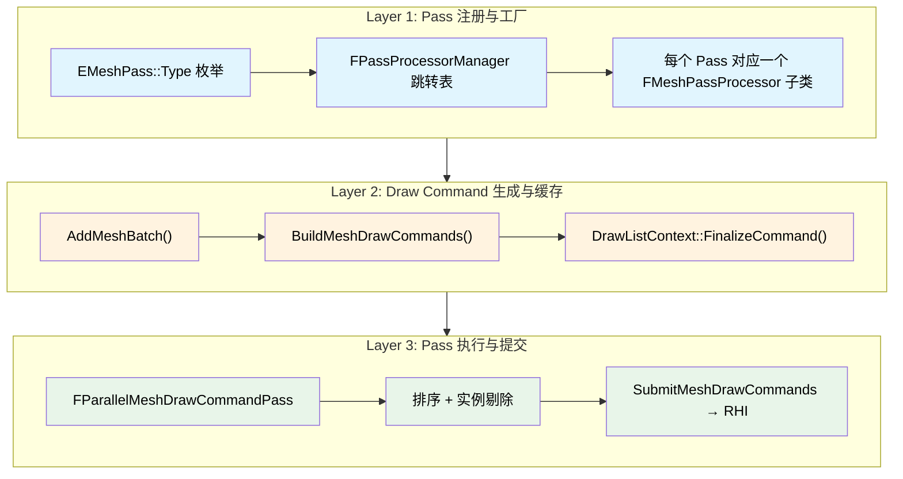
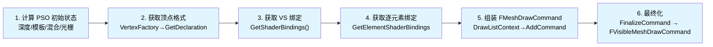
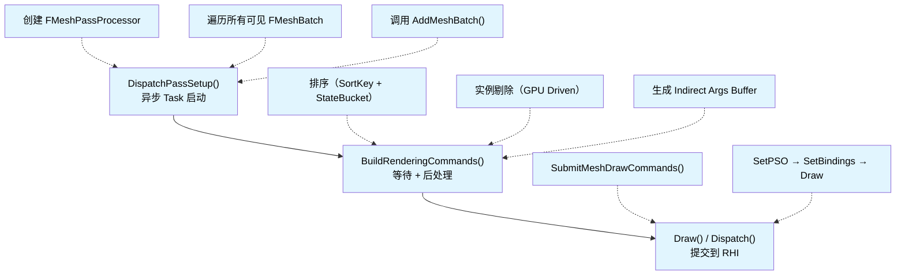
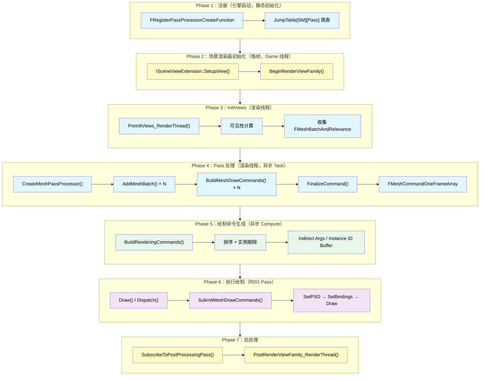
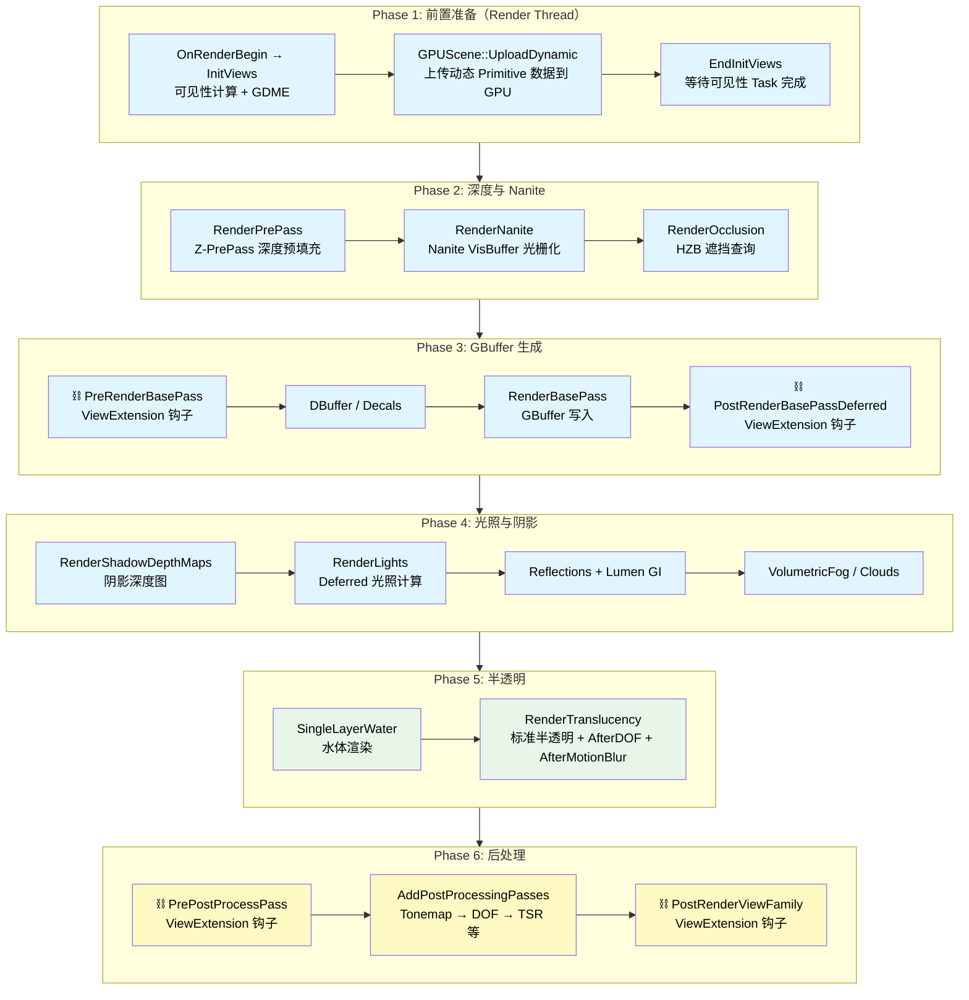
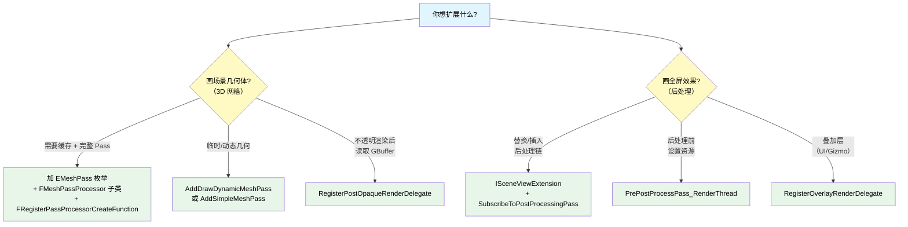

+++
date = '2026-06-08T18:00:00+08:00'
draft = false
title = 'UE5 RenderPass 与 MeshPassProcessor 源码解析'
tags = ['UE', '渲染管线', 'MeshPassProcessor', 'SceneViewExtension', 'RenderPass']
categories = ['图形渲染']
+++

> 本文基于 UE 5.7 引擎源码（`D:\BuildUnrealEngine\Engine\Source\Runtime\Renderer`），系统梳理 UE 的 RenderPass 架构：Pass 如何注册、FMeshPassProcessor 如何将 FMeshBatch 转换为 GPU 命令、开发者有哪些扩展点可以插入自定义 Pass。所有代码引用标注了引擎内原始路径和行号。

---

## 1. 整体架构概览

UE 的渲染 Pass 体系由三个核心层级构成：



简单来说：**Pass 是"渲染什么"的模板，MeshPassProcessor 负责把场景网格编译成 GPU 看得懂的 DrawCommand，Pass 执行器负责按正确顺序提交到 RHI。**

---

## 2. FMeshPassProcessor：Pass 处理器核心

### 2.1 类结构与继承

**文件：** `Engine/Source/Runtime/Renderer/Public/MeshPassProcessor.h:2203`

```cpp
class FMeshPassProcessor : public IPSOCollector
```

继承 `IPSOCollector`，意味着每个 MeshPassProcessor 都参与 PSO 预缓存系统。类本身不直接实例化——每个 Pass 类型（BasePass、DepthPass、Velocity 等）都有自己的子类实现。

### 2.2 核心成员

| 成员 | 类型 | 说明 |
|------|------|------|
| `MeshPassType` | `EMeshPass::Type` | 标识当前 Pass 类型（6 位打包，最多 64 种） |
| `Scene` | `const FScene*` | 场景后向指针 |
| `FeatureLevel` | `ERHIFeatureLevel::Type` | Shader 特性级别（SM5/SM6） |
| `ViewIfDynamicMeshCommand` | `const FSceneView*` | 动态 Pass 的视图上下文 |
| `DrawListContext` | `FMeshPassDrawListContext*` | Draw Command 输出目标 |

### 2.3 核心纯虚函数

```cpp
// MeshPassProcessor.h:2234
virtual void AddMeshBatch(
    const FMeshBatch& RESTRICT MeshBatch,
    uint64 BatchElementMask,
    const FPrimitiveSceneProxy* RESTRICT PrimitiveSceneProxy,
    int32 StaticMeshId = -1) = 0;
```

**每个子类必须实现此函数**。它是 Pass 处理器的核心入口——将 `FMeshBatch`（场景中一组网格 + 材质的配对）转换为一个或多个 `FMeshDrawCommand`（GPU 可执行的绘制命令）。

简化理解：

```
FMeshBatch（场景数据）──AddMeshBatch()──→ FMeshDrawCommand（GPU 命令）
                      ↑ 子类覆写决定
                      用什么 Shader、什么 PSO
```

### 2.4 BuildMeshDrawCommands：核心模板方法

**文件：** `MeshPassProcessor.inl:49`

BuildMeshDrawCommands 模板签名的完整参数列表：const FMeshBatch&, uint64, const FPrimitiveSceneProxy*, const FMaterialRenderProxy&, const FMaterial&, const FMeshPassProcessorRenderState&, const PassShadersType&, ERasterizerFillMode, ERasterizerCullMode, FMeshDrawCommandSortKey, EMeshPassFeatures, const ShaderElementDataType&

```cpp
template<typename PassShadersType, typename ShaderElementDataType>
void FMeshPassProcessor::BuildMeshDrawCommands(
    const FMeshBatch& MeshBatch,
    uint64 BatchElementMask,
    const FPrimitiveSceneProxy* PrimitiveSceneProxy,
    const FMaterialRenderProxy& MaterialRenderProxy,
    const FMaterial& MaterialResource,
    const FMeshPassProcessorRenderState& DrawRenderState,
    PassShadersType PassShaders,
    ERasterizerFillMode MeshFillMode,
    ERasterizerCullMode MeshCullMode,
    FMeshDrawCommandSortKey SortKey,
    EMeshPassFeatures MeshPassFeatures,
    const ShaderElementDataType& ShaderElementData)
```

**执行流程（6 步）：**



> **关键设计**：`PassShadersType` 模板参数让 BuildMeshDrawCommands 在编译时就绑定了具体的 Shader 类型（顶点着色器、像素着色器），避免了运行时虚函数开销。

### 2.5 EMeshPass::Type 枚举：所有内置 Pass

**文件：** `MeshPassProcessor.h:41-93`

约 39 个（Shipping 构建）/ 43 个（Editor 构建）硬编码的 Pass 类型：

| Pass 类型 | 说明 |
|-----------|------|
| `DepthPass` | 深度预 Pass（Z-PrePass） |
| `BasePass` | 主颜色 Pass（GBuffer 写入） |
| `Velocity` | 运动向量（TAA/TSR 用） |
| `TranslucencyStandard` | 标准半透明 |
| `TranslucencyAfterDOF` | DOF 后半透明 |
| `TranslucencyAfterMotionBlur` | 运动模糊后半透明 |
| `ShadowDepth` | 阴影深度 Pass |
| `CustomDepth` | 自定义深度 |
| `NaniteMeshPass` | Nanite 光栅化 |
| `SingleLayerWater` | 单层水体 |
| `DebugViewMode` | 编辑器调试视图 |
| `HitProxy` | 编辑器 Hit 代理 |

MeshPassType 为 EMeshPass::Type，Enum NumBits=6 限制其最多支持 64 种 Pass，在 FCachedMeshDrawCommandInfo 中以 7 位（NumBits+1）位域存储，与 SortKey 并列但不属于 SortKey 打包字段。

### 2.6 PSO 预缓存系统

**文件：** `MeshPassProcessor.cpp:1176-1216`、`MeshPassProcessor.cpp:1782`、`MeshPassProcessor.cpp:2192`

GPU PSO（Pipeline State Object）编译是一个昂贵的操作。如果在 DrawCall 提交时才发现 PSO 未创建，会导致运行时卡顿（Hitch）。UE5 的预缓存系统在 DrawCommand 构建阶段就提前向 `PipelineStateCache` 注册 PSO，确保 GPU 在需要时 PSO 已经就绪。

#### PSO 的 6 要素

PSO 由 `FGraphicsMinimalPipelineStateInitializer` 唯一确定，其要素包括：VertexShader、PixelShader、GeometryShader（部分平台）/ MeshShader、VertexDeclaration、BlendState、RasterizerState、DepthStencilState、ImmutableSamplerState、bDepthBounds、bAllowVariableRateShading、DrawShadingRate、PrimitiveType

`BuildMeshDrawCommands` 在执行流程的第 1 步就组装了这些要素，并同步注册到 PSO 收集器。

#### IPSOCollector 继承

`FMeshPassProcessor` 继承自 `IPSOCollector`，构造时通过跳转表获取对应的预缓存索引：

```cpp
// MeshPassProcessor.cpp:1782
FMeshPassProcessor::FMeshPassProcessor(EMeshPass::Type InMeshPassType, ...)
    : IPSOCollector(FPassProcessorManager::GetPSOCollectorIndex(
        GetFeatureLevelShadingPath(InFeatureLevel), InMeshPassType))
```

`PSOCollectorIndex` 是一个静态二维数组 `[EShadingPath::Num][EMeshPass::Num]`（`MeshPassProcessor.cpp:2192`），注册宏在填写跳转表时同步填充。

#### 提交时的 PSO 状态检查

在 `FMeshDrawCommand::SubmitDrawBegin`（`MeshPassProcessor.cpp:1218`）中，每次 Draw 提交前调用 `RetrieveAndCachePSOPrecacheResult`：

```cpp
// MeshPassProcessor.cpp:1239
EPSOPrecacheResult PSOPrecacheResult = RetrieveAndCachePSOPrecacheResult(
    MeshPipelineState, GraphicsPSOInit, bAllowSkipDrawCommand);
```

检查逻辑：
- **Unknown / Active** → 查询 `PipelineStateCache::CheckPipelineStateInCache`，缓存结果
- **Complete** → 直接使用，无需再查
- **若开启 `GSkipDrawOnPSOPrecaching` 且 PSO 未就绪** → 跳过本次 Draw，避免运行时 PSO 编译卡顿

> **关键设计**：PSO 状态被缓存在 `FGraphicsMinimalPipelineStateInitializer::PSOPrecacheState` 中。后续 Frame 无需再次查询，消除了 PSO 查找的 CPU 开销。

---

## 3. Pass 注册机制

### 3.1 FPassProcessorManager：跳转表

**文件：** `MeshPassProcessor.h:2359-2406`

```cpp
struct FPassProcessorManager
{
    // 二维跳转表：[EShadingPath::Num] × [EMeshPass::Num]
    static PassProcessorCreateFunction JumpTable[EShadingPath::Num][EMeshPass::Num];
    
    // 每个 Pass 的标志位
    static EMeshPassFlags Flags[EShadingPath::Num][EMeshPass::Num];
    
    // PSO 预缓存索引
    static uint32 PSOCollectorIndex[...];
    
    // 统一创建入口
    static FMeshPassProcessor* CreateMeshPassProcessor(
        EShadingPath ShadingPath,
        EMeshPass::Type PassType,
        ERHIFeatureLevel::Type FeatureLevel,
        const FScene* Scene,
        const FSceneView* View,
        FMeshPassDrawListContext* DrawListContext);
};
```

FPassProcessorManager 类位于 MeshPassProcessor.h:2359-2406，包含 JumpTable[EShadingPath::Num][EMeshPass::Num]、DeprecatedJumpTable、Flags、PSOCollectorIndex 四个静态数组，CreateMeshPassProcessor 是唯一创建入口

### 3.2 FRegisterPassProcessorCreateFunction：RAII 注册器

**文件：** `MeshPassProcessor.h:2408-2432`

```cpp
struct FRegisterPassProcessorCreateFunction
{
    FRegisterPassProcessorCreateFunction(
        PassProcessorCreateFunction CreateFunction,
        EShadingPath ShadingPath,
        EMeshPass::Type MeshPass,
        EMeshPassFlags Flags,
        int32 PSOCollectorIndex = INDEX_NONE);
    ~FRegisterPassProcessorCreateFunction();
};
```

构造函数将工厂函数写入跳转表，析构函数清除。**通过文件级静态全局变量实现自动注册**——程序启动时 `main()` 之前就完成了注册。

### 3.3 注册宏

```cpp
// MeshPassProcessor.h:2435-2441
#define REGISTER_MESHPASSPROCESSOR_AND_PSOCOLLECTOR( \
    Name, MeshPassProcessorCreateFunction, \
    ShadingPath, MeshPass, MeshPassFlags)
```

**使用示例（BasePassRendering.cpp）：**

```cpp
REGISTER_MESHPASSPROCESSOR_AND_PSOCOLLECTOR(
    BasePass,
    CreateBasePassProcessor,
    EShadingPath::Deferred,
    EMeshPass::BasePass,
    EMeshPassFlags::CachedMeshCommands | EMeshPassFlags::MainView);
```

### 3.4 工厂函数签名

```cpp
// MeshPassProcessor.h:2348-2349
typedef FMeshPassProcessor* (*PassProcessorCreateFunction)(
    ERHIFeatureLevel::Type FeatureLevel,
    const FScene* Scene,
    const FSceneView* InViewIfDynamicMeshCommand,
    FMeshPassDrawListContext* InDrawListContext);
```

---

## 4. DrawListContext 体系

### 4.1 抽象基类

**文件：** `MeshPassProcessor.h:1674-1693`

```cpp
class FMeshPassDrawListContext
{
public:
    virtual FMeshDrawCommand& AddCommand(
        FMeshDrawCommand& Initializer, uint32 NumElements) = 0;
    virtual void FinalizeCommand(
        FMeshDrawCommand& MeshDrawCommand, ...) = 0;
};
```

### 4.2 三种实现

| 类 | 用途 | 存储方式 |
|----|------|----------|
| `FDynamicPassMeshDrawListContext` (line 1802) | 逐帧动态 Pass | Chunked Array，每帧重建 |
| `FCachedPassMeshDrawListContext` (line 1968) | 静态缓存 Pass | 存入 `FScene::CachedDrawLists` |
| `FCachedPassMeshDrawListContextDeferred` (line 2043) | 延迟批量提交 | 批量 Finalize，性能优于逐个提交 |

> **设计精髓**：同一个 `AddMeshBatch()` 代码，通过注入不同的 `DrawListContext` 就能切换输出目标是缓存还是动态。这是策略模式的典型应用。

---

## 5. Pass 执行器

### 5.1 FParallelMeshDrawCommandPass：主执行器

**文件：** `Engine/Source/Runtime/Renderer/Private/MeshDrawCommands.h:121-259`

FParallelMeshDrawCommandPass 类位于 MeshDrawCommands.h:121-259，包含 DispatchPassSetup、BuildRenderingCommands、Draw/Dispatch 三阶段接口。`ParallelMeshDrawCommandPasses` 数组声明位于 SceneRendering.h:1288：

```cpp
// SceneRendering.h:1286-1288
TStaticArray<FParallelMeshDrawCommandPass*, EMeshPass::Num> ParallelMeshDrawCommandPasses;

FParallelMeshDrawCommandPass* CreateMeshPass(EMeshPass::Type MeshPass);
```

**生命周期三阶段：**



### 5.2 FSimpleMeshDrawCommandPass：轻量替代

**文件：** `Engine/Source/Runtime/Renderer/Public/SimpleMeshDrawCommandPass.h:21-62`

非并行版本，适合小批量或编辑器 Pass。提供 `AddSimpleMeshPass` 模板（line 65-209），一行调用搞定整个流程：

```cpp
AddSimpleMeshPass(GraphBuilder, PassParameters, Scene, View,
    InstanceCullingManager, RDG_EVENT_NAME, ViewRect,
    [&](FDynamicPassMeshDrawListContext* Context) {
        // 在这里创建 MeshPassProcessor，调用 AddMeshBatch
    });
```

### 5.3 AddDrawDynamicMeshPass：Legacy 便捷接口

**文件：** `MeshPassProcessor.inl:358`

RDG 感知的同步版本，自动创建设置任务、编码光栅 Pass、调用 submit。适合编辑器工具或一次性 Pass。

### 5.4 RDG 与 MeshPassProcessor 的桥接

一个常见的困惑是：UE5 的渲染框架是 RDG（Render Dependency Graph），但 MeshPassProcessor 的输出是 `FMeshDrawCommand` 数组——这两者如何衔接？

**答案：MeshPass 不是原生 RDG Pass，而是通过 Lambda 嵌入 RDG 的 Pass 图中执行。**

#### 桥接流程

```
DispatchPassSetup()           ← 异步启动，遍历 FMeshBatch 编译为 FMeshDrawCommand[]
        │
BuildRenderingCommands()      ← 等待异步完成 + 运行 GPU 实例剔除
        │                       产出 InstanceCullingDrawParams
        │                       （Indirect Args Buffer + Instance ID Buffer）
        │
GraphBuilder.AddDispatchPass / AddPass  ← 将提交代码打包进 RDG Pass Lambda
        │                       RDG 管理依赖和屏障
        │
Pass->Dispatch() / Pass->Draw()         ← Lambda 内部，走传统 RHI 提交路径
        │
SubmitMeshDrawCommands()                ← 最终 RHI DrawIndexedPrimitive
```

#### 两种 RDG 嵌入模式

**并行模式**（`MeshDrawCommands.cpp:2086`）——用于 BasePass 等大批量 Pass：

```cpp
// BasePassRendering.cpp:1705-1714（典型用法）
Pass->BuildRenderingCommands(GraphBuilder, Scene->GPUScene, ...);
GraphBuilder.AddDispatchPass(
    RDG_EVENT_NAME("BasePassParallel"),
    ERDGPassFlags::Raster,
    [&](FRDGDispatchPassBuilder& Builder) {
        Pass->Dispatch(Builder, &Params.InstanceCullingDrawParams);
    });
```

`AddDispatchPass` 告诉 RDG 这会派发多个并行 RHI CommandList，RDG 据此插入正确的 GPU 屏障。

**非并行模式**（`MeshDrawCommands.cpp:2047`）——用于小批量或编辑器 Pass：

```cpp
// BasePassRendering.cpp:1787-1822
Pass->BuildRenderingCommands(GraphBuilder, Scene->GPUScene, ...);
GraphBuilder.AddPass(
    RDG_EVENT_NAME("BasePass"),
    ERDGPassFlags::Raster,
    [&](FRHICommandList& RHICmdList) {
        Pass->Draw(RHICmdList, &Params.InstanceCullingDrawParams);
    });
```

#### RDG 的角色边界

RDG **不管理** DrawCommand 的生成和 PSO 切换——这仍然是 MeshPassProcessor 的职责。RDG 的角色是：

| RDG 负责 | MeshPassProcessor 负责 |
|----------|----------------------|
| Pass 顺序（依赖图自动拓扑排序） | 编译 FMeshBatch → FMeshDrawCommand |
| 资源转换（自动插入 Transition 屏障） | PSO 选择与绑定 |
| 临时纹理分配与自动释放 | SortKey 排序 + 合批 |
| Pass 间依赖追踪 | RHI DrawIndexedPrimitive 调用 |

可以这样理解：**RDG 是"调度器"（管先后依赖），MeshPassProcessor 是"工人"（管怎么画）。** RDG 不关心你画什么，只关心你用的资源什么时候就绪。

---

## 6. ISceneViewExtension：开发者扩展点

### 6.1 类层次

**文件：** `Engine/Source/Runtime/Engine/Public/SceneViewExtension.h`

```
ISceneViewExtension (纯虚接口, line 112)
  └─ FSceneViewExtensionBase (具体基类, line 273)
       ├─ FWorldSceneViewExtension (限定特定 World, line 287)
       └─ FHMDSceneViewExtension (VR HMD 视口, line 300)
```

### 6.2 全部虚函数钩子（按调用时序排列）

所有虚函数都有默认空实现，开发者只需覆写需要的钩子。

| # | 函数 (行号) | 调用时机 | 线程 |
|---|-------------|----------|------|
| 1 | `SetupViewFamily()` (140) | 创建 ViewFamily | Game |
| 2 | `SetupView()` (145) | 创建单个 View | Game |
| 3 | `SetupViewPoint()` (150) | 裁剪前（设置视点） | Game |
| 4 | `SetupViewProjectionMatrix()` (155) | 投影矩阵设置 | Game |
| 5 | `BeginRenderViewFamily()` (160) | 渲染开始前 | Game |
| 6 | `PostCreateSceneRenderer()` (165) | SceneRenderer 创建后 | Game |
| 7 | `PreRenderViewFamily_RenderThread()` (170) | 渲染开始（整帧） | Render |
| 8 | `PreRenderView_RenderThread()` (175) | 每 View，在 #7 之后 | Render |
| 9 | `PreInitViews_RenderThread()` (180) | InitViews 之前 | Render |
| 10 | `PreRenderBasePass_RenderThread()` (185) | BasePass 之前 | Render |
| 11 | `PostRenderBasePassDeferred_RenderThread()` (190) | Deferred BasePass 之后 | Render |
| 12 | `PostRenderBasePassMobile_RenderThread()` (195) | Mobile BasePass 之后 | Render |
| 13 | `PostTLASBuild_RenderThread()` (200) | TLAS 构建后 | Render |
| 14 | `PrePostProcessPass_RenderThread()` (205) | 后处理之前 | Render |
| 15 | `PrePostProcessPassMobile_RenderThread()` (210) | Mobile 后处理之前 | Render |
| 16 | `SubscribeToPostProcessingPass()` (217) | 后处理设置阶段 | Render |
| 17 | `PostRenderViewFamily_RenderThread()` (222) | 3D 内容渲染后 | Render |
| 18 | `PostRenderView_RenderThread()` (227) | 3D 内容后（每 View） | Render |
| 19 | `GetPriority()` (232) | 优先级排序 | Any |
| 20 | `IsActiveThisFrame()` (237) | 每帧激活检查 | Any |
| 21 | `GetFlags()` (242) | Flag 查询 | Any |

### 6.3 注册方式

```cpp
// SceneViewExtension.h:315-348
FSceneViewExtensions::NewExtension<FMyExtension>(args...);
```

使用私有 Token 模式（`FAutoRegister`），通过 `FSceneViewExtensions` 全局注册。**禁止外部直接构造**，防止绕过注册逻辑。

### 6.4 后处理插入点（SubscribeToPostProcessingPass）

**文件：** `PostProcess/PostProcessing.cpp:756-777`

`SubscribeToPostProcessingPass` 调用位置在 `AddPostProcessingPasses` 函数中，Pass 序列启用标志设置完毕后被调用。Extension 将自定义委托推入 `FPostProcessingPassDelegateArray`。支持的插入位置（`EPostProcessingPass` 枚举）：

| 插入点 | 说明 |
|--------|------|
| `BeforeDOF` | 景深之前 |
| `AfterDOF` | 景深之后 |
| `TranslucencyAfterDOF` | DOF 后半透明 |
| `SSRInput` | 屏幕空间反射输入 |
| `ReplacingTonemapper` | **替换 Tonemapper**（最强控制力） |
| `MotionBlur` | 运动模糊阶段 |
| `Tonemap` | 色调映射 |
| `FXAA` | FXAA 抗锯齿 |
| `SMAA` | SMAA 抗锯齿 |
| `VisualizeDepthOfField` | DOF 可视化 |

其中 `ReplacingTonemapper` 是整个后处理链中最强的插入点——它允许 Extension 完全接管最终的色彩映射，常用于实现自定义色调映射方案或调试可视化。

---

## 7. 其他扩展手段

### 7.1 PostOpaqueRender / OverlayRender 委托

**文件：** `RendererInterface.h:804`（RegisterPostOpaqueRenderDelegate）、:806（RegisterOverlayRenderDelegate）、:801（RegisterCustomCullingImpl）、:802（UnregisterCustomCullingImpl）

```cpp
// 不透明渲染后，获取 GBuffer 内容
virtual FDelegateHandle RegisterPostOpaqueRenderDelegate(
    const FPostOpaqueRenderDelegate&) = 0;

// 叠加层渲染（UI 轮廓线、Gizmo 等）
virtual FDelegateHandle RegisterOverlayRenderDelegate(
    const FPostOpaqueRenderDelegate&) = 0;
```

通过 `IRendererModule` 获取。委托参数携带 Color/Depth/Normal/Velocity 纹理、GraphBuilder、ViewUniformBuffer。适合插入简单的全屏 Pass 或叠加效果，比 `ISceneViewExtension` 更轻量。

### 7.2 Custom Culling

```cpp
// RendererInterface.h:801（RegisterCustomCullingImpl）、:802（UnregisterCustomCullingImpl）
virtual void RegisterCustomCullingImpl(ICustomCulling* impl) = 0;
```

允许注入自定义可见性剔除逻辑。

---

## 8. 完整渲染 Pass 生命周期

将以上所有组件串联，一条 DrawCall 走过 Pass 系统的完整路径如下：



---

## 9. 帧级 Pass 编排全景

前文以单个 Pass 为视角追踪了它的 7 阶段生命周期。本章以**一整帧**为视角，展示 `FDeferredShadingSceneRenderer::Render()` 如何编排所有 Pass。

### 9.1 主入口

**文件：** `DeferredShadingRenderer.cpp:1742`

`FDeferredShadingSceneRenderer::Render()` 是整个 Deferred 渲染管线的唯一入口，约 2000+ 行。按时间线分为 6 个阶段。

### 9.2 一帧的 Pass 执行序列



> ⛓ 标记表示 ViewExtension 钩子点。`PreRenderBasePass` 和 `PostRenderBasePassDeferred` 精确夹住 BasePass，允许外部在不透明渲染前后插入自定义逻辑。

### 9.3 GPU Scene 更新时机

**文件：** `DeferredShadingRenderer.cpp:2168-2190`

在所有 Pass 之前，有一个关键步骤——GPU Scene 数据上传。它必须在两个条件满足后才执行：

1. **GDME 完成**（`FinishGatherDynamicMeshElements`，line 2153）——动态网格的 MeshBatch 可能携带需要上传到 GPU 的新数据
2. **在 SetupMeshPass 之前**——后续的 Pass 处理器需要从 GPU Scene Buffer 读取 Primitive 变换、材质参数

```cpp
// DeferredShadingRenderer.cpp:2169-2180（外层 RDG scope 自 2169 起，for 循环体 2173-2180）
// UploadDynamicPrimitiveShaderDataForView 调用位于 line 2178
RDG_EVENT_SCOPE_STAT(GraphBuilder, GPUSceneUpdate, "GPUSceneUpdate");
for (int32 ViewIndex = 0; ViewIndex < AllViews.Num(); ViewIndex++)
{
    FViewInfo& View = *AllViews[ViewIndex];
    Scene->GPUScene.UploadDynamicPrimitiveShaderDataForView(GraphBuilder, View);
}
```

这个时序解释了 **为什么动态网格总能读取到最新的 Transform，而静态网格的 DrawCommand 可能使用上一帧的缓存**：动态网格的数据在每帧通过 `UploadDynamicPrimitiveShaderDataForView` 重新上传到 GPU Scene；静态网格的 DrawCommand 在 `CacheMeshDrawCommands` 时（Primitive 注册 / 加载时）就已经固化了 Transform 和材质参数。

### 9.4 Nanite 与传统管线的分流

**文件：** `DeferredShadingRenderer.cpp:1886-1912`（可见性查询）、`DeferredShadingRenderer.cpp:1370-1729`（光栅化）、`DeferredShadingRenderer.cpp:2639-2646`（着色命令构建）

Nanite **完全不经过 `FMeshPassProcessor`**，而是拥有独立的渲染路径。分流点非常明确：

| 阶段 | 传统管线 | Nanite 管线 |
|------|---------|------------|
| 可见性 | FrustumCull / OcclusionCull → `GetViewRelevance()` | `FNaniteVisibility::BeginVisibilityQuery()`（line 1904） |
| 裁剪 | CPU 剔除（视锥 + 距离 + HZB） | GPU Two-Pass Occlusion Culling（VisBuffer） |
| 光栅化 | `FMeshPassProcessor::BuildMeshDrawCommands` → Indirect Draw | `FNaniteRasterPipelines` → Hardware Rasterizer |
| 着色 | Pixel Shader 逐像素（标准 GBuffer 写入） | Visibility Buffer + Material Table → Tile-based Shading |
| 提交拐点 | `FParallelMeshDrawCommandPass::Dispatch/Draw` | `Nanite::BuildShadingCommands`（line 2641）→ 注入 `RenderBasePass` 的 `NaniteShadingCommands` 参数 |

**分流图：**

```
InitViews (通用可见性)
    │
    ├─ FNaniteVisibility::BeginVisibilityQuery()      ← Nanite 独立可见性（line 1904）
    │      └─ RenderNanite()                          ← 独立光栅化（line 2411）
    │             └─ Nanite::BuildShadingCommands()    ← 构建着色命令（line 2641）
    │
    └─ 传统路径 → SetupMeshPass → FMeshPassProcessor::AddMeshBatch → BuildMeshDrawCommands
                                                    │
    RenderBasePass(..., NaniteShadingCommands, ...)  ← 两者汇合：Nanite 作为全屏着色 Pass 注入
```

**为什么这样设计？** Nanite 的 VisBuffer 输出的是 `(TriangleId, Depth, VisData)` 的逐像素信息，与传统管线的逐三角形顶点着色完全不同。它需要一个定制的、GPU-Driven 的裁剪和光栅化流水线，无法套用 CPU 构建 DrawCommand 的框架。但在着色阶段，Nanite 仍需写入相同的 GBuffer（BaseColor / Normal / Roughness），所以通过 `NaniteShadingCommands` 参数汇入 `RenderBasePass`——此时它不再是逐网格绘制，而是一个全屏着色 Pass。

### 9.5 半透明的三级分层

为什么有 3 种半透明 Pass？这不是性能变体，而是**空间排序**——确保半透明物体绘制在正确的后处理层级：

| Pass | 枚举值 | 绘制时机 | 典型用途 |
|------|--------|---------|---------|
| Standard | `TranslucencyStandard` | 不透明光照完成后 | 普通半透明、粒子 |
| AfterDOF | `TranslucencyAfterDOF` | 景深计算后 | UI 元素、瞄准镜（不受 DOF 模糊影响） |
| AfterMotionBlur | `TranslucencyAfterMotionBlur` | 运动模糊后 | HUD、屏幕文字（完全不受后处理影响） |

三种半透明 Pass 在 `TranslucentRendering.cpp:1958-1972` 的 `RenderTranslucency()` 中依次调度：`ETranslucencyPass::TPT_TranslucencyStandard`（第 1960 行）、`ETranslucencyPass::TPT_TranslucencyAfterDOF`（第 1970 行）、`ETranslucencyPass::TPT_TranslucencyAfterMotionBlur`（第 1972 行）

### 9.6 完整调用树（简化版）

```
FDeferredShadingSceneRenderer::Render()                     [DeferredShadingRenderer.cpp:1742]
├─ OnRenderBegin → InitViews (可见性 + GDME + SetupMeshPass) [SceneVisibility.cpp]
├─ GPUScene.Update + UploadDynamicPrimitiveShaderDataForView [GPUScene.cpp:883 / DSR.cpp:2178]
├─ EndInitViews (等待异步 Task 完成)                         [DSR.cpp:2322]
├─ RenderShadowDepthMaps (阴影深度图)                        [ShadowDepthRendering.cpp]
├─ RenderPrePass (Z-PrePass)                                [DepthRendering.cpp:525]
├─ RenderNanite (Nanite VisBuffer 光栅化)                    [DSR.cpp:1370]
├─ RenderOcclusion (HZB 遮挡查询)                            [HZB.cpp]
├─ ★ PreRenderBasePass_RenderThread (ViewExtension 钩子)     [DSR.cpp:2735]
├─ DBuffer + Decals (延迟贴花)                               [CompositionLighting.cpp]
├─ RenderBasePass (GBuffer: BaseColor/Normal/Roughness 等)   [BasePassRendering.cpp:1092]
├─ ★ PostRenderBasePassDeferred_RenderThread (ViewExt 钩子)  [BasePassRendering.cpp:1348]
├─ RenderLights (Deferred 光照 + MegaLights)                 [LightRendering.cpp]
├─ RenderDeferredReflections + Lumen GI                      [IndirectLightRendering.cpp]
├─ VolumetricFog / Clouds                                    [VolumetricFog.cpp]
├─ SingleLayerWater                                          [SingleLayerWaterRendering.cpp]
├─ RenderTranslucency (三级半透明)                            [TranslucentRendering.cpp]
├─ ★ PrePostProcessPass_RenderThread (ViewExtension 钩子)    [DSR.cpp:3996]
├─ AddPostProcessingPasses (Tonemap → DOF → TSR)             [PostProcessing.cpp:352]
└─ ★ PostRenderViewFamily_RenderThread (ViewExtension 钩子)  [SceneRendering.cpp:4672]
```

> ★ 标记为 ViewExtension 钩子触发点（线程：Render Thread）。全部 21 个钩子的说明见第 6 章 `ISceneViewExtension`。注意 `ShadowDepthMaps` 在传统 Deferred 管线中实际位于 BasePass 之后（见 §9.2 的 Phase 4），此处为简化表示。

---

## 10. 扩展方案对比与推荐

| 方式 | 侵入性 | 能力 | 适用场景 |
|------|--------|------|----------|
| **ISceneViewExtension** | 无（插件级） | 20 个钩子点，可插入后处理 | 通用扩展、后处理效果、自定义渲染到 RT |
| **PostOpaqueRender Delegate** | 无 | 不透明渲染后执行自定义 RDG Pass | 简单的全屏效果、调试可视化 |
| **OverlayRender Delegate** | 无 | 叠加层渲染 | UI 叠加、轮廓线、Gizmo |
| **FMeshPassProcessor 子类** | 需改引擎（加 EMeshPass 枚举值） | 完整的 Mesh Pass，参与缓存 + 并行 | 全新的几何体 Pass（如 ID 遮罩、自定义 GBuffer） |
| **AddDrawDynamicMeshPass** | 无 | 在现有 Pass 间隙提交动态几何 | 临时的、逐帧变化的几何体绘制 |
| **AddSimpleMeshPass** | 无 | 轻量、RDG 集成 | 简单的小批量自定义 Pass |

### 推荐策略

1. **只想加后处理效果** → `ISceneViewExtension` + `SubscribeToPostProcessingPass()`
2. **想在不透明渲染后画东西到 GBuffer** → `RegisterPostOpaqueRenderDelegate()`
3. **想画自定义几何体到现有 Pass** → `AddDrawDynamicMeshPass` 或 `AddSimpleMeshPass`
4. **想要完整的、参与缓存的几何体 Pass** → 在 `EMeshPass` 加枚举值 + 实现 `FMeshPassProcessor` 子类 + 用 `FRegisterPassProcessorCreateFunction` 注册

### 关键设计要点

- **FMeshPassProcessor 是无状态工厂**：每个 Pass 每帧每 View 创建新实例，通过 `DrawListContext` 输出 DrawCommand。这使得同一套代码可以同时用于静态缓存和动态生成。
- **SortKey 决定绘制顺序**：`FMeshDrawCommandSortKey` 包含 6 位 Pass 类型 + Shader ID + 材质状态哈希，确保相同 PSO 的绘制命令聚在一起，减少状态切换。
- **ViewExtension 是 UE 推荐的扩展方式**：它覆盖了从 Scene 设置到后处理的完整生命周期，且不要求修改引擎源码。Epic 自身的大量功能（HMD、Lumen 可视化、Nanite 调试等）都基于 ViewExtension 实现。

---

## 11. 实战追踪：BasePass 的完整生命周期

以上是架构层面的抽象描述，下面以 BasePass 为例，追踪每一步的具体代码路径。

### 10.1 静态注册

`BasePassRendering.cpp:2915` — 八个 Pass 类型通过同一宏注册，但共用同一个工厂函数和同一个 `FBasePassMeshProcessor` 类：

```cpp
REGISTER_MESHPASSPROCESSOR_AND_PSOCOLLECTOR(
    BasePass, CreateBasePassProcessor,
    EShadingPath::Deferred, EMeshPass::BasePass,
    EMeshPassFlags::CachedMeshCommands | EMeshPassFlags::MainView);
```

关键细节：`CachedMeshCommands` 标志意味着静态网格的 BasePass DrawCommand **在 AddToScene 时就预编译缓存**，不是每帧重建。这也意味着不透明物体的 BasePass 开销主要来自动态网格和可见性变化。

工厂函数 `CreateBasePassProcessor`（line 2832）就是一行 `new FBasePassMeshProcessor(EMeshPass::BasePass, ...)`，**没有 switch 分支**——同一个类通过 `ETranslucencyPass::Type` 构造参数区分不透明/半透明行为。

### 10.2 FBasePassMeshProcessor::AddMeshBatch 内部过滤链

`BasePassRendering.cpp:2255-2275` → 调用 `TryAddMeshBatch`（line 2335），内部做了三层过滤后选 Shader：

```
MeshBatch.bUseForMaterial? ──No──→ 跳过
        │Yes
Material 是否有效? ──No──→ 跳过
        │Yes
ShouldDraw(Material)         ← 按 BlendMode/Alpha/Holdout 过滤
ShouldRenderInMainPass()     ← Primitive 级别过滤
ShouldIncludeDomainInMeshPass() ← MaterialDomain 过滤
ShouldIncludeMaterialInDefaultOpaquePass() ← 排除 Water/SLW/Lumen/ThinTranslucent
        │全部通过
GetUniformLightMapPolicyType()   ← 选 Lightmap 策略（7 种）
        │
Process<FUniformLightMapPolicy>(...) → BuildMeshDrawCommands()
```

`GetUniformLightMapPolicyType`（line 2527-2636）的决策树是 BasePass 独有的复杂逻辑：根据 Primitive 的 Lightmap 数据、间接光照缓存、距离场阴影等条件，选择 7 种策略之一（`LMP_NO_LIGHTMAP` / `LMP_LQ_LIGHTMAP` / `LMP_HQ_LIGHTMAP` / `LMP_DISTANCE_FIELD_SHADOWS_AND_HQ_LIGHTMAP` 等）。**策略本质上是模板参数，决定 Shader 排列**——这也是为什么 BasePass 的 Shader 排列数远超其他 Pass。

### 10.3 每帧 Pass 实例化

`SceneRendering.cpp:4737` — `FSceneRenderer::SetupMeshPass` 遍历所有 `EMeshPass::Num`：

```cpp
// 创建处理器（从跳转表查找工厂函数）
FMeshPassProcessor* MeshPassProcessor =
    FPassProcessorManager::CreateMeshPassProcessor(ShadingPath, PassType, ...);  // line 4783

// 获取 Pass 执行器（每个 View 一个，懒创建）
FParallelMeshDrawCommandPass& Pass = View.CreateMeshPass(PassType);  // line 4785

// 异步分发：提交动态网格元素 + 静态网格缓存引用
Pass.DispatchPassSetup(Scene, View, InstanceCullingContext,
    PassType, MeshPassProcessor,
    DynamicMeshElements, ..., StaticMeshCommandBuildRequests);  // line 4809
```

`DispatchPassSetup`（`MeshDrawCommands.cpp:1540`）将动态网格收集到 `TaskContext`，然后**异步启动** `FMeshDrawCommandPassSetupTask`（line 1637）。这个 Task 内部遍历所有 `FMeshBatch`，调用 `AddMeshBatch()` 将每个 Batch 编译为 `FMeshDrawCommand`。

### 10.4 执行绘制

`BasePassRendering.cpp:1498` — `RenderBasePassInternal`，两种路径：

**并行路径**（line 1680-1714）：
```cpp
Pass->BuildRenderingCommands(GraphBuilder, Scene->GPUScene, ...);
GraphBuilder.AddDispatchPass("BasePassParallel", ERDGPassFlags::Raster,
    [&](FRDGDispatchPassBuilder& Builder) {
        Pass->Dispatch(Builder, &Params.InstanceCullingDrawParams);
    });
```

**非并行路径**（line 1787-1822）：
```cpp
Pass->BuildRenderingCommands(GraphBuilder, Scene->GPUScene, ...);
GraphBuilder.AddPass("BasePass", ERDGPassFlags::Raster,
    [&](FRHICommandList& RHICmdList) {
        Pass->Draw(RHICmdList, &Params.InstanceCullingDrawParams);
    });
```

`BuildRenderingCommands`（`MeshDrawCommands.cpp:1958`）等待异步 Task 完成，然后运行 GPU 实例剔除生成 Indirect Args Buffer。`Dispatch` 创建多个 `FDrawVisibleMeshCommandsAnyThreadTask` 任务图 Task 多线程提交 RHI 命令；`Draw` 在单线程上串行提交。

### 10.5 最终的 RHI Draw Call

整个链条的终点（`MeshPassProcessor.cpp:1302-1356`，`DrawIndexedPrimitive` 在 line 1320，`DrawPrimitive` 在 line 1343）：

```cpp
void FMeshDrawCommand::SubmitDrawEnd(FRHICommandList& RHICmdList, ...)
{
    // 设置 Uniform Buffer 偏移 + Root Constants
    // 然后发起最终 GPU 绘制：
    if (IndexBuffer)
        RHICmdList.DrawIndexedPrimitive(IndexBuffer, ...);   // line 1320
    else
        RHICmdList.DrawPrimitive(NumPrimitives, ...);        // line 1343
}
```

### 10.6 ViewExtension 钩子时间线

两个钩子精确夹住 BasePass：

```
PreRenderBasePass_RenderThread()     ← DeferredShadingRenderer.cpp:2735
         │ 传入 bDepthBufferIsPopulated（Z-PrePass 是否已执行）
    RenderBasePass()                  ← BasePassRendering.cpp:1092
         │
PostRenderBasePassDeferred_RenderThread() ← BasePassRendering.cpp:1348
         │ 传入 BasePassRenderTargets（完整 GBuffer 纹理）
```

`PostRenderBasePassDeferred` 传入全部 GBuffer 内容（BaseColor/Normal/Roughness 等），Extension 可以读取 GBuffer 做自定义处理（例如 Lumen 就在此阶段读取 GBuffer 做光照计算）。

### 10.7 BasePass 全链路调用栈

```
REGISTER_MESHPASSPROCESSOR_AND_PSOCOLLECTOR(BasePass, ...)       [BasePassRendering.cpp:2915]
  │
CreateBasePassProcessor() → new FBasePassMeshProcessor(...)     [BasePassRendering.cpp:2832]
  │
FSceneRenderer::SetupMeshPass()                                  [SceneRendering.cpp:4737]
  → FPassProcessorManager::CreateMeshPassProcessor()             [SceneRendering.cpp:4783]
  → Pass.DispatchPassSetup(...)                                  [SceneRendering.cpp:4809]
     → FMeshDrawCommandPassSetupTask (async TaskGraph Task)      [MeshDrawCommands.cpp:1637]
        → FBasePassMeshProcessor::AddMeshBatch()                 [BasePassRendering.cpp:2255]
           → TryAddMeshBatch()                                   [BasePassRendering.cpp:2335]
              → GetUniformLightMapPolicyType()                   [BasePassRendering.cpp:2527]
              → Process<FUniformLightMapPolicy>() → BuildMeshDrawCommands()
  │
ViewExtension->PreRenderBasePass_RenderThread()                 [DeferredShadingRenderer.cpp:2735]
  │
RenderBasePass()                                                 [BasePassRendering.cpp:1092]
  → RenderBasePassInternal()                                     [BasePassRendering.cpp:1498]
     → BuildRenderingCommands() + AddDispatchPass()             [BasePassRendering.cpp:1705-1714]
        → Pass->Dispatch() → FDrawVisibleMeshCommandsAnyThreadTask [MeshDrawCommands.cpp:2133]
           → FInstanceCullingContext::SubmitDrawCommands()        [InstanceCullingContext.cpp:1673]
              → FMeshDrawCommand::SubmitDrawBegin()              [MeshPassProcessor.cpp:1218]
              → FMeshDrawCommand::SubmitDrawEnd()                [MeshPassProcessor.cpp:1302]
                 → RHICmdList.DrawIndexedPrimitive()             [MeshPassProcessor.cpp:1320]
  │
ViewExtension->PostRenderBasePassDeferred_RenderThread()        [BasePassRendering.cpp:1348]
```

---

## 12. 实战追踪：PostProcess Pass 链

PostProcess 走的是完全不同的模式——不涉及 `FMeshPassProcessor`，而是基于 **RDG Pass + Delegate 链**。

### 11.1 两种管线对比

| 维度 | BasePass（Mesh 管线） | PostProcess（RDG Delegate 链） |
|------|----------------------|-------------------------------|
| 输入 | `FMeshBatch`（场景几何体） | RDG Texture（上个 Pass 输出） |
| 处理单元 | `FMeshPassProcessor::AddMeshBatch` | Shader + `AddDrawScreenPass` / `ComputePass` |
| 输出 | `FMeshDrawCommand` → RHI Draw | RDG Texture（被下个 Pass 消费） |
| 注册方式 | `FRegisterPassProcessorCreateFunction`（静态） | `SubscribeToPostProcessingPass()` delegate（每帧） |
| 状态管理 | PSO 缓存 + SortKey 排序 | 无缓存，全屏 Pass 调用次数极少 |
| 并行 | TaskGraph + GPU 实例剔除 | RDG 依赖图自动调度 |

### 11.2 订阅阶段：SubscribeToPostProcessingPass

`PostProcessing.cpp:756-777` — 在 `AddPostProcessingPasses` 开头，对 `View.Family->ViewExtensions` 中所有 ViewExtension 调用 `SubscribeToPostProcessingPass`。早期 Pass（BeforeDOF~ReplacingTonemapper 共 5 个）存入 `TStaticArray<FPostProcessingPassDelegateArray, 5>`，后期 Pass（MotionBlur~MAX）存入 `PassSequence.GetAfterPassCallbacks()`：

```cpp
// 收集"早期" Pass 的 delegate（BeforeDOF~ReplacingTonemapper，共 5 个）
TStaticArray<FPostProcessingPassDelegateArray, 5> SceneViewExtensionDelegates;

for (ViewExtension : ViewFamily.ViewExtensions)
{
    // Loop 1: 早期 Pass — delegate 存入独立数组，手动在固定位置触发
    for (int32 PassId = 0; PassId < FirstAfterPass; PassId++)
    {
        ViewExtension->SubscribeToPostProcessingPass(
            SceneViewPass, View, SceneViewExtensionDelegates[PassId], bEnabled);
    }

    // Loop 2: 后期 Pass — delegate 直接推入 PassSequence 的 AfterPass[] 数组
    for (int32 PassId = FirstAfterPass; PassId < (int32)EPostProcessingPass::MAX; PassId++)
    {
        ViewExtension->SubscribeToPostProcessingPass(
            SceneViewPass, View,
            PassSequence.GetAfterPassCallbacks(TranslatePass(SceneViewPass)), bEnabled);
    }
}
```

两个渠道的分界点是 `MotionBlur`（enum 值 5）：
- **早期**（BeforeDOF/AfterDOF/TranslucencyAfterDOF/SSRInput/ReplacingTonemapper）：delegate 存入独立 `SceneViewExtensionDelegates` 数组，由 `AddSceneViewExtensionPassChain()` 手动在固定位置调用
- **后期**（MotionBlur/Tonemap/FXAA/SMAA）：delegate 存入 `PassSequence.AfterPass[]`，由 `AddAfterPass()` 在对应引擎 Pass 之后自动调用

### 11.3 执行阶段：Tonemap 的三级优先级

`PostProcessing.cpp:1494` — 最典型的例子，展示了 Extension → PostProcessMaterial → Engine Default 的决策链：

```cpp
if (PassSequence.IsEnabled(EPass::Tonemap))
{
    const auto& ReplacingDelegates = SceneViewExtensionDelegates[ReplacingTonemapper];
    const auto MaterialChain = GetPostProcessMaterialChain(View, BL_ReplacingTonemapper);

    if (ReplacingDelegates.Num())           // 1) ViewExtension 替换（取最高优先级 [0]）
    {
        SceneColor = ReplacingDelegates[0].Execute(GraphBuilder, View, inputs);
    }
    else if (MaterialChain.Num())           // 2) PostProcessMaterial 替换（Blendable）
    {
        SceneColor = AddPostProcessMaterialPass(GraphBuilder, View, inputs, MaterialChain[0]);
    }
    else                                    // 3) 引擎内置 Tonemapper
    {
        SceneColor = AddTonemapPass(GraphBuilder, View, inputs);
    }
}
// 4) 所有注册到 "After Tonemap" 的 delegate 链式执行
SceneColor = AddAfterPass(EPass::Tonemap, SceneColor);
```

**`ReplacingTonemapper` 的特殊性**：它不是"在 Tonemap 之后插入"，而是**完全替代** Tonemap。只有最高优先级的一个 delegate 会执行（取 `[0]`）。如果没人替代，则走标准 `AddTonemapPass`。

`AddAfterPass`（line 649）则是**链式执行**——所有注册到该 Pass 后的 delegate 按顺序依次执行，每个的输出是下一个的输入：

```cpp
const auto AddAfterPass = [&](EPass InPass, FScreenPassTexture InSceneColor)
{
    for (int32 i = 0; i < PassSequence.GetAfterPassCallbacks(InPass).Num(); i++)
    {
        PassSequence.AcceptOverrideIfLastPass(InPass, inputs.OverrideOutput, i);
        InSceneColor = PassCallbacks[i].Execute(GraphBuilder, View, inputs);
    }
    return InSceneColor;
};
```

### 11.4 具体 Pass 的 RDG 模式（以 Tonemap 为例）

`PostProcessTonemap.cpp:569` — `AddTonemapPass` 展示标准 RDG Pass 的写法：

```cpp
// 1. 分配 RDG 参数结构体
FTonemapPS::FParameters* PassParameters =
    GraphBuilder.AllocParameters<FTonemapPS::FParameters>();
PassParameters->Tonemap = CommonParameters;  // 色调映射参数
PassParameters->RenderTargets[0] = Output.GetRenderTargetBinding();

// 2. 从 View.ShaderMap 获取 Shader（按排列查找）
TShaderMapRef<FTonemapVS> VertexShader(View.ShaderMap);
TShaderMapRef<FTonemapPS> PixelShader(View.ShaderMap, PermutationVector);

// 3. 添加 RDG Pass — GraphBuilder 自动处理依赖和屏障
AddDrawScreenPass(GraphBuilder, RDG_EVENT_NAME("Tonemap"), View,
    OutputViewport, InputViewport,
    FScreenPassPipelineState(VertexShader, PixelShader, BlendState),
    PassParameters, EScreenPassDrawFlags::None,
    [](FRHICommandList& RHICmdList) { /* SetShaderParameters */ });
```

与 BasePass 的关键区别：没有 `FMeshPassProcessor`、没有 `FMeshDrawCommand`、没有 SortKey、没有缓存——因为全屏 Pass 一帧只画一次，不需要批量合并优化。

### 11.5 PrePostProcessPass 钩子的定位

`DeferredShadingRenderer.cpp:3996` — 在后处理链开始前调用：

```cpp
for (ViewExt : ViewFamily.ViewExtensions)
    for (View : Views)
        ViewExtensions[ViewExt]->PrePostProcessPass_RenderThread(
            GraphBuilder, View, PostProcessingInputs);
```

这个钩子的用途和 `SubscribeToPostProcessingPass` 不同：

- `PrePostProcessPass`：**设置状态和资源**——注入自定义 LUT、修改曝光参数、在 SceneColor 上预绘制
- `SubscribeToPostProcessingPass`：**插入具体的绘制 Pass**——替换或追加到后处理链

`PrePostProcessPass_RenderThread` 调用位于 `DeferredShadingRenderer.cpp:3996`，但并非紧接 `AddPostProcessingPasses`——在两个调用之间还有一个独立的 View 循环用于资源映射设置（line 3999-4007），以及校准材质判断、管线状态准备和 Instanced Stereo 处理（line 4009-4037），最终 `AddPostProcessingPasses` 从 line 4039 开始。

### 11.6 RegisterPostOpaqueRenderDelegate 具体用法

**文件：** `RendererInterface.h:559-579`

委托签名提供完整的 GBuffer 访问：

```cpp
class FPostOpaqueRenderParameters
{
    FIntRect ViewportRect;
    FRDGTexture* ColorTexture;       // SceneColor
    FRDGTexture* DepthTexture;       // SceneDepth
    FRDGTexture* NormalTexture;      // GBuffer Normal
    FRDGTexture* VelocityTexture;    // Motion Vector
    FRDGBuilder* GraphBuilder;
    TRDGUniformBufferRef<FSceneTextureUniformParameters> SceneTexturesUniformParams;
    // ...
};
```

**注册方式**（以 GPULightmass 插件为例，`LightmapRenderer.cpp:278`）：

```cpp
// 构造时注册
IrradianceCacheVisualizationDelegateHandle =
    GetRendererModule().RegisterPostOpaqueRenderDelegate(
        FPostOpaqueRenderDelegate::CreateRaw(this, &FLightmapRenderer::RenderIrradianceCacheVisualization));

// 析构时注销
GetRendererModule().RemovePostOpaqueRenderDelegate(IrradianceCacheVisualizationDelegateHandle);
```

**广播位置**：`RenderPostOpaqueExtensions` 调用位于 `DeferredShadingRenderer.cpp:3646`；`PostOpaqueRender` 委托广播位于 `SceneRendering.cpp:5395`，在不透明渲染和天空/云渲染之后，但在头发渲染、半透明和整个后处理链之前。

---

## 13. 总结：两条管线的适用场景



两个具体实例的完整调用栈清晰地展示了这种分野：**BasePass 是一个极致的批量优化机器**（从注册到缓存的每一步都在减少 CPU 开销），**PostProcess 是一个灵活的委托链**（每个阶段都可以被外部替换或追加）。选择哪种扩展方式，取决于你的需求到底在管线的哪一个位置。

---

## 参考

- `Engine/Source/Runtime/Renderer/Public/MeshPassProcessor.h` — FMeshPassProcessor、FPassProcessorManager、FRegisterPassProcessorCreateFunction 的完整定义
- `Engine/Source/Runtime/Renderer/Public/MeshPassProcessor.inl` — BuildMeshDrawCommands、AddDrawDynamicMeshPass 模板实现
- `Engine/Source/Runtime/Renderer/Private/MeshDrawCommands.h` — FParallelMeshDrawCommandPass 执行器
- `Engine/Source/Runtime/Renderer/Public/SimpleMeshDrawCommandPass.h` — FSimpleMeshDrawCommandPass 轻量执行器
- `Engine/Source/Runtime/Engine/Public/SceneViewExtension.h` — ISceneViewExtension 完整钩子定义
- `Engine/Source/Runtime/Engine/Public/SceneViewExtensionContext.h` — FSceneViewExtensionContext 上下文
- `Engine/Source/Runtime/Renderer/Private/DeferredShadingRenderer.cpp` — 各 ViewExtension 钩子的实际调用点
- `Engine/Source/Runtime/Renderer/Private/PostProcess/PostProcessing.cpp` — SubscribeToPostProcessingPass 的调度逻辑

> **📋 事实核查**：本文于 2026-06-17 经 fact-check-report 核查，共 64 条陈述（✅ 48 正确 / ❌ 16 有误 / ❓ 0 无法核实，已修正16处）。
