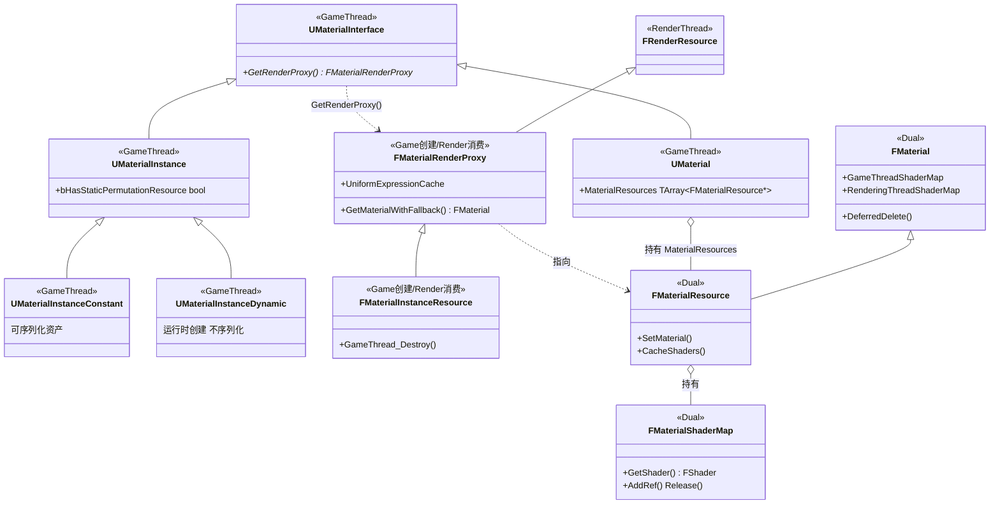
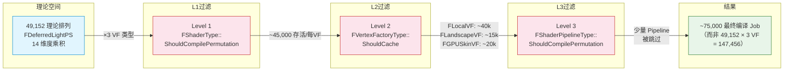
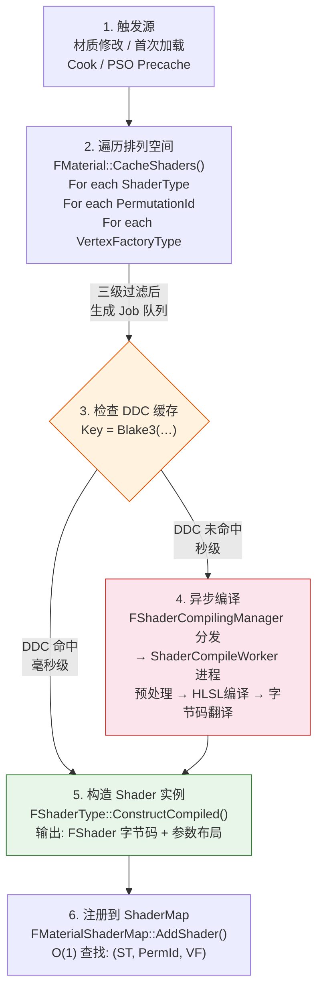
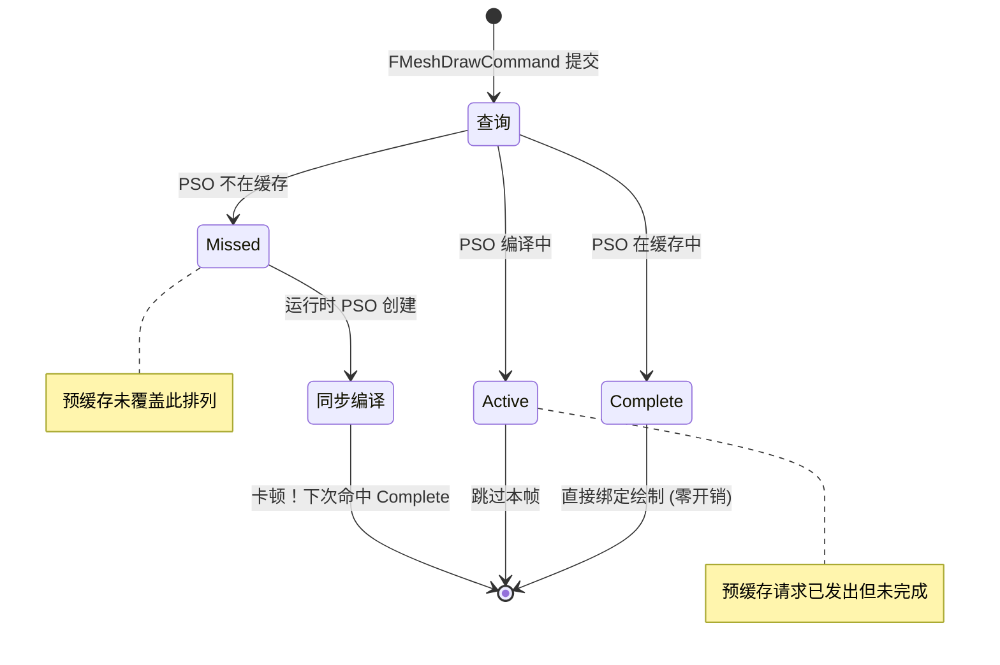
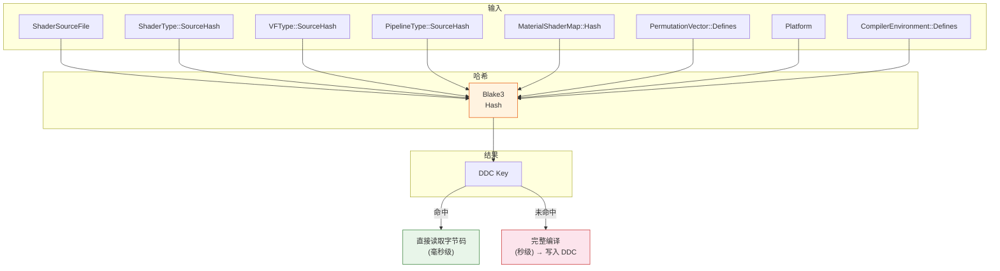
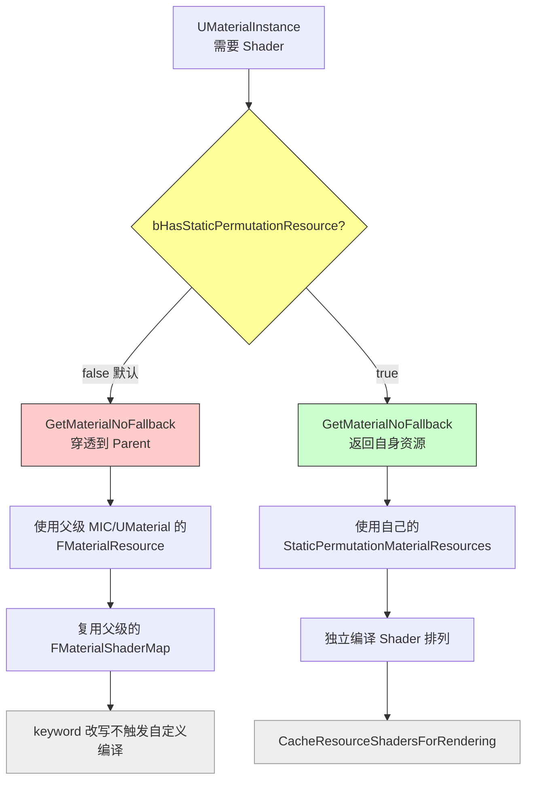
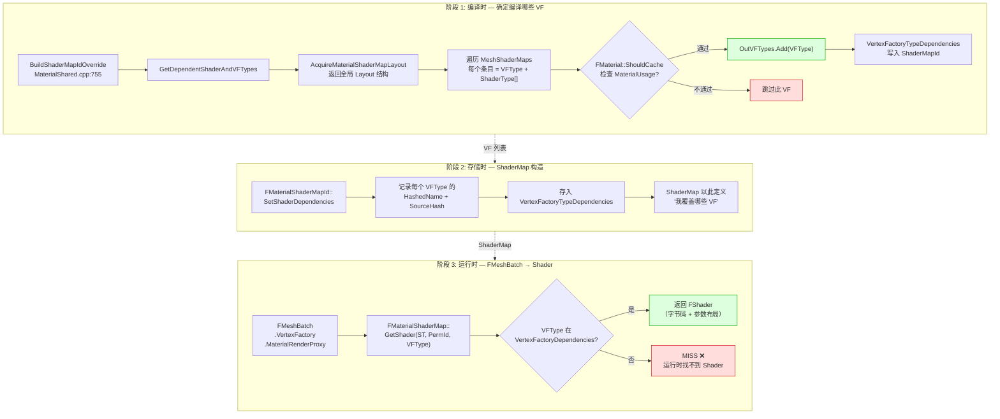
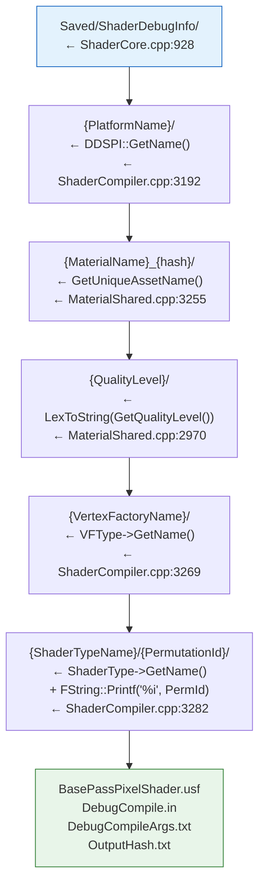

+++
date = '2026-05-18T18:00:00+08:00'
draft = false
title = 'UE Shader 编译规则详解'
tags = ['UE', 'Shader', 'Permutation', 'PSO', 'VertexFactory', 'Material']
categories = ['图形渲染']
+++

## 概述

UE 的 Shader 不是"一份源码编译出一个二进制"，而是 **一份源码 × N 个排列组合 → 成千上万个二进制**。本文从源码出发，梳理 Shader 编译的完整规则：排列组合怎么产生、怎么过滤、怎么缓存、怎么在运行时选择。

---

## 线程归属 — 游戏线程 vs 渲染线程

UE 的材质系统跨两条线程运行：**游戏线程** (Game Thread) 处理 UObject 资产和编译调度，**渲染线程** (Render Thread) 消费编译结果并执行实际绘制。理解每个类的线程归属是排查材质问题的前置条件。

### 总览

```
┌──────────────────────────────────────────────────────────────────┐
│  游戏线程 (Game Thread)                                           │
│                                                                  │
│  UMaterialInterface  (UObject)                                   │
│    ├─ UMaterial           MaterialResources: TArray<FMaterialResource*> │
│    └─ UMaterialInstance                                          │
│         ├─ UMaterialInstanceConstant  (MIC，资产)                 │
│         └─ UMaterialInstanceDynamic   (MID，运行时)               │
│                                                                  │
│  UMaterialInterface::GetRenderProxy()                            │
│    → FMaterialRenderProxy  (FRenderResource 子类)                 │
├──────────────────────────────────────────────────────────────────┤
│  渲染线程 (Render Thread)                                         │
│                                                                  │
│  FMaterialRenderProxy ──指向──→  FMaterialResource                │
│                            (FMaterial 子类, MaterialShared.h:3208)│
│                                     │                            │
│                                     ├─ FMaterialShaderMap         │
│                                     │   (编译好的 Shader 变体集合)  │
│                                     ├─ 材质属性快照                 │
│                                     │   (BlendMode, ShadingModel…)│
│                                     └─ Uniform Expression          │
│                                         (参数绑定)                  │
│                                                                  │
│  FPrimitiveSceneProxy  ──提交──→  FMeshBatch                      │
│                                     └─ FMeshDrawCommand            │
│                                          └─ PipelineStateCache     │
└──────────────────────────────────────────────────────────────────┘
```

### FMaterialResource — 渲染线程的材质镜像

**`FMaterialResource` 是 `UMaterial` 的渲染线程侧镜像，继承自 `FMaterial`（`MaterialShared.h:3208`），两者都不是 UObject。**

核心关系：

- **`UMaterial::MaterialResources`** (`Material.h:1320`) — `TArray<FMaterialResource*>`，一个 `UMaterial` 对每个 `(ShaderPlatform, QualityLevel)` 组合持有一个独立的 `FMaterialResource`。为什么是数组？同一进程可能同时跑 D3D12 SM6 + D3D12 SM5，每个需要自己的 Shader 变体。
- **`FMaterialRenderProxy`** (`MaterialRenderProxy.h:101`) — 游戏线程到渲染线程的桥梁。继承自 `FRenderResource`，源码明确注释 *"These functions should only be called by the rendering thread."* 游戏线程通过 `UMaterialInterface::GetRenderProxy()` 获得 Proxy，渲染线程通过 `GetMaterialWithFallback()` 找到 FMaterialResource。
- **`FMaterialInstanceResource`** (`MaterialInstanceSupport.h:207`) — MIC/MID 专用的 Proxy，继承自 `FMaterialRenderProxy`。

### 关键类线程速查表

| 类 | 所在线程 | 继承关系 | 说明 |
|---|---|---|---|
| **UMaterial** | 游戏 | UObject | 材质资产，持有 `MaterialResources: TArray<FMaterialResource*>` |
| **UMaterialInstance** | 游戏 | UObject | 实例基类，含 MIC / MID |
| **UMaterialInstanceConstant (MIC)** | 游戏 | UMaterialInstance | 可序列化资产，静态参数固定后触发编译 |
| **UMaterialInstanceDynamic (MID)** | 游戏 | UMaterialInstance | 运行时创建，不序列化，重启后为 null |
| **FMaterialRenderProxy** | 游戏创建 / 渲染消费 | FRenderResource | 跨线程桥梁，`UpdateUniformExpressionCacheIfNeeded()` 在渲染线程 |
| **FMaterialInstanceResource** | 游戏创建 / 渲染消费 | FMaterialRenderProxy | MIC/MID 的 Proxy，`GameThread_Destroy()` 体现线程语义 |
| **FMaterial** | **双线程** | (独立类) | 游戏线程编译/设置 ShaderMap，渲染线程消费属性查询 |
| **FMaterialResource** | **双线程** | FMaterial | UMaterial 的渲染侧实现，ShaderMap 在游戏线程设置，属性查询在渲染线程 |
| **FMaterialShaderMap** | **双线程** | — | 编译结果容器，通过 `GameThreadShaderMap` 和 `RenderingThreadShaderMap` 分离访问 |
| **FShader** | **渲染** | — | 单个 Shader 的字节码 + 参数布局 |
| **FPrimitiveSceneProxy** | 游戏创建 / **渲染**消费 | — | 场景代理，`GetDynamicMeshElements()` 在渲染线程提交 FMeshBatch |
| **FMeshBatch** | 渲染构建 / 渲染消费 | — | 由 `GetDynamicMeshElements()`（渲染线程）构建，MeshPassProcessor 在同一线程消费 |
| **FMeshDrawCommand** | **渲染** | — | 可缓存的渲染命令 + PSO ID，`SubmitDraw()` 在渲染线程录制 RHI 命令，RHI 线程翻译执行 |
| **FShaderCompileJob** | **编译工作线程** | — | 单个编译任务，不在游戏/渲染线程 |
| **FShaderCompilingManager** | **游戏线程**调度 | — | 管理编译队列，分发给 SCW 独立进程 |
| **ShaderCompileWorker (SCW)** | **独立进程** | — | 离线编译 HLSL，不在引擎主进程内 |
| **FShaderType / FVertexFactoryType** | **全局注册表** | — | 静态全局对象，编译时读取，运行时查找 |
| **PipelineStateCache** | **渲染** | — | PSO 缓存，`CheckPipelineStateInCache()` 发生在渲染线程 |

### 类继承与线程关系



### 为什么区分线程重要

1. **生命周期** — `FMaterialResource` 用 `FMaterial::DeferredDelete()` 延迟销毁（等渲染线程用完），MID 的 `FMaterialInstanceResource` 通过 `GameThread_Destroy()` 发起销毁。搞错线程直接崩溃。
2. **行号偏移** — 本文基于 UE 5.x 源码，行号可能因引擎版本差异偏移 ±5~50 行。
3. **编译触发** — `CacheResourceShadersForRendering()` 必须在游戏线程调用（它操作 UObject 的 `MaterialResources` 数组），但编译结果最终在渲染线程被消费。
4. **数据竞争** — `FMaterialRenderProxy::UniformExpressionCache` 标记为 `mutable`，有多线程访问保护。不了解这一点就去改材质参数，轻则渲染错误，重则 UB。
5. **Landscape VF 诊断** — Game Thread 改变 StaticSwitch 参数 → InitStaticPermutation 编译 FMaterialShaderMap → 若缺 FLandscapeVertexFactory，渲染线程查找时 Miss。

---

## 编译粒度 — Material × VertexFactory × Pass × Platform

UE 编译 Shader 的最小单位是一个 **FShaderCompileJob**。编译粒度由三维决定（`FShaderCompileJobKey`，`ShaderCompilerJobTypes.h:307`），Platform 隐式编码在 ShaderMap 上下文中：

```
FShaderCompileJobKey = {
    ShaderType,          // 哪个 Shader（如 TBasePassPS, FDeferredLightPS）
    PermutationId,       // 哪个排列组合（0 ~ TotalPermutationCount-1）
    VertexFactoryType,   // 哪个顶点工厂（如 FLocalVertexFactory, FLandscapeVertexFactory）
    // Platform 隐含在 FMaterialShaderMap 的编译上下文中，不直接出现在 Job Key 里
}
```

材质触发编译时，会遍历所有可能的组合：

```
对于每个材质 M:
  对于每个 ShaderType (BasePassVS, BasePassPS, ShadowDepthPS, ...):
    对于每个 PermutationId [0, ShaderType::GetPermutationCount()):
      对于每个 VertexFactoryType (FLocalVF, FLandscapeVF, FGPUSkinVF, ...):
        如果三级过滤都通过:
          加入编译队列
```

**这就是组合爆炸的根源**。

---

## Shader 组合矩阵图解

编译的"组合爆炸"来自三个输入维度的笛卡尔积，经三级过滤压缩为实际 Job，每个 Job 输出一份独立字节码：

```
 Materials           ShaderType × Perms              VertexFactory
 ─────────           ──────────────────              ─────────────
 ┌─────────┐         ┌─────────────────────┐         ┌────────────┐
 │  Mat A  │         │ BasePassPS           │         │LandscapeVF │
 └─────────┘         │ Perm[0 .. N)         │         └────────────┘
 ┌─────────┐         └─────────────────────┘         ┌────────────┐
 │  Mat B  │   ×     ┌─────────────────────┐   ×     │  LocalVF   │
 └─────────┘         │ ShadowDepthPS        │         └────────────┘
 ┌─────────┐         │ Perm[0 .. M)         │         ┌────────────┐
 │  Mat C  │         └─────────────────────┘         │ GPUSkinVF  │
 └─────────┘         ┌─────────────────────┐         └────────────┘
    ...              │ DeferredLightPS      │            ...
                     │ Perm[0 .. K)         │
                     └─────────────────────┘
                        ...

           笛卡尔积 → 理论组合总数（数万至数百万级别）
                               │
              ┌────────────────┴────────────────┐
              │            三级过滤               │
              │  (1) ShaderType::               │
              │      ShouldCompilePermutation   │
              │  (2) VertexFactoryType::         │
              │      ShouldCache                │
              │  (3) ShaderPipelineType::        │
              │      ShouldCompilePermutation   │
              └────────────────┬────────────────┘
                               │ 大量无效组合被剪枝
                               ▼
┌──────────────────────────────────────────────────────────────────┐
│                    FShaderCompileJob 队列                         │
│                                                                  │
│  ┌──────────┐ ┌──────────┐ ┌──────────┐       ┌──────────┐     │
│  │  Job 0   │ │  Job 1   │ │  Job 2   │  ...  │  Job N   │     │
│  │ Mat=A    │ │ Mat=A    │ │ Mat=B    │       │ Mat=C    │     │
│  │ BasePS   │ │ BasePS   │ │ ShadPS   │       │  ...     │     │
│  │ Perm=3   │ │ Perm=7   │ │ Perm=0   │       │ Perm=K   │     │
│  │ LscVF    │ │ LocVF    │ │ LocVF    │       │  ...     │     │
│  └──────────┘ └──────────┘ └──────────┘       └──────────┘     │
└────────────────────────────┬─────────────────────────────────────┘
                             │
                 ┌───────────┴───────────┐
                 ▼                       ▼
      ┌──────────────────┐   ┌───────────────────────┐
      │    DDC 命中       │   │      DDC 未命中         │
      │  直接读缓存字节码  │   │  ShaderCompileWorker   │
      └────────┬─────────┘   │  并行编译               │
               │             └───────────┬─────────────┘
               └─────────────┬───────────┘
                             ▼
┌──────────────────────────────────────────────────────────────────┐
│              编译产物（每个 Job → 一份独立字节码）                  │
│                                                                  │
│  ┌──────┐ ┌──────┐ ┌──────┐ ┌──────┐ ┌──────┐ ┌──────┐        │
│  │ .bin │ │ .bin │ │ .bin │ │ .bin │ │ .bin │ │ .bin │  ...   │
│  └──────┘ └──────┘ └──────┘ └──────┘ └──────┘ └──────┘        │
└────────────────────────────┬─────────────────────────────────────┘
                             │  FShaderType::ConstructCompiled()
                             ▼
               ┌─────────────────────────────────┐
               │         FMaterialShaderMap        │
               │  key: (ShaderType, PermId, VF)    │
               │  val: FShader (字节码 + 参数布局)  │
               │  运行时 O(1) 查找                  │
               └─────────────────────────────────┘
```

每一行 `.bin` 对应一个独立的 `FShaderCompileJob` 编译结果；Materials / ShaderType+Perms / VertexFactory 三列方块代表三个正交维度，`×` 符号表示笛卡尔积展开。

---

## 排列组合系统 — TShaderPermutationDomain

### 维度类型

每个 Shader 声明自己的排列维度，定义在 `ShaderPermutation.h`：

| 类型 | 宏 | 值域 | 乘法因子 |
|------|-----|------|---------|
| 布尔 | `SHADER_PERMUTATION_BOOL("NAME")` | {false, true} | ×2 |
| 整数 | `SHADER_PERMUTATION_INT("NAME", N)` | {0, 1, ..., N-1} | ×N |
| 枚举 | `SHADER_PERMUTATION_ENUM_CLASS("NAME", E)` | {E::0, E::1, ..., E::MAX-1} | ×E::MAX |
| 稀疏整数 | `SHADER_PERMUTATION_SPARSE_INT("NAME", ...)` | 指定值集合 | ×count |

**总排列数 = 所有维度乘法因子的乘积**。

### 实例 — FDeferredLightPS

`LightRendering.cpp` 中 `FDeferredLightPS` 声明了 14 个维度（13 个内联定义 + 1 个外部引用 `Substrate::FSubstrateTileType`）：

```cpp
class FSourceShapeDim          : SHADER_PERMUTATION_ENUM_CLASS("LIGHT_SOURCE_SHAPE", ELightSourceShape);  // ×3
class FSourceTextureDim        : SHADER_PERMUTATION_BOOL("USE_SOURCE_TEXTURE");                            // ×2
class FIESProfileDim           : SHADER_PERMUTATION_BOOL("USE_IES_PROFILE");                               // ×2
class FLightFunctionAtlasDim   : SHADER_PERMUTATION_BOOL("USE_LIGHT_FUNCTION_ATLAS");                     // ×2
class FVisualizeCullingDim     : SHADER_PERMUTATION_BOOL("VISUALIZE_LIGHT_CULLING");                      // ×2
class FLightingChannelsDim     : SHADER_PERMUTATION_BOOL("USE_LIGHTING_CHANNELS");                        // ×2
class FTransmissionDim         : SHADER_PERMUTATION_BOOL("USE_TRANSMISSION");                             // ×2
class FHairLighting            : SHADER_PERMUTATION_INT("USE_HAIR_LIGHTING", 2);                          // ×2
class FHairComplexTransmittance: SHADER_PERMUTATION_BOOL("USE_HAIR_COMPLEX_TRANSMITTANCE");              // ×2
class FAtmosphereTransmittance : SHADER_PERMUTATION_BOOL("USE_ATMOSPHERE_TRANSMITTANCE");                // ×2
class FCloudTransmittance      : SHADER_PERMUTATION_BOOL("USE_CLOUD_TRANSMITTANCE");                      // ×2
class FAnistropicMaterials     : SHADER_PERMUTATION_BOOL("SUPPORTS_ANISOTROPIC_MATERIALS");              // ×2
class FVirtualShadowMapMask    : SHADER_PERMUTATION_BOOL("USE_VIRTUAL_SHADOW_MAP_MASK");                 // ×2
// 第 14 个维度 Substrate::FSubstrateTileType 定义在 Substrate 子系统中，作为外部类型引入   // ×4
```

理论排列数 = `3 × 2^12 × 4 = 49,152`

> **说明**：12 个二值维度（含 `FHairLighting` 的 `SHADER_PERMUTATION_INT(2)` → ×2）× 1 个三值枚举 `FSourceShapeDim`（×3）× 1 个四值整数 `Substrate::FSubstrateTileType`（×4）。

实际编译数约 40,000–50,000（`ShouldCompilePermutation` 过滤了大量无效组合）。

### 排列数增长速度

| 布尔维度数 | 排列数 | 规模 |
|-----------|--------|------|
| 10 | 1,024 | KB 级 Shader Cache |
| 15 | 32,768 | MB 级 |
| 20 | 1,048,576 | GB 级 |
| 25 | 33,554,432 | 不可行 |

引擎对单个 ShaderType 的排列数设有告警阈值 `832`（参考 `ShaderCompiler.cpp`），超过时会在日志中提示。

---

## 三级过滤 — 砍掉不可能的组合

理论排列数巨大，但绝大多数组合在逻辑上不成立。UE 用三级过滤器逐层砍掉：

```
对于每个 (ShaderType, PermutationId, VertexFactoryType, Platform):

  Level 1: FShaderType::ShouldCompilePermutation()
    → 这个 Shader 的这个排列有没有意义？

  Level 2: FVertexFactoryType::ShouldCache()
    → 这个 Shader 和这个 VertexFactory 的组合有没有意义？

  Level 3: FShaderPipelineType::ShouldCompilePermutation()
    → Pipeline 中所有 Stage 是否都通过？

  三级都通过 → 加入编译队列
  任一不通过 → 跳过
```

### Level 1: FShaderType::ShouldCompilePermutation

每个 ShaderType 实现自己的过滤逻辑，最常见的判断依据：

```cpp
// FDeferredLightPS::ShouldCompilePermutation 示例
bool FDeferredLightPS::ShouldCompilePermutation(const FShaderPermutationParameters& Parameters)
{
    // 光源形状不匹配 → 跳过
    if (SourceShape == Directional && bUseIESProfile) return false;  // 方向光不用 IES
    if (SourceShape != Directional && bUseAtmosphereTransmittance) return false;  // 只有方向光用大气
    if (SourceShape != Directional && bUseCloudTransmittance) return false;
    if (SourceShape != Directional && bUseVirtualShadowMapMask) return false;
    ...
    return true;
}
```

FBasePassPS 的过滤更复杂——它会检查材质属性和 ShadingModel：

```cpp
// TBasePassPS<LightMapPolicyType, bEnableSkyLight, GBufferLayout>
// 位于 BasePassRendering.h
bool TBasePassPS::ShouldCompilePermutation(const FGlobalShaderPermutationParameters& Parameters)
{
    // 模板参数决定编译分支：bEnableSkyLight, bTranslucent 混合模式,
    // IsSingleLayerWater ShadingModel 等
    // 注意：此类是模板，不同 LightMapPolicyType 产生不同排列
    ...
}
```

> **说明**：以上为概念性示例，旨在展示 ShaderType 过滤的基本模式。真实的 `TBasePassPS` 是模板类（`BasePassRendering.h:634`），其 `ShouldCompilePermutation` 基于模板参数（`LightMapPolicyType`、`bEnableSkyLight`、`GBufferLayout`）和 ShadingModel 决定编译哪些排列，不直接检查 `bIsUsedWithLandscape`。此过滤模式在概念层面适用于所有 ShaderType。

### Level 2: FVertexFactoryType::ShouldCache

VertexFactory 决定哪些 Shader 可以和自己组合。注意：VF 类的方法名是 `ShouldCompilePermutation`，但通过 `IMPLEMENT_VERTEX_FACTORY_VTABLE` 宏绑定到 `FVertexFactoryType::ShouldCacheRef` 函数指针，以 `FVertexFactoryType::ShouldCache()` 作为外部 API 调用：

```cpp
// FLandscapeVertexFactory（LandscapeRender.cpp:3826）
// 类方法名是 ShouldCompilePermutation
bool FLandscapeVertexFactory::ShouldCompilePermutation(const FVertexFactoryShaderPermutationParameters& Parameters)
{
    return Parameters.MaterialParameters.bIsUsedWithLandscape 
        || Parameters.MaterialParameters.bIsSpecialEngineMaterial;
}

// FLocalVertexFactory (普通 Mesh)
bool FLocalVertexFactory::ShouldCompilePermutation(const FVertexFactoryShaderPermutationParameters& Parameters)
{
    if (Parameters.MaterialParameters.bIsUsedWithLandscape && !Parameters.MaterialParameters.bIsUsedWithOther)
        return false;  // 地表专用材质不需要和普通 Mesh VF 组合
    ...
}
```

### Level 3: FShaderPipelineType::ShouldCompilePermutation

Pipeline 级别要求所有 Stage 都通过：

```cpp
bool FShaderPipelineType::ShouldCompilePermutation(...)
{
    for (FShaderType* Stage : Stages)
    {
        if (!Stage->ShouldCompilePermutation(Parameters))
            return false;  // 任一 Stage 不通过 → 整个 Pipeline 不编译
    }
    return true;
}
```

### 过滤效果示意

```
FDeferredLightPS × 49,152 排列
  ↓ Level 1 (ShouldCompilePermutation)
  约 45,000 排列存活

FDeferredLightPS × 45,000 × 3 个 VertexFactory
  ↓ Level 2 (ShouldCache)
  FLocalVF: ~40,000 存活
  FLandscapeVF: ~15,000 存活 (只编译地表材质)
  FGPUSkinVF: ~20,000 存活 (只编译骨骼材质)

  ↓ Level 3 (Pipeline)
  少量 Pipeline 被整体跳过

最终编译数: ~75,000 (而非 49,152 × 3 = 147,456)
```

### 三级过滤漏斗



---

## 编译环境 — ModifyCompilationEnvironment

通过三级过滤后，进入编译前还需要设置编译环境——把排列维度的具体值转化为 Shader `#define`：

```
FShaderType::ModifyCompilationEnvironment()
  ├─ TShaderPermutationDomain::ModifyCompilationEnvironment()
  │    └─ 逐维度调用 SetDefine():
  │         SetDefine("LIGHT_SOURCE_SHAPE", 1)     // Capsule
  │         SetDefine("USE_SOURCE_TEXTURE", 1)      // true
  │         SetDefine("USE_IES_PROFILE", 0)         // false
  │         SetDefine("SUBSTRATE_TILETYPE", 2)      // int
  │         ...
  │
  ├─ FVertexFactoryType::ModifyCompilationEnvironment()
  │    └─ #include "LandscapeVertexFactory.ush"  // 注入 VF 的 Shader 源码
  │
  └─ FShaderPipelineType::ModifyCompilationEnvironment()
       └─ 跨 Stage 输出优化标记
```

Shader 源码中用 `#if` / `#ifdef` 响应这些 `#define`：

```hlsl
// LightRendering.usf
#if USE_SOURCE_TEXTURE
    Color *= SampleSourceTexture(...);
#endif

#if USE_IES_PROFILE
    Color *= SampleIESProfile(...);
#endif
```

每个排列组合产生不同的 `#define` 集合 → 不同的预处理器路径 → 不同的编译结果。

---

## 编译流程 — 从请求到二进制

```
┌─────────────────────────────────────────────────────┐
│ 1. 触发源                                             │
│    材质修改 / 首次加载 / Cook / PSO Precache          │
└──────────────────┬──────────────────────────────────┘
                   ↓
┌─────────────────────────────────────────────────────┐
│ 2. 遍历排列空间                                       │
│    FMaterial::CacheShaders()                         │
│    ├─ For each ShaderType                            │
│    ├─ For each PermutationId [0, N)                  │
│    ├─ For each VertexFactoryType                     │
│    └─ 三级过滤 → 生成 FShaderCompileJob 队列         │
└──────────────────┬──────────────────────────────────┘
                   ↓
┌─────────────────────────────────────────────────────┐
│ 3. 检查 DDC 缓存                                     │
│    Key = Blake3(ShaderSourceHash + ShaderTypeHash      │
│                + VFSourceHash + PermutationDefines      │
│                + Platform + MaterialShaderMapId)        │
│    （流程示意，完整实现见 MaterialShader.cpp:238）       │
│    ├─ DDC 命中 → 直接使用缓存字节码                   │
│    └─ DDC 未命中 → 加入编译队列                       │
└──────────────────┬──────────────────────────────────┘
                   ↓
┌─────────────────────────────────────────────────────┐
│ 4. 异步编译 (FShaderCompilingManager)                │
│    ├─ 分发给 ShaderCompileWorker 进程                 │
│    ├─ 每个进程编译一个 Job                            │
│    ├─ 流程: 预处理 → HLSL编译 → RHI字节码翻译        │
│    └─ 输出 FShaderCompilerOutput (字节码+元数据)      │
└──────────────────┬──────────────────────────────────┘
                   ↓
┌─────────────────────────────────────────────────────┐
│ 5. 构造 Shader 实例                                   │
│    FShaderType::ConstructCompiled(Output)            │
│    → FShader 实例 (持有字节码 + 参数布局)             │
└──────────────────┬──────────────────────────────────┘
                   ↓
┌─────────────────────────────────────────────────────┐
│ 6. 注册到 ShaderMap                                  │
│    FMaterialShaderMap::AddShader(Shader)              │
│    → 运行时通过 (ShaderType, PermId, VF) 查找        │
└─────────────────────────────────────────────────────┘
```

### 编译全流程



---

## PSO 缓存 — 从 Shader 到完整管线状态

Shader 编译完成后，运行时还需要将 VS + PS + BlendState + RasterizerState + DepthStencilState + RenderTargetFormats 组合成 **PSO (Pipeline State Object)**。PSO 缓存分两级：

### 预缓存 (PSOPrecache)

```
FPrimitiveSceneProxy 注册时:
  → GetPSOPrecacheVertexFetchElements() (VF 提供顶点声明)
  → 遍历该 Proxy 可能用到的 (ShaderType, PermId, VF, Material) 组合
  → PipelineStateCache::PrecacheGraphicsPipelineState()
       → 后台编译 PSO
       → 返回 FPSOPrecacheRequestID
```

### 运行时查找

```
FMeshDrawCommand 提交时:
  → FGraphicsMinimalPipelineStateId (PSO Hash)
  → PipelineStateCache::CheckPipelineStateInCache()
       ├─ Complete: 直接使用
       ├─ Active: 编译中, 跳过本帧
       └─ Missed: 运行时同步编译 (卡顿!)
```

### PSO 预缓存策略

```cpp
enum class EShaderPermutationPrecacheRequest : uint8
{
    Precached,     // 始终预缓存
    NotPrecached,  // 仅 Debug 编译, 不预缓存
    NotUsed        // 从不使用 (功能关闭/平台不支持)
};
```

`FShaderType::ShouldPrecachePermutation()` 返回上述值，控制哪些排列参与 PSO 预缓存。

### PSO 缓存架构

**预缓存流程：**


**运行时查找三态：**



> **关键**：PSOPrecache 的目标是消灭 Missed 状态。Missed 发生时渲染线程同步等待 PSO 创建，造成帧率卡顿。

---

## DDC 缓存 — 跨构建复用

Shader 编译结果通过 **DDC (Derived Data Cache)** 持久化，避免重复编译：

```
DDC Key = Hash(
    ShaderSourceFile +
    ShaderType::SourceHash +
    VertexFactoryType::SourceHash +
    ShaderPipelineType::SourceHash +
    MaterialShaderMap::Hash +
    PermutationVector::Defines +
    Platform +
    CompilerEnvironment::Defines
)
```

- **命中 DDC**：直接读取字节码，跳过编译（毫秒级）
- **未命中 DDC**：完整编译（秒级）
- Cook 过程会预热 DDC，确保打包游戏不触发运行时编译

### DDC Key 构成



---

## 材质实例链与 Shader 编译传播

### 链式结构：UMaterial → MIC → MID

UE 的材质实例形成三层链：

```
UMaterial                        ← 基材，含 Shader 源码 + MaterialUsages
  └─ UMaterialInstanceConstant   ← MIC (资产)，静态参数固定
       └─ UMaterialInstanceDynamic ← MID (运行时)，可动态改标量/向量/keyword
```

每个 `UMaterialInstance` 都有一个关键标志位 **`bHasStaticPermutationResource`**（`MaterialInstance.h`），它决定了 Shader 编译时走哪条路径：

```
bHasStaticPermutationResource == false (默认，普通 MID)
  → GetMaterialNoFallback() 穿透到 Parent
  → 实际使用父级 (LMIC 或 UMaterial) 的 FMaterialResource
  → keyword 改写不触发自定义编译

bHasStaticPermutationResource == true (含 StaticSwitch/Keyword 的 MIC)
  → GetMaterialNoFallback() 返回自身的 StaticPermutationMaterialResources
  → 独立编译 Shader 排列
```

### InitStaticPermutation — 触发编译的入口

任何对材质静态参数的修改都会走到这里（`MaterialInstance.cpp:2399`）：

```cpp
void UMaterialInstance::InitStaticPermutation(EMaterialShaderPrecompileMode PrecompileMode)
{
    UpdateOverridableBaseProperties();

    // 标准 UE5 — 决定是否需要独立编译
    // 注：HasOverridenBaseProperties() 在引擎源码中受 #if WITH_EDITORONLY_DATA 守卫
    bHasStaticPermutationResource = Parent && (
        HasStaticParameters()              // 有 StaticSwitch 改写 → true
        || HasOverridenBaseProperties()    // 覆盖了基材属性 → true
    );

    if (FApp::CanEverRender())
    {
        // 触发编译
        CacheResourceShadersForRendering(PrecompileMode, ResourcesToFree);
    }

    FMaterial::DeferredDeleteArray(ResourcesToFree);
}
```

### 编译路径决策：穿透 vs 独立编译



> **何时 bHasStaticPermutationResource = true？**
> - `HasStaticParameters()` → 有 StaticSwitch 参数改写
> - `HasOverridenBaseProperties()` → 覆盖了基材属性（如 BlendMode）

### 编译调用链

```
InitStaticPermutation()                              ← MaterialInstance.cpp:2399
  → CacheResourceShadersForRendering()               ← MaterialInstance.cpp:2685
    → FindOrCreateMaterialResource()                  ← 为当前实例创建/查找 FMaterialResource
    → CacheShadersForResources()                      ← MaterialInstance.cpp:2858
      → FMaterial::CacheShaders()             ← MaterialShared.cpp:2935
        → BuildShaderMapIdOverride(NoStaticParametersId, ...)
                                                      ← 构建 ShaderMapId，确定编译哪些 VF
                                                      （API 入口 BuildShaderMapId 在 MaterialShared.h:2374，旧版重载 2368 已弃用）
        → CacheShaders(Id, PrecompileMode, ...)       ← 实际调度编译任务
```

---

## VertexFactory 与 Shader 配对 — VS/PS 如何匹配

### 核心问题

一个材质编译完成后，运行时如何确定「用哪个 VS + 哪个 PS」来渲染一个 `FMeshBatch`？答案是：**通过 VertexFactoryType 做双重匹配**。

### 第一重：编译时 — 确定编译哪些 VF

`BuildShaderMapIdOverride`（`MaterialShared.cpp:755-793`）调用 `GetDependentShaderAndVFTypes` 收集 VF 列表（外部 API 入口为 inline wrapper `BuildShaderMapId`，`MaterialShared.h:2374，旧版重载 2368 已弃用`）：

> **说明**：以下为概念性伪代码，展示核心逻辑。完整实现见 MaterialShared.cpp:4617-4665，包含 Shaders/ShaderPipelines/MeshShaderMaps 三个独立循环。

```cpp
void FMaterial::GetDependentShaderAndVFTypes(
    const FPlatformTypeLayoutParameters& LayoutParams,
    TArray<FShaderType*>& OutShaderTypes,
    TArray<const FShaderPipelineType*>& OutShaderPipelineTypes,
    TArray<FVertexFactoryType*>& OutVFTypes) const
{
    const FMaterialShaderMapLayout& Layout = AcquireMaterialShaderMapLayout(
        GetShaderPlatform(), GetShaderPermutationFlags(LayoutParams), MaterialParameters);

    // 遍历 Layout 中的每个 MeshShaderMap 条目
    for (const FMeshMaterialShaderMapLayout& MeshLayout : Layout.MeshShaderMaps)
    {
        bool bIncludeVertexFactory = false;

        // 检查此 VF 下的每个 ShaderType 是否应编译
        for (const FShaderLayoutEntry& Shader : MeshLayout.Shaders)
        {
            if (ShouldCache(Shader.ShaderType, MeshLayout.VertexFactoryType))
            {
                bIncludeVertexFactory = true;
                AddSortedShader(OutShaderTypes, Shader.ShaderType);
            }
        }
        // ... 同样检查 Pipeline

        if (bIncludeVertexFactory)
            OutVFTypes.Add(MeshLayout.VertexFactoryType);  // ← 这个 VF 进入编译列表
    }
}
```

**关键对象**：`FMaterialShaderMapLayout` — 全局静态数据结构，描述「什么材质域 × 什么 VF」需要编译哪些 ShaderType。它的 `MeshShaderMaps` 数组每个元素是一个 `(VertexFactoryType, [ShaderLayoutEntry...])` 对。

**决定 VF 是否出现的因素**：
- `AcquireMaterialShaderMapLayout()` 根据材质域（Surface/DeferredDecal/...）、混合模式等确定 layout
- `FMaterial::ShouldCache()` 对 Material 级别永远返回 `true`（`MaterialShared.cpp:3814`）—— 过滤不在这一层
- 实际过滤发生在运行时 `FVertexFactoryType::ShouldCache()`，它检查材质参数如 `bIsUsedWithLandscape`

### 第二重：编译结果存储 — FMaterialShaderMap

编译完成后，结果存储在 `FMaterialShaderMap` 中（`MaterialShader.cpp:1802-1823`）：

```cpp
void FMaterialShaderMapId::SetShaderDependencies(
    const TArray<FShaderType*>& ShaderTypes,
    const TArray<const FShaderPipelineType*>& ShaderPipelineTypes,
    const TArray<FVertexFactoryType*>& VFTypes,
    EShaderPlatform ShaderPlatform)
{
    for (const FVertexFactoryType* VFType : VFTypes)
    {
        FVertexFactoryTypeDependency Dependency;
        Dependency.VertexFactoryTypeName = VFType->GetHashedName();
        Dependency.VFSourceHash = VFType->GetSourceHash(ShaderPlatform);
        VertexFactoryTypeDependencies.Add(Dependency);  // ← 存入 ShaderMapId
    }
    // ... 同样处理 ShaderType 和 ShaderPipeline
}
```

`VertexFactoryTypeDependencies` 是 `FMaterialShaderMapId` 的成员——**它定义了此 ShaderMap 覆盖的 VF 集合**。运行时只有这个集合里的 VF 才能从此 ShaderMap 中查到 Shader。

### 第三重：运行时查找 — FMeshBatch → Shader

渲染时（`FMeshDrawCommand` 生成阶段），查找路径为：

```
FMeshBatch
  ├─ VertexFactory       → 确定 FVertexFactoryType
  └─ MaterialRenderProxy → 确定 FMaterial → FMaterialShaderMap

查找:
  FMaterialShaderMap::GetShader(ShaderType, PermutationId, VertexFactoryType)
    → 匹配 VertexFactoryType 一致才返回 Shader
```

### VF-Shader 配对全生命周期



**VS 和 PS 虽然都在同一个 `FMaterialShaderMap` 里，但它们的 `ShaderType` 不同**——`TBasePassVS` 和 `TBasePassPS` 是两个独立的 `FShaderType`。每个 `ShaderType` 在 `MeshShaderMaps` 中以 `FShaderLayoutEntry` 的形式出现，按 `(ShaderType, PermutationId, VF)` 三重索引。

```hlsl
// 以 Landscape 为例
FLandscapeVertexFactory:
  ├─ TBasePassVS       Perm[0..N]  ← 顶点着色器
  ├─ TBasePassPS       Perm[0..N]  ← 像素着色器
  ├─ TShadowDepthVS    Perm[0..N]
  ├─ TShadowDepthPS    Perm[0..N]
  ├─ TDepthOnlyVS      Perm[0..N]
  └─ ...
```

每个 `(ShaderType, PermId, VF)` 组合产生一个独立的 `FShaderCompileJob`，编译出独立的二进制。

---

## 与 Unity URP 的对比

| 维度 | Unity URP | UE |
|------|-----------|-----|
| **编译触发** | 材质变化时自动重编 | 材质变化 → 异步编译 → ShaderMap 更新 |
| **排列来源** | Shader 关键字 (multi_compile, shader_feature) | TShaderPermutationDomain 宏 |
| **过滤机制** | `#pragma shader_feature` (按需) vs `#pragma multi_compile` (全编) | 三级 ShouldCompilePermutation |
| **VF 组合** | 无 (VertexFactory 是 Unity 内部概念) | 显式 Material × VF 笛卡尔积 |
| **缓存** | Shader Cache (PlayerPrefs / 文件) | DDC + ShaderMap + PSO Cache |
| **运行时编译** | 有 (`shader_feature` 首次使用时编译 Shader 变体) | 无 Shader 字节码编译（仅在 Editor/Cook 时编译）；PSO 运行时创建可能卡顿 |
| **预缓存** | Shader Variant Collection | PSOPrecache + ShaderPipelineCache |
| **排列规模** | 通常 100–1000/Shader | 单个 Shader 可达数万 |

**核心差异**：Unity 的 `shader_feature` 是"用到才编"，UE 的 ShouldCompilePermutation 是"编前先判"——效果类似但 UE 的排列空间远大于 Unity（因为多了 VertexFactory 维度）。

---

## 关键源码速查

| 组件 | 文件 | 路径 | 线程 |
|------|------|------|------|
| **排列框架** | `ShaderPermutation.h` | `Runtime/RenderCore/Public/` | 编译时（模板定义排列维度，运行时读取） |
| **ShaderType** | `Shader.h` | `Runtime/RenderCore/Public/` | 全局注册表（静态全局对象，跨线程只读） |
| **VertexFactoryType** | `VertexFactory.h` | `Runtime/RenderCore/Public/` | 全局注册表（静态全局对象，跨线程只读） |
| **编译管理器** | `ShaderCompiler.h` / `ShaderCompiler.cpp` | `Runtime/Engine/Public/` & `Private/ShaderCompiler/` | 游戏线程（管理编译队列，分发到 SCW） |
| **PSO 缓存** | `PipelineStateCache.h` / `PipelineFileCache.h` | `Runtime/RHI/Public/` | 渲染线程（PSO 创建和查找） |
| **材质编译** | `ShaderCompiler.cpp` | `Runtime/Engine/Private/ShaderCompiler/` | 编译工作线程（SCW 独立进程编译 HLSL） |
| **排列实例** | `LightRendering.cpp` | `Runtime/Renderer/Private/` | 编译时（Shader 类排列定义，运行时查找） |
| **地表 VF 过滤** | `LandscapeRender.cpp` | `Runtime/Landscape/Private/` | 渲染线程（VF 的 ShouldCache 在编译时调用） |
| **FMaterialResource** | `MaterialShared.h` | `Runtime/Engine/Public/` | 双线程（游戏线程设置 ShaderMap，渲染线程查询属性） |
| **FMaterialRenderProxy** | `MaterialRenderProxy.h` | `Runtime/Engine/Public/Materials/` | 游戏创建 / 渲染消费（跨线程桥梁） |
| **UMaterial / UMaterialInstance** | `Material.h` / `MaterialInstance.h` | `Runtime/Engine/Public/Materials/` | 游戏线程（UObject，持有 MaterialResources 数组） |

---

## 编译产物：磁盘上的两个输出目录

引擎编译完 Shader 后，会在 `Saved/` 下生成两个目录：**ShaderDebugInfo**（编译过程产物）和 **ShaderSymbols**（最终二进制 + 调试符号）。两者的 CVar、路径结构、代码路径完全不同。

### 一、ShaderDebugInfo — 编译过程产物

**目录层级：**

```
Saved/ShaderDebugInfo/                                       ← ShaderCore.cpp:928
  {PlatformName}/                                            ← FDataDrivenShaderPlatformInfo::GetName()
                                                               ShaderCompiler.cpp:3192
    {MaterialName}_{hash}/                                   ← GetUniqueAssetName()
                                                               MaterialShared.cpp:3268
      {QualityLevel}/                                        ← LexToString(GetQualityLevel())
                                                               MaterialShared.cpp:2970
        {VertexFactoryName}/                                 ← VFType->GetName()
                                                               ShaderCompiler.cpp:3269
          {ShaderTypeName}/                                  ← ShaderType->GetName()
                                                               ShaderCompiler.cpp:3282
            {PermutationId}/                                 ← FString::Printf("%i", PermId)
                                                               ShaderCompiler.cpp:3282
              BasePassPixelShader.usf      ← 预处理后的 HLSL 源码
              DebugCompile.in              ← SCW 序列化输入
              DebugCompileArgs.txt         ← 调试用的编译参数
              OutputHash.txt               ← 编译输出 SHA
```

**路径构建代码链（全有行号）：**

第 1 层 `Saved/ShaderDebugInfo` — `ShaderCore.cpp:919-947`，`GetShaderDebugInfoPath()` 返回 `{ProjectSavedDir}/ShaderDebugInfo`。

第 2 层 `PCD3D_SM6` — `ShaderCompiler.cpp:3192`，`FDataDrivenShaderPlatformInfo::GetName(ShaderPlatform)`，来自 `Engine/Config/` 中 DDSPI 定义。

第 3 层 `MaterialName_Hash` — `MaterialShared.cpp:3255-3268`，`FMaterial::GetUniqueAssetName()`：
```cpp
FString FMaterial::GetUniqueAssetName(const FMaterialShaderMapId& ShaderMapId) const
{
    // 对 ShaderMapId 做稳定 hash（排除源码 hash → 跨编译稳定）
    FXxHash64Builder Hasher;
    FMaterialKeyGeneratorContext KeyGenCtx(...);
    KeyGenCtx.RemoveFlags(EMaterialKeyInclude::SourceAndMaterialState | ...);
    const_cast<FMaterialShaderMapId&>(ShaderMapId).RecordAndEmit(KeyGenCtx);
    FString BaseMaterialPath = GetBaseMaterialPathName();
    Hasher.Update(BaseMaterialPath.GetCharArray().GetData(), BaseMaterialPath.Len() * sizeof(TCHAR));
    return FString::Printf(TEXT("%s_%llx"), *GetFriendlyName(), Hasher.Finalize().Hash);
}
```

第 6 层 `32` — 同一行 `ShaderCompiler.cpp:3282`，`FString::Printf(TEXT("%i"), PermutationId)`。不同的 keyword 组合产生不同的 PermutationId → 落到不同的子目录。

**完整路径拼装：** `ShaderCore.cpp:3994-4021`，`FShaderCompilerInput::GetOrCreateShaderDebugInfoPath()`：
```cpp
FString OutDumpDebugInfoPath = FPaths::Combine(DumpDebugInfoRootPath, DebugGroupName + DebugExtension);
// 替换非法字符：< → (   > → )   :: → ==   | → _   * → -   ? → !   " → '
OutDumpDebugInfoPath.ReplaceInline(TEXT("<"), TEXT("("));
// ...
```

#### 路径构建代码链



**CVar 控制：** `r.DumpShaderDebugInfo`（`ShaderCompiler.cpp:306`）：
- `0` = Never（默认）
- `1` = Always
- `2` = OnError
- `3` = OnErrorOrWarning

**用途：** 排查编译错误、确认材质 × VF 编译了哪些 ShaderType × 哪些 Permutation。打开后每个编译的 Shader 都会在这里留下完整的预处理源码和编译参数。

---

### 二、ShaderSymbols — 最终二进制 + 调试符号

**目录结构：** 扁平的单层目录，无子目录。

```
Saved/ShaderSymbols/                                         ← ShaderSymbolExport.cpp  Initialize()
  {PlatformName}/                                            ← 如 PCD3D_SM6
    0003313a789a9e47b84599b529e48adc.dxil  ← DXIL 字节码（12,272 个）
    0003313a789a9e47b84599b529e48adc.pdb  ← 调试符号 .pdb （12,272 个）
    00035fe6e5c3b04125e362e4154266e1.dxil
    00035fe6e5c3b04125e362e4154266e1.pdb
    ...
```

**文件名规则：** 32 字符十六进制 hash，来自 DXC 编译器输出的 PDB 文件名。`.dxil` 和 `.pdb` 成对出现。

**代码链（三个文件合作）：**

**(A) CVar 注册 — `ShaderCompiler.cpp:357-444`**

| CVar | 默认 | 作用 |
|---|---|---|
| `r.Shaders.Symbols` | 0 | 主开关 = GenerateSymbols + WriteSymbols |
| `r.Shaders.GenerateSymbols` | 0 | 编译时带调试信息（不写磁盘） |
| `r.Shaders.WriteSymbols` | 0 | 把已有 debug data 写磁盘 |
| `r.Shaders.WriteSymbols.Zip` | 0 | 0=松散文件, 1=不压缩zip, 2=压缩zip |
| `r.Shaders.SymbolPathOverride` | (空) | 覆盖输出路径 |
| `r.Shaders.AllowUniqueSymbols` | 0 | 每个源码文件独立一份（文件数暴增） |
| `r.Shaders.ExtraData` | 0 | 包含 Shader 名称等额外元数据 |

**(B) 编译时生成 — `D3DShaderCompilerDXC.cpp:843-864`**

DXC 编译输出 `.pdb` 和 `.dxil`，打包进 `FD3DShaderDebugData` 结构体：
```cpp
FD3DShaderDebugData DebugData;
FD3DShaderDebugData::FFile& PdbFile = DebugData.Files.AddDefaulted_GetRef();
PdbFile.Name = PdbName;           // 32 位 hex hash → "0003313a789a9e47..."
PdbFile.Contents = MakeArrayViewFromBlob(PdbBlob);

FD3DShaderDebugData::FFile& DxilFile = DebugData.Files.AddDefaulted_GetRef();
DxilFile.Name = FPaths::ChangeExtension(PdbName, TEXT(".dxil"));
DxilFile.Contents = MakeArrayViewFromBlob(ShaderBlob);
```

> **说明**：以上为简化示意。实际源码中整个块受 `if ((bWriteSymbols || bWriteSymbolsInfo) && !PdbName.IsEmpty())` 守卫，且 `.dxil` 文件的填充仅在 `if (bWriteSymbols)` 分支内执行，最后通过 `FMemoryWriter` 序列化写入 `Output.ShaderCode`。完整逻辑见 `D3DShaderCompilerDXC.cpp:842-864`。

`FD3DShaderDebugData` 定义在 `ShaderFormatD3D.h:94`，是一个通用键值容器 `TArray<FFile>`。

**(C) 写入磁盘 — `ShaderSymbolExport.cpp`**

完整调用链：
```
FShaderMapResourceCode::NotifyShadersCompiled()   ← ShaderResource.cpp:469
  └→ IShaderFormat::NotifyShaderCompiled()        ← ShaderFormatD3D.cpp:153
       └→ FShaderSymbolExport::NotifyShaderCompiled<FD3DShaderDebugData>()
                                                   ← ShaderSymbolExport.h:77
            └→ WriteSymbolData() 每个 .pdb / .dxil 写一次
                                                   ← ShaderSymbolExport.cpp:148
```

`FShaderSymbolExport` 类负责：
- `Initialize()` — 确定输出路径 `${Saved}/ShaderSymbols/${Platform}`，被 `r.Shaders.SymbolPathOverride` 覆盖
- `NotifyShaderCompiled()` — 每个 Shader 编译完时回调，反序列化 `FD3DShaderDebugData`，遍历 Files，按 hash 去重后写磁盘
- `NotifyShaderCompilersShutdown()` — Cook 结束时合并多进程输出

**用途：** 给 PIX for Windows 等外部调试器用的 Shader 调试数据。`.dxil` 是可直接在 GPU Debugger 中查看的字节码，`.pdb` 提供源码级调试能力。

---

### 三、两个目录对比

| | ShaderDebugInfo | ShaderSymbols |
|---|---|---|
| **目的** | 排查编译问题 | 外部调试器（PIX）用 |
| **层级** | 多层目录树 | 扁平单层 |
| **文件名** | 描述性文字（材质名/VF/ST/PermId） | 32 字符十六进制 hash |
| **内容** | 预处理 HLSL 源码 + 编译参数 | DXIL 字节码 + PDB 调试符号 |
| **主 CVar** | `r.DumpShaderDebugInfo` | `r.Shaders.Symbols` |
| **路径构建** | `GetShaderDebugInfoPath()` `ShaderCore.cpp` | `FShaderSymbolExport::Initialize()` `ShaderSymbolExport.cpp` |
| **写入时机** | 编译过程中 | Shader 最终化时 (`NotifyShaderCompiled`) |

---

## 总结

UE Shader 编译的核心规则是 **Material × VertexFactory × Permutation × Platform 的笛卡尔积**，通过三级过滤器（ShaderType / VertexFactoryType / ShaderPipelineType）砍掉逻辑上不成立的组合。每个排列组合通过 `ModifyCompilationEnvironment` 转化为 `#define` 集合，编译出独立的 Shader 二进制。编译结果通过 DDC 持久化，PSO 通过预缓存避免运行时卡顿。

排列组合的数量是 Shader 维度的乘积——10 个布尔维度 = 1024 排列，20 个 = 百万级。`ShouldCompilePermutation` 是控制编译量的关键防线，也是 TA 修改引擎 Shader 时最容易踩坑的地方：每加一个 `SHADER_PERMUTATION_BOOL`，所有相关材质的 Shader 编译量翻倍。
