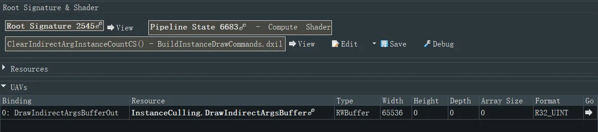
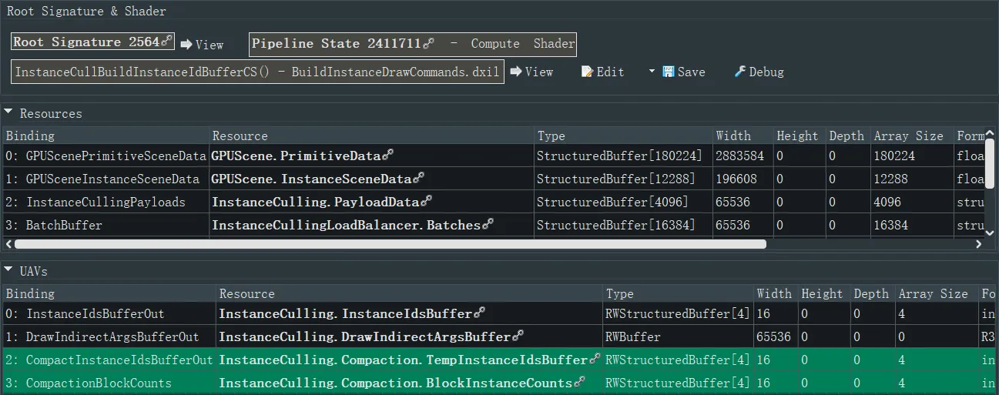
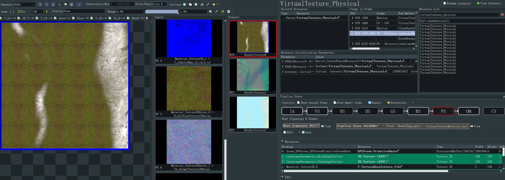
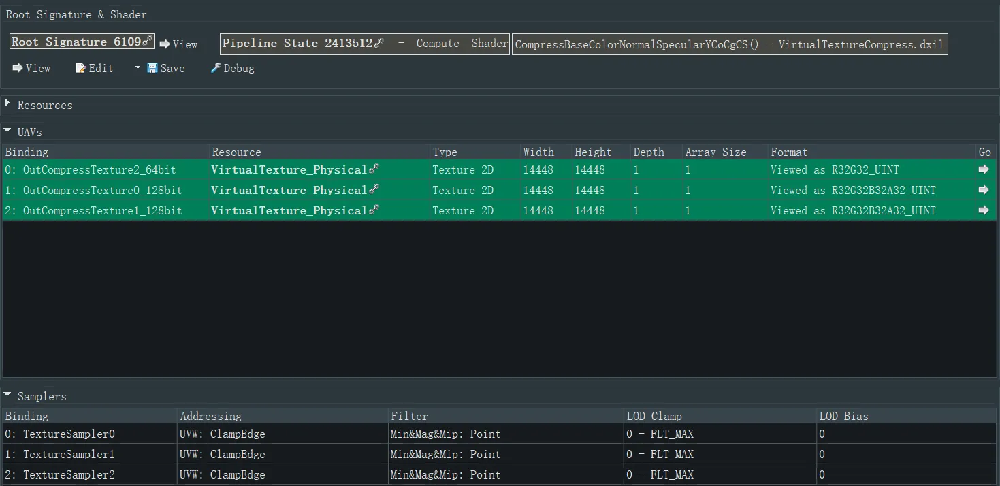
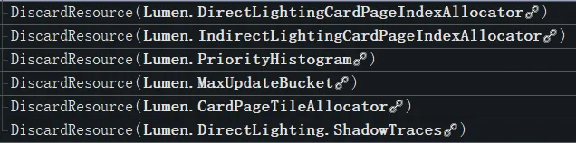
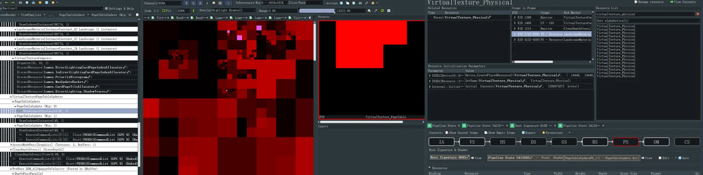
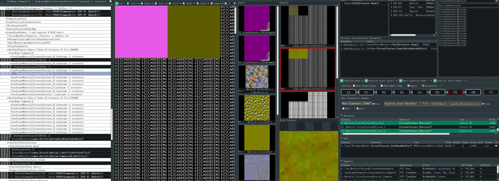

+++
date = '2026-04-23T16:26:25+08:00'
draft = false
title = 'UE5 地表 RVT 烘焙 RDC 流程'
tags = ['GPU', 'IdSplat', 'RuntimeVirtualTexture', 'Terrain', 'VirtualHeightfieldMesh']
categories = ['图形渲染']
+++

## 概述

本文档基于 RenderDoc 抓帧，记录一帧中 RVT 烘焙的完整 GPU 事件流水线。事件 ID（EID）反映引擎内部执行顺序。

**帧级管线结构**（自顶向下）：

1. **前置帧 Buffer 上传**：提交 `PageTableUpdateBuffer` 等全局 Buffer
2. **AsyncCompute 屏障** → **Scene**：VT 更新的总入口
3. **VT 更新阶段**（条件触发）：
   - `VirtualTextureFinalizeRequests`：BuildRenderingCommands → VirtualTextureDraw（两批 × 4 DrawCall）→ VirtualTextureCompress
   - `VirtualTexturePageTableUpdates`：PageTableUpdate（Mip 0~2）
4. **深度 PrePass**：ClearDepthStencil → PrePass → DepthPassParallel
5. **Lumen 场景更新**：MeshCardCapture 重新渲染 Landscape，采样 `View_VTFeedbackBuffer`
6. **光线追踪 + BasePass**：RayTracingDynamicUpdate → BasePass 渲染 Landscape 到 GBuffer

## 一、RVT 烘焙流程事件概览

### 1.1 前置帧：Buffer 上传与场景初始化

| EID | 事件 | 说明 |
|-----|------|------|
| 564 | SceneRender - ViewFamilies | 前置帧渲染入口 |
| 632 | RenderGraphExecute - /ViewFamilies | RDG 执行 |
| 641 | FRDGBuilder::SubmitBufferUploads | 一次性上传所有 Buffer，包括 `VirtualTexture_PageTableUpdateBuffer` |
| 671 | CopyBufferRegion | PageTableUpdateBuffer 拷贝到 GPU |
| 724 | Frame 47044 | 前一帧场景渲染 |
| 868 | Scene | 前一帧 Scene Pass |
| 871 | FXSystemPreRender | 粒子/特效系统预渲染 |

### 1.2 VT 更新阶段（条件触发）

> 以下事件仅在 VT 需要更新时出现。整体位于 `AccessModePass[AsyncCompute]` (EID 874) → `Scene` (EID 1018) 下。

**VirtualTextureFinalizeRequests** (EID 1165) 内部流程：

| EID | 事件 | 说明 |
|-----|------|------|
| 1168 | BuildRenderingCommands(Culling=Off) | 为 VT 渲染构建命令，禁用剔除 |
| 1171 | ClearIndirectArgInstanceCount | Dispatch(1x1x1)，清空间接绘制实例计数 |
| 1183 | CullInstances(UnCulled) | Dispatch(1x1x1)，Instance 剔除 |
| 1199 | **VirtualTextureDraw** | 第 1 批 VT 绘制，Clear 3 个 RT（slice1） |
| 1210 | LandscapeMaterialInstanceConstant_43 Landscape (1 instances) | `Bake Pass`，idx=96774 |
| 1243 | LandscapeMaterialInstanceConstant_35 Landscape (1 instances) | idx=96774 |
| 1256 | LandscapeMaterialInstanceConstant_12 Landscape (1 instances) | idx=96774 |
| 1269 | LandscapeMaterialInstanceConstant_25 Landscape (1 instances) | idx=96774 |
| 1285 | BuildRenderingCommands(Culling=Off) | 第 2 批命令构建 |
| 1288 | ClearIndirectArgInstanceCount | Dispatch(1x1x1) |
| 1299 | CullInstances(UnCulled) | 含 1 次 DiscardResource + Dispatch |
| 1317 | **VirtualTextureDraw** | 第 2 批 VT 绘制，Clear 3 个 RT（slice2） |
| 1325 | LandscapeMaterialInstanceConstant_34 Landscape (1 instances) | idx=96774 |
| 1349 | LandscapeMaterialInstanceConstant_42 Landscape (1 instances) | idx=96774 |
| 1362 | LandscapeMaterialInstanceConstant_32 Landscape (1 instances) | idx=96774 |
| 1375 | LandscapeMaterialInstanceConstant_24 Landscape (1 instances) | idx=96774 |
| 1391 | **VirtualTextureCompress** | Dispatch(33x33x2)，3 张 page 拷贝压缩到 3 张 VT（BC1/BC3/BC5），后接 6 次 DiscardResource（Lumen 相关） |

**VirtualTexturePageTableUpdates** (EID 1415) 流程：

| EID | 事件 | 说明 |
|-----|------|------|
| 1418 | PageTableUpdate | VS 读取 `VirtualTexture_PageTableUpdateBuffer`（RGBA16UInt），写入对应 Mip |
| 1421 | PageTableUpdate (Mip: 0) | Draw(idx=48 inst=1)，生成 Lumen Card 需要的页表 |
| 1438 | PageTableUpdate (Mip: 1) | Draw(idx=48 inst=1) |
| 1450 | PageTableUpdate (Mip: 2) | Draw(idx=48 inst=1) |

> `VirtualTextureCompress` 在 `PageTableUpdate` 之前执行，确保物理纹理压缩完成后再更新页表指向。

### 1.3 深度 PrePass

| EID | 事件 | 说明 |
|-----|------|------|
| 1513 | ClearDepthStencil (SceneDepthZ) | 清空场景深度缓冲 |
| 1527 | PrePass DDM_AllOpaqueNoVelocity (Forced by DBuffer) | 深度 Prepass |
| 1530 | DepthPassParallel | 并行深度通道 |
| 1540 | ParallelDraw (Index: 0, Num: 1) | 并行绘制调度 |
| 1543 | WorldGridMaterial Landscape (1 instances) | Landscape 深度写入，idx=96774 |
| 1940 | EditorPrimitives | 编辑器图元 |

### 1.4 Lumen 场景更新

| EID | 事件 | 说明 |
|-----|------|------|
| 2660 | LumenSceneUpdate: 2 card captures 0.031M texels | Lumen 场景卡片捕获 |
| 2736 | MeshCardCapture Pages:2 Draws:18 Instances:18 Tris:2340900 | 网格卡片渲染 |
| 2739 | CardPage Commands:9 | 卡片页面命令 |
| 2742 | LandscapeMaterialInstanceConstant_45 Landscape (1 instances) | 重新渲染地表顶点，采样 pagecache，读取 UAV `View_VTFeedbackBuffer`，idx=390150 |
| 2765 | DrawIndexedInstanced | 实际绘制调用 |

### 1.5 光线追踪与 BasePass

| EID | 事件 | 说明 |
|-----|------|------|
| 3446 | RayTracingDynamicGeometry | 光线追踪动态几何 |
| 3449 | RayTracingDynamicUpdate | 动态几何更新 |
| 3452 | RayTracingDynamicGeometryUpdate | 几何数据更新 |
| 4087 | BasePass | 主渲染 Pass |
| 4090 | BasePassParallel | 并行 BasePass |
| 4100 | ParallelDraw (Index: 0, Num: 1) | 并行绘制 |
| 4103 | LandscapeMaterialInstanceConstant_37 Landscape (1 instances) | GBuffer 地表绘制（Lumen Scene），idx=96774 |
| 4132 | DrawIndexedInstanced | 实际绘制调用 |

## 二、完整事件层级（RenderDoc 原始结构）

以下为有缩进的原始事件树，直观展示引擎内部的父子调用关系：

- EID 564: SceneRender - ViewFamilies
  - EID 632: RenderGraphExecute - /ViewFamilies
    - EID 641: FRDGBuilder::SubmitBufferUploads
      - `一次性上传所有Buffer，包括VirtualTexture_PageTableUpdateBuffer`
      - EID 671: ID3D12GraphicsCommandList::CopyBufferRegion() `Copy`
    - EID 724: Frame 47044
      - EID 731: SceneRender - ViewFamilies
        - EID 857: RenderGraphExecute - /ViewFamilies
          - EID 868: Scene
            - EID 871: FXSystemPreRender
- EID 874: AccessModePass[AsyncCompute] (Textures: 0, Buffers: 1)
  - EID 1018: Scene
    - **EID 1165: VirtualTextureFinalizeRequests** `触发VT更新才有`
      - **EID 1168: BuildRenderingCommands(Culling=Off)**
        - EID 1171: ClearIndirectArgInstanceCount
          - EID 1178: ID3D12GraphicsCommandList::Dispatch() `Dispatch(1x1x1)`
          - 
        - EID 1183: CullInstances(UnCulled)
          - EID 1191: ID3D12GraphicsCommandList::Dispatch() `Dispatch(1x1x1)`
          - 
      - **EID 1199: VirtualTextureDraw**
        - EID 1202: ID3D12GraphicsCommandList::DiscardResource() `Clear` `Discard VTPage (no compress)`
        - EID 1203: ID3D12GraphicsCommandList::DiscardResource() `Clear`
        - EID 1205: ID3D12GraphicsCommandList::ClearRenderTargetView() `Clear VTPage 0,1,2, slice1, no compress`
        - EID 1206: ID3D12GraphicsCommandList::ClearRenderTargetView() `Clear`
        - EID 1207: ID3D12GraphicsCommandList::ClearRenderTargetView() `Clear`
        - > 四个 DrawCall，地形的四块高度保证覆盖完全这个 VTDraw 的范围
        - EID 1210: LandscapeMaterialInstanceConstant_43 Landscape (1 instances) `Bake Pass`
          - `VS[(_HeightmapTexture,256,mip9,rgba8), UAV * 4]`
          - `PS[(texturearray,2048,mip12,bc3), (T_IdSplateMap,512,mip10,rgba8unorm), (VirtualTexture_PageTableAdapitveIndirection_1/_2,64,mip1,R32Uint)`
          - `OM (3 * 1032 * N, mip1, rgba8unorm)`
          - 
          - EID 1238: ID3D12GraphicsCommandList::DrawIndexedInstanced() `Draw(idx=96774 inst=1)`
        - EID 1243: LandscapeMaterialInstanceConstant_35 Landscape (1 instances)
          - EID 1251: ID3D12GraphicsCommandList::DrawIndexedInstanced() `Draw(idx=96774 inst=1)`
        - EID 1256: LandscapeMaterialInstanceConstant_12 Landscape (1 instances)
          - EID 1264: ID3D12GraphicsCommandList::DrawIndexedInstanced() `Draw(idx=96774 inst=1)`
        - EID 1269: LandscapeMaterialInstanceConstant_25 Landscape (1 instances)
          - EID 1277: ID3D12GraphicsCommandList::DrawIndexedInstanced() `Draw(idx=96774 inst=1)`
      - *EID 1285: BuildRenderingCommands(Culling=Off)* `和前面一样，每个VirtualTextureDraw前面都加一个，给顶点设置buffer`
        - EID 1288: ClearIndirectArgInstanceCount
          - EID 1294: ID3D12GraphicsCommandList::Dispatch() `Dispatch(1x1x1)`
        - EID 1299: CullInstances(UnCulled)
          - EID 1302: ID3D12GraphicsCommandList::DiscardResource() `Clear`
          - EID 1309: ID3D12GraphicsCommandList::Dispatch() `Dispatch(1x1x1)`
      - *EID 1317: VirtualTextureDraw*
        - EID 1320: ID3D12GraphicsCommandList::ClearRenderTargetView() `Clear VTPage 0,1,2, slice2, no compress`
        - EID 1321: ID3D12GraphicsCommandList::ClearRenderTargetView() `Clear`
        - EID 1322: ID3D12GraphicsCommandList::ClearRenderTargetView() `Clear`
        - EID 1325: LandscapeMaterialInstanceConstant_34 Landscape (1 instances) `Same As Above`
          - EID 1344: ID3D12GraphicsCommandList::DrawIndexedInstanced() `Draw(idx=96774 inst=1)`
        - EID 1349: LandscapeMaterialInstanceConstant_42 Landscape (1 instances)
          - EID 1357: ID3D12GraphicsCommandList::DrawIndexedInstanced() `Draw(idx=96774 inst=1)`
        - EID 1362: LandscapeMaterialInstanceConstant_32 Landscape (1 instances)
          - EID 1370: ID3D12GraphicsCommandList::DrawIndexedInstanced() `Draw(idx=96774 inst=1)`
        - EID 1375: LandscapeMaterialInstanceConstant_24 Landscape (1 instances)
          - EID 1383: ID3D12GraphicsCommandList::DrawIndexedInstanced() `Draw(idx=96774 inst=1)`
      - **EID 1391: VirtualTextureCompress**
        - EID 1400: ID3D12GraphicsCommandList::Dispatch() `Dispatch(33x33x2)` `[numthreads(8,8,1)]`
          - `直接把三张page(3*1032*N,mip1,rgba8unorm)拷贝到三张VT(14448=14*1032,BC1, BC3, BC5)，直接完成压缩`
          - `dispatch的z应该就是输入贴图的slice数量，也就是前面culling+vtbake组的数量`
          - 
        - > 不清楚为何在此处 discard Lumen 相关资源
        - EID 1402: ID3D12GraphicsCommandList::DiscardResource() `Clear`
        - EID 1403: ID3D12GraphicsCommandList::DiscardResource() `Clear`
        - EID 1404: ID3D12GraphicsCommandList::DiscardResource() `Clear`
        - EID 1405: ID3D12GraphicsCommandList::DiscardResource() `Clear`
        - EID 1406: ID3D12GraphicsCommandList::DiscardResource() `Clear`
        - EID 1407: ID3D12GraphicsCommandList::DiscardResource() `Clear`
        - 
    - **EID 1415: VirtualTexturePageTableUpdates** `触发VT更新才有`
      - EID 1418: PageTableUpdate
        - EID 1421: PageTableUpdate (Mip: 0)
          - EID 1433: ID3D12GraphicsCommandList::DrawIndexedInstanced() `Draw(idx=48 inst=1)`
          - `VS读取UAV VirtualTexture_PageTableUpdateBuffer RGBA16UInt`
          - `更新pagetable，vs读buffer VirtualTexture_PageTableUpdateBuffer，后面两个只往对应mip里画`
          - `这个生成lumencard要用到`
          - 
        - EID 1438: PageTableUpdate (Mip: 1)
          - EID 1445: ID3D12GraphicsCommandList::DrawIndexedInstanced() `Draw(idx=48 inst=1)`
        - EID 1450: PageTableUpdate (Mip: 2)
          - EID 1457: ID3D12GraphicsCommandList::DrawIndexedInstanced() `Draw(idx=48 inst=1)`
          - EID 1461: => ExecuteCommandLists(2)[1]: Close(ResourceId::2745470)
          - EID 1466: => ExecuteCommandLists(5)[0]: Reset(ResourceId::2745473)
    - EID 1513: ClearDepthStencil (SceneDepthZ)
      - EID 1516: ID3D12GraphicsCommandList::ClearDepthStencilView() `Clear`
    - EID 1527: PrePass DDM_AllOpaqueNoVelocity (Forced by DBuffer)
      - EID 1530: DepthPassParallel
        - EID 1535: => ExecuteCommandLists(5)[1]: Close(ResourceId::2745469)
        - EID 1536: => ExecuteCommandLists(5)[2]: Reset(ResourceId::2745472)
        - EID 1540: ParallelDraw (Index: 0, Num: 1)
          - EID 1543: /Engine/EngineMaterials/WorldGridMaterial.WorldGridMaterial Landscape (1 instances) `*N`
            - EID 1565: ID3D12GraphicsCommandList::DrawIndexedInstanced() `Draw(idx=96774 inst=1)`
        - EID 1932: => ExecuteCommandLists(5)[2]: Close(ResourceId::2745472)
        - EID 1933: => ExecuteCommandLists(5)[3]: Reset(ResourceId::2745471)
      - EID 1940: EditorPrimitives
  - EID 2660: LumenSceneUpdate: 2 card captures 0.031M texels
    - EID 2736: MeshCardCapture Pages:2 Draws:18 Instances:18 Tris:2340900
      - EID 2739: CardPage Commands:9
        - EID 2742: LandscapeMaterialInstanceConstant_45 Landscape (1 instances)
          - EID 2765: ID3D12GraphicsCommandList::DrawIndexedInstanced() `DrawIndexedInstanced(idx=390150, inst=1)`
          - > Lumen 生成 card，需要再跑地表顶点，采样 pagecache，读取 UAV View_VTFeedbackBuffer
          - 
  - EID 3446: RayTracingDynamicGeometry
    - EID 3449: RayTracingDynamicUpdate
      - EID 3452: RayTracingDynamicGeometryUpdate
        - EID 4087: BasePass
          - EID 4090: BasePassParallel
            - EID 4100: ParallelDraw (Index: 0, Num: 1)
              - EID 4103: LandscapeMaterialInstanceConstant_37 Landscape (1 instances)
                - > GBuffer 地表绘制 Lumen Scene
                - EID 4132: ID3D12GraphicsCommandList::DrawIndexedInstanced() `DrawIndexedInstanced(idx=96774, inst=1)`

---

## 小结

**层级关系**：

- `VirtualTextureFinalizeRequests` (EID 1165) 与 `VirtualTexturePageTableUpdates` (EID 1415) 是 **兄弟节点**，均属于 `Scene` (EID 1018) 的子节点
- `VirtualTextureCompress` (EID 1391) 位于 `VirtualTextureFinalizeRequests` **内部**，在两批 VirtualTextureDraw 之后执行，先压缩物理纹理再更新页表
- `VirtualTexturePageTableUpdates` 独立于 FinalizeRequests，VS 读取 `VirtualTexture_PageTableUpdateBuffer`（RGBA16UInt），按 Mip 级别逐级更新页表映射

**VT 渲染模式**：

- `VirtualTextureFinalizeRequests` 内部采用 **两批串行** 的 `BuildRenderingCommands → VirtualTextureDraw` 模式，每批包含 4 个 Landscape DrawCall
- 每批 VirtualTextureDraw 前 Clear 3 个 RenderTarget（对应 BC1/BC3/BC5 三张 VT 的物理页面），两批分别对应 slice1 和 slice2

**Lumen 与 VT 的交互**：

- Lumen Card 捕获 (EID 2742) 需要重新渲染地表顶点，采样 pagecache 并读取 `View_VTFeedbackBuffer`
- PageTableUpdate 生成的页表数据会被 Lumen Card 渲染使用
- BasePass (EID 4103) 中 Landscape 渲染到 GBuffer，供 Lumen Scene 消费
