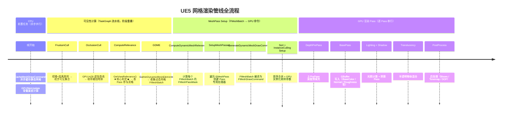
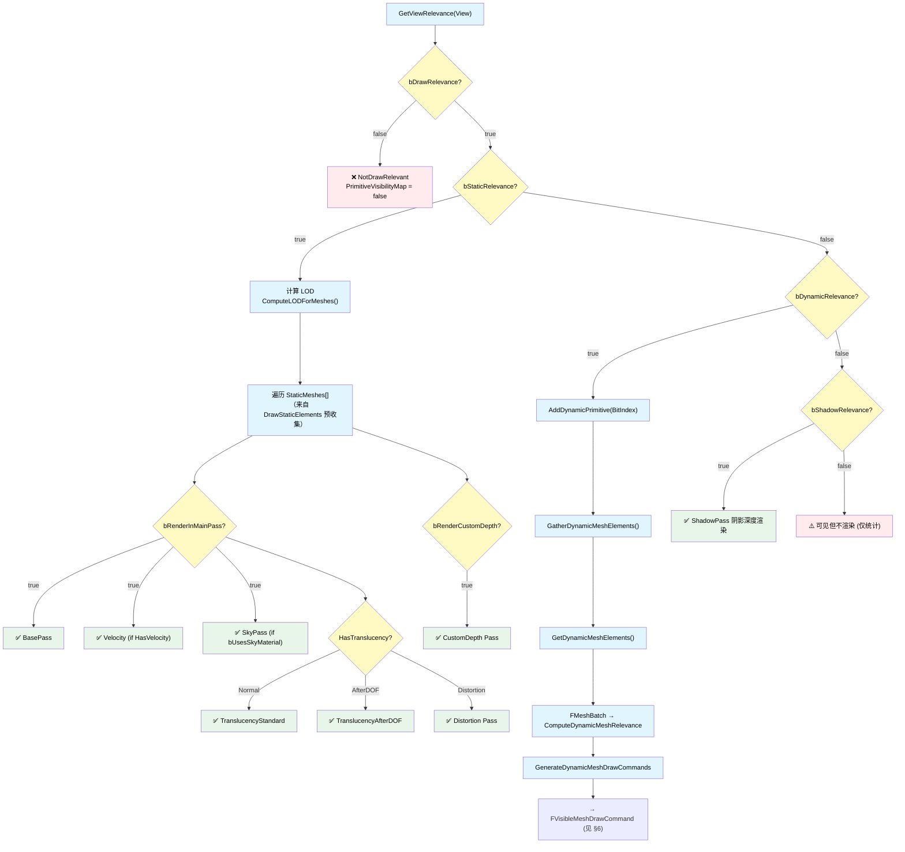
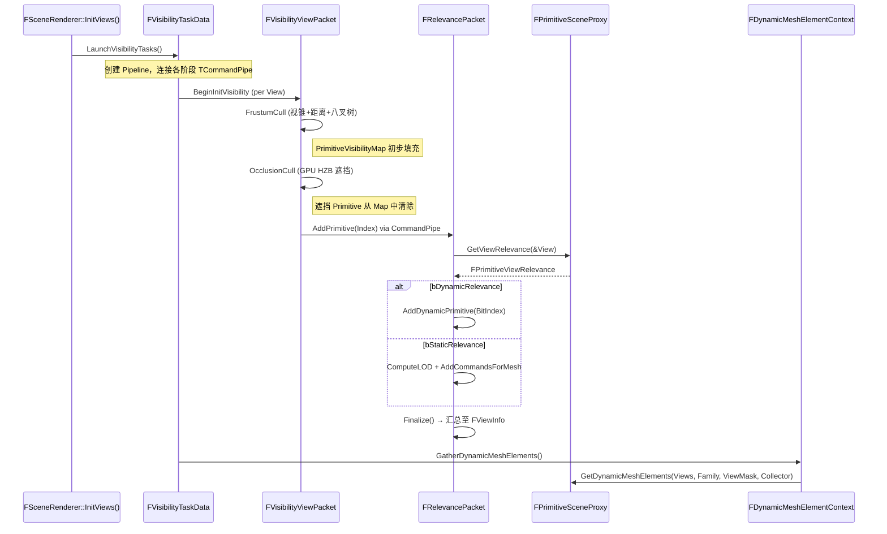
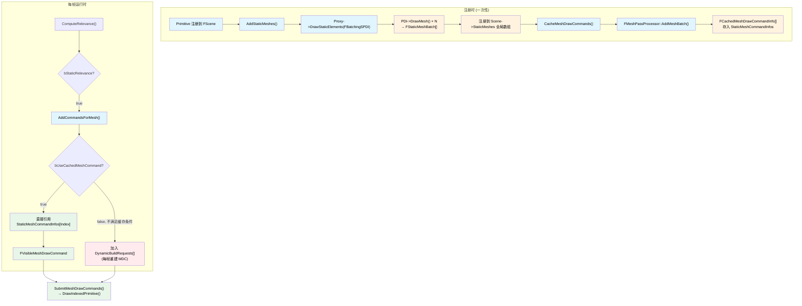

+++
date = '2026-06-01T18:00:00+08:00'
draft = false
title = 'UE5 网格渲染管线：从 ViewRelevance 到 DrawCall 源码级全流程解析'
tags = ['UE5', '渲染管线', '源码分析', 'MeshDrawCommand', '可见性']
categories = ['图形渲染']
+++

> 本文基于 UE 5.5 引擎源码，追踪场景中一个网格从 `GetViewRelevance()` 判定到最终 `DrawIndexedPrimitive()` 的完整路径。所有代码引用标注了引擎内原始路径和行号。

---

## 1. 先看全景：一条 DrawCall 的诞生

场景里放一个 StaticMesh，点 Play，它在屏幕上显示出来。这中间发生了什么？

用一句话概括：**CPU 判定可见 → CPU 收集网格数据 → CPU 构建 GPU 命令 → GPU 执行绘制**。但这句话掩盖了巨大的复杂度。下面是全流程的时序图：

### 全流程时序



> ⚠️ `CacheMeshDrawCommands` 的主体工作在 Primitive 注册/加载时一次性完成（见 §6.4.4）。图中每帧的异步任务是处理增量更新（新注册或脏缓存）。

五层结构：**前置任务** (异步缓存) → **可见性计算** (CPU 并行 TaskGraph) → **MeshPass 构建** (FMeshBatch→FMeshDrawCommand) → **GPU 渲染** (各 Pass 依次执行) → **最终像素**。

---

## 2. 核心数据结构速览

在进入流程前，先认识三个关键数据结构：

### 2.1 FPrimitiveViewRelevance —— 判定结果

```cpp
// Engine/Source/Runtime/Engine/Public/PrimitiveViewRelevance.h:13-99
struct FPrimitiveViewRelevance : public FMaterialRelevance
{
    // === View 级判定标志 ===
    uint32 bStaticRelevance : 1;     // 走静态缓存路径 (StaticMesh 默认)
    uint32 bDynamicRelevance : 1;    // 走 GDME 动态路径
    uint32 bDrawRelevance : 1;       // 总开关，false = 不绘制
    uint32 bShadowRelevance : 1;     // 投射阴影
    uint32 bRenderInMainPass : 1;    // 进入 BasePass 核心开关
    uint32 bRenderCustomDepth : 1;   // 额外 CustomDepth Pass
    uint32 bRenderInDepthPass : 1;   // 即使不在 MainPass 也写深度
    uint32 bVelocityRelevance : 1;   // 运动向量 Pass
    // ... 共约 20 个标志位
};
```

`FPrimitiveViewRelevance` 继承自 `FMaterialRelevance` — 后者携带材质级标志 (`bOpaque`、`bTranslucent`、`bDistortion`、`bUsesSkyMaterial` 等 30+ 个位)。两者合在一起，构成了"这个 Primitive 应该参与哪些 Pass"的完整答案。

### 2.2 FMeshBatch —— 网格中间描述

```cpp
// Engine/Source/Runtime/Engine/Public/MeshBatch.h:370-571
struct FMeshBatch
{
    const FVertexFactory* VertexFactory;          // 顶点工厂
    const FMaterialRenderProxy* MaterialRenderProxy; // 材质代理
    TArray<FMeshBatchElement, TInlineAllocator<1>> Elements;

    uint32 CastShadow : 1;       // 是否用于阴影 Pass
    uint32 bUseForMaterial : 1;  // 是否用于材质 Pass (BasePass 等)
    uint32 bUseForDepthPass : 1; // 是否用于深度 Pass
    uint32 bUseAsOccluder : 1;   // 是否适合做遮挡体
    // ...
};
```

`FMeshBatch` 是 `FMeshBatchElement` 的容器，后者才包含最终绘制参数：

```cpp
// Engine/Source/Runtime/Engine/Public/MeshBatch.h:231-360
struct FMeshBatchElement
{
    const FIndexBuffer* IndexBuffer;
    uint32 FirstIndex;
    uint32 NumPrimitives;
    uint32 NumInstances;
    uint32 BaseVertexIndex;
    FRHIUniformBuffer* PrimitiveUniformBuffer;
};
```

### 2.3 FMeshDrawCommand —— GPU 就绪的执行单元

```cpp
// Engine/Source/Runtime/Renderer/Public/MeshPassProcessor.h:1227-1483
class FMeshDrawCommand
{
    FMeshDrawShaderBindings ShaderBindings;   // 所有 Shader 资源绑定
    FVertexInputStreamArray VertexStreams;    // 顶点布局
    FRHIBuffer* IndexBuffer;                 // 索引缓冲区
    FGraphicsMinimalPipelineStateId CachedPipelineId; // PSO 缓存 ID
    uint32 FirstIndex;
    uint32 NumPrimitives;
    uint32 NumInstances;
    uint8 StencilRef;
};
```

`FMeshDrawCommand` 是一个"即插即用"的 GPU 命令——PSO、Shader 绑定、顶点流、绘制参数一应俱全，从 `FMeshBatch` 编译而来，可以直接喂给 RHI。

### 2.4 DrawStaticElements —— 静态路径的入口

`FPrimitiveSceneProxy` 有三个关键的渲染接口，分工明确：

| 接口 | 调用时机 | 产出 | 频率 |
|------|---------|------|------|
| `GetViewRelevance()` | 可见性计算阶段 | `FPrimitiveViewRelevance` (判定结果) | 每帧 × 每 View |
| `DrawStaticElements()` | Primitive **注册时** | `FStaticMeshBatch[]` (缓存复用) | 一次 |
| `GetDynamicMeshElements()` | GDME 阶段 | `FMeshBatch[]` (每帧重建) | 每帧 |

```cpp
// Engine/Source/Runtime/Engine/Public/PrimitiveSceneProxy.h:464
virtual void DrawStaticElements(FStaticPrimitiveDrawInterface* PDI) {}
```

基类默认实现为空——如果不重写，就**没有**静态路径。`FStaticPrimitiveDrawInterface` 只有一个核心方法：

```cpp
// Engine/Source/Runtime/Engine/Public/SceneManagement.h:1292-1308
class FStaticPrimitiveDrawInterface
{
public:
    virtual void SetHitProxy(HHitProxy* HitProxy) = 0;
    virtual void ReserveMemoryForMeshes(int32 MeshNum) = 0;

    // ★ 提交一个 FMeshBatch，附带屏幕尺寸用于 LOD 选择
    virtual void DrawMesh(const FMeshBatch& Mesh, float ScreenSize) = 0;
};
```

Proxy 在 `DrawStaticElements()` 里多次调用 `PDI->DrawMesh(...)` 提交每个 LOD/Section 的网格批次。PDI 的具体实现是 `FBatchingSPDI`——它把 `DrawMesh` 的调用结果直接追加到 `FPrimitiveSceneInfo::StaticMeshes[]` 和 `StaticMeshRelevances[]` 数组中。

这一设计将**静态网格数据的收集**与**运行时可见性判定**完全解耦：`DrawStaticElements` 只在 Primitive 首次注册（或需要重建时）调用一次，产出的 `FStaticMeshBatch` 存入 `FPrimitiveSceneInfo`，后续每帧的 `ComputeRelevance` 只做 LOD 选择和命令引用。

> **FStaticMeshBatch** 继承自 `FMeshBatch`，额外携带关键字段：
> - `int32 Id` — 在 `FScene::StaticMeshes` 全局数组中的唯一索引
> - `int8 LODIndex` — 所属 LOD 层级
> - `float ScreenSize` — 屏幕尺寸阈值（LOD 选择用）
> - `HHitProxy* HitProxy` — 编辑器 Hit Proxy
> 
> 这些字段使其可以挂载到场景全局数组中，并在随后每帧的 `ComputeRelevance` 中通过 `Id` 进行 O(1) 索引——这是静态路径零开销的核心。

---

## 3. 阶段一：GetViewRelevance() —— 命运判定

### 3.1 谁在调用它

```cpp
// Engine/Source/Runtime/Renderer/Private/SceneVisibility.cpp:1602
void FRelevancePacket::ComputeRelevance()
{
    for (int32 Index = 0; Index < Input.NumPrims; Index++)
    {
        int32 BitIndex = Input.Prims[Index];
        FPrimitiveSceneInfo* PrimitiveSceneInfo = Scene.Primitives[BitIndex];
        FPrimitiveSceneProxy* PrimitiveSceneProxy = PrimitiveSceneInfo->Proxy;

        // ★ 核心调用：每个可见 Primitive × 每个 View，每帧调用一次
        const FPrimitiveViewRelevance ViewRelevance =
            PrimitiveSceneProxy->GetViewRelevance(&View);
        // ...
    }
}
```

调用频率：**每个通过视锥 + 遮挡剔除的 Primitive，每 View 一次，每帧**。在大场景中这是数千次虚函数调用，所以 Proxy 实现必须快速。

### 3.2 StaticMesh 的典型实现

```cpp
// Engine/Source/Runtime/Engine/Private/StaticMeshSceneProxy.cpp:2372-2431
FPrimitiveViewRelevance FStaticMeshSceneProxy::GetViewRelevance(const FSceneView* View) const
{
    FPrimitiveViewRelevance Result;
    Result.bDrawRelevance = IsShown(View) && View->Family->EngineShowFlags.StaticMeshes;
    Result.bRenderCustomDepth = ShouldRenderCustomDepth();
    Result.bRenderInMainPass = ShouldRenderInMainPass();
    Result.bRenderInDepthPass = ShouldRenderInDepthPass();
    Result.bShadowRelevance = IsShadowCast(View);

    // 将预缓存的材质标志位复制到 ViewRelevance
    MaterialRelevance.SetPrimitiveViewRelevance(Result);

    // 正常情况：静态路径
    Result.bStaticRelevance = true;
    Result.bVelocityRelevance = Result.bOpaque && Result.bRenderInMainPass && DrawsVelocity();

    return Result;
}
```

### 3.3 何时用动态路径

`bDynamicRelevance = true` 的场景：

- **骨骼网格** (SkeletalMesh)：`FSkeletalMeshSceneProxy::GetViewRelevance()` 在 `Line 1309` 设置 `bDynamicRelevance = ~bStaticRelevance`
- **编辑器覆盖**：碰撞显示、线框模式、Bounds 可视化
- **自定义 Proxy**：需要每帧提交额外 FMeshBatch（例如地表混合、粒子系统）

### 3.4 判定决策树



> bStaticRelevance、bDynamicRelevance、bShadowRelevance 三者是独立的位标志，可以同时为 true。本图仅展示主导渲染路径的判定逻辑。

`bDynamicRelevance = false` 且 `bStaticRelevance = false` 且 `bShadowRelevance = false` → 该 Primitive 不在任何 Pass 中渲染。这是一个常见的"为什么我的物体不显示"排查点。

---

## 4. 阶段二：可见性管线 —— 从场景到可见列表

### 4.1 五阶段流水线



### 4.2 剔除步骤全列表

`FVisibilityTaskData` (定义在 `SceneVisibilityPrivate.h:529`) 管理的各阶段：

| 阶段 | 剔除内容 | 实现位置 |
|------|---------|---------|
| **AlwaysVisible** | 天空盒等始终可见物体，直接设 bit | `SceneVisibility.cpp:745` |
| **FrustumCull** | 视锥平面、Min/MaxDrawDistance、八叉树粗筛、HLOD 裁剪 | `SceneVisibility.cpp:794-993` |
| **OcclusionCull** | GPU HZB 遮挡查询、预计算可见性 | `SceneVisibility.cpp:3292` (OcclusionCullPrimitive), `3952` (OcclusionCullTask), `4112` (PrecomputedOcclusionCull) |
| **ComputeRelevance** | 调用 `GetViewRelevance()` (函数入口 L1503，调用点在 L1602)，判定各 Pass 参与资格 | `SceneVisibility.cpp:1503/1602` |
| **GatherDynamicMeshElements** | 收集动态 Primitive 的 FMeshBatch | `SceneVisibility.cpp:5267` |
| **SetupMeshPasses** | 合并静态+动态，构建最终 DrawCommand | `SceneVisibility.cpp:5380` |

### 4.3 两种调度模式

| 模式 | 行为 | 控制 CVar |
|------|------|----------|
| **Parallel** (默认 PC) | TaskGraph 异步，各阶段通过 TCommandPipe 流水线重叠 | `r.Visibility.TaskSchedule 1` |
| **RenderThread** (Mobile/调试) | 渲染线程串行，ParallelFor 辅助 | `r.Visibility.TaskSchedule 0` |

Parallel 模式下，FrustumCull 完成后即通过 `OcclusionCull.CommandPipe` 传递结果，无需等待全部完成；OcclusionCull 同理通过 `Relevance.CommandPipe` 传递。三个阶段可以流水线重叠执行。

---

## 5. 阶段三：GDME —— 动态网格的收集

### 5.1 调用链

```cpp
// Engine/Source/Runtime/Renderer/Private/SceneVisibility.cpp:4794-4836
void FDynamicMeshElementContext::GatherDynamicMeshElementsForPrimitive(
    FPrimitiveSceneInfo* Primitive, uint8 ViewMask)
{
    MeshCollector.SetPrimitive(Primitive->Proxy, Primitive->DefaultDynamicHitProxyId);

    // ★ 实际调用 GetDynamicMeshElements
    Primitive->Proxy->GetDynamicMeshElements(
        FirstViewFamily.AllViews,
        FirstViewFamily,
        ViewMask,
        MeshCollector);
}
```

### 5.2 触发条件回顾

`bDynamicRelevance = true` → `AddDynamicPrimitive(BitIndex)` — 这是 `ComputeRelevance()` 内部定义的 **lambda** (定义 L1557, 调用 L2251) → GDME 阶段遍历 → 调用 `GetDynamicMeshElements()`。

### 5.3 并行控制

- `bSupportsParallelGDME` (PrimitiveSceneProxy.h:1414)：允许多个 Primitive 的 GDME 在不同线程并发执行
- `bSinglePassGDME` (PrimitiveSceneProxy.h:1423)：不同 ViewFamily 共享一次 GDME 调用（避免重复生成 FMeshBatch）

不满足并行条件的 Primitive 被过滤到渲染线程串行执行，成为潜在瓶颈。

---

## 6. 阶段四：MeshDrawCommand 生成 —— FMeshBatch 的编译

经过 ComputeRelevance 的双路分发和 GDME 的动态收集后，引擎手中有两份数据：① 静态路径的 Cached MDC 引用（已在 `ViewCommands.MeshCommands[]` 中）；② 动态路径的原始 `FMeshBatch`（在 `View.DynamicMeshElements[]` 中）。接下来的 SetupMeshPasses 统一将两者按 Pass 类型分派，编译为最终的 `FMeshDrawCommand`。

在正式进入 SetupMeshPasses 之前，`ComputeDynamicMeshRelevance()` 会先为每个动态 FMeshBatch 计算其 `FMeshPassMask`——这是一个 64-bit 位掩码，标记该批次需要参与哪些 Pass（见 §6.2）。

### 6.1 SetupMeshPasses 分发

```cpp
// Engine/Source/Runtime/Renderer/Private/SceneRendering.cpp:4747-4823
void FSceneRenderer::SetupMeshPass()
{
    for (int32 PassIndex = 0; PassIndex < EMeshPass::Num; PassIndex++)
    {
        const EMeshPass::Type PassType = (EMeshPass::Type)PassIndex;

        // 跳过无内容的 Pass
        if (ViewCommands.MeshCommands[PassIndex].IsEmpty() &&
            View.NumVisibleDynamicMeshElements[PassType] == 0)
            continue;

        // 创建 Pass 专用处理器
        FMeshPassProcessor* MeshPassProcessor =
            FPassProcessorManager::CreateMeshPassProcessor(PassType, ...);

        // 调度异步任务：FMeshBatch → FMeshDrawCommand
        Pass.DispatchPassSetup(Scene, View, InstanceCullingContext, PassType, ...,
            View.DynamicMeshElements,
            &View.DynamicMeshElementsPassRelevance,  // FMeshPassMask 筛选
            View.NumVisibleDynamicMeshElements[PassType],
            ViewCommands.DynamicMeshCommandBuildRequests[PassType],
            ViewCommands.MeshCommands[PassIndex]);
    }
}
```

### 6.2 FMeshPassMask —— Pass 筛选位掩码

在 `ComputeDynamicMeshRelevance()` (SceneVisibility.cpp:2994-3266) 中，每个 FMeshBatch 获得一个 64-bit 的 `FMeshPassMask`：

```text
bRenderInMainPass  && bOpaque            → BasePass
bRenderInMainPass  && bUsesSkyMaterial   → SkyPass
bRenderInDepthPass                       → DepthPass
bRenderCustomDepth                       → CustomDepth
bNormalTranslucency                      → TranslucencyStandard
bSeparateTranslucency                    → TranslucencyAfterDOF
bDistortion                              → Distortion
bVelocityRelevance                       → Velocity
// ...
```

### 6.3 GenerateDynamicMeshDrawCommands 内部

```cpp
// Engine/Source/Runtime/Renderer/Private/MeshDrawCommands.cpp:595-699
void GenerateDynamicMeshDrawCommands(...)
{
    for (int32 MeshIndex = 0; MeshIndex < NumDynamicMeshBatches; MeshIndex++)
    {
        // PassMask 筛选：该 FMeshBatch 属于当前 Pass 吗？
        if (!DynamicMeshElementsPassRelevance ||
            (*DynamicMeshElementsPassRelevance)[MeshIndex].Get(PassType))
        {
            const FMeshBatchAndRelevance& MeshAndRelevance = DynamicMeshElements[MeshIndex];
            // ★ 将 FMeshBatch 喂给 Pass 专用处理器
            PassMeshProcessor->AddMeshBatch(
                *MeshAndRelevance.Mesh,
                ~0ull,
                MeshAndRelevance.PrimitiveSceneProxy);
        }
    }
}
```

`PassMeshProcessor->AddMeshBatch()`

> `AddMeshBatch()` 是 `FMeshPassProcessor` 的纯虚函数。每个 Pass 有各自的子类实现——例如 `FBasePassMeshProcessor` 按材质域（Surface/DeferredDecal/Volume）分支、`FDepthPassMeshProcessor` 检查 `bUseForDepthPass` 标志——在调用通用的 `BuildMeshDrawCommands()` 模板之前注入 Pass 专属的 Shader 参数和 PSO 选择逻辑。这就是为什么同一个 `FMeshBatch` 能被循环中所有 Pass Processor 调用，但只在正确的 Pass 中生成绘制命令。

`PassMeshProcessor->AddMeshBatch()` 内部调用 `BuildMeshDrawCommands()` 模板方法 (MeshPassProcessor.inl:49-208)：

1. 从 Material + VertexFactory + Pass 类型查找/创建 PSO
2. 填充 `SharedMeshDrawCommand` 的 ShaderBindings (UniformBuffers、Texture SRV、Sampler)
3. 设置 VertexStreams (顶点布局)
4. 设置 IndexBuffer、FirstIndex、NumPrimitives
5. 调用 `FinalizeCommand()` → CachedPipelineId 固化

### 6.4 静态路径详解：DrawStaticElements → Cached MeshDrawCommand (MDC)

动态路径每帧重建 `FMeshDrawCommand`，但 StaticMesh 不需要——它的网格数据不随帧变化。静态路径在 Primitive **首次注册到场景**时就完成了所有重活，之后的每一帧只是引用缓存结果。

#### 6.4.1 阶段零：DrawStaticElements 收集

Primitive 注册到场景时，`FPrimitiveSceneInfo::AddStaticMeshes()` 被调用：

```cpp
// Engine/Source/Runtime/Renderer/Private/PrimitiveSceneInfo.cpp:1537-1557
void FPrimitiveSceneInfo::AddStaticMeshes(
    FRHICommandListBase& RHICmdList, FScene* Scene,
    TArrayView<FPrimitiveSceneInfo*> SceneInfos, bool bCacheMeshDrawCommands)
{
    // Step 1: 并行调用每个 Proxy 的 DrawStaticElements()
    ParallelForTemplate(SceneInfos.Num(), [Scene, &SceneInfos](int32 Index)
    {
        FPrimitiveSceneInfo* SceneInfo = SceneInfos[Index];

        // FBatchingSPDI 是 FStaticPrimitiveDrawInterface 的实现
        // 它把 PDI->DrawMesh() 的调用收集到 SceneInfo->StaticMeshes[] 中
        FBatchingSPDI BatchingSPDI(SceneInfo);
        BatchingSPDI.SetHitProxy(SceneInfo->DefaultDynamicHitProxy);

        // ★ 调用 Proxy 的 DrawStaticElements
        SceneInfo->Proxy->DrawStaticElements(&BatchingSPDI);
        // 此时 SceneInfo->StaticMeshes[] 已填充完毕
        // 同时填充 SceneInfo->StaticMeshRelevances[]

        SceneInfo->bPendingAddStaticMeshes = false;
    });

    // Step 2: 将收集的 FStaticMeshBatch 注册到 FScene 全局数组
    for (FPrimitiveSceneInfo* SceneInfo : SceneInfos)
    {
        for (int32 MeshIndex = 0; MeshIndex < SceneInfo->StaticMeshes.Num(); MeshIndex++)
        {
            FStaticMeshBatch& Mesh = SceneInfo->StaticMeshes[MeshIndex];
            // 分配全局唯一 ID
            FSparseArrayAllocationInfo Allocation = Scene->StaticMeshes.AddUninitialized();
            Scene->StaticMeshes[Allocation.Index] = &Mesh;
            Mesh.Id = Allocation.Index;
        }
    }

    // Step 3: 生成缓存的 MeshDrawCommands
    if (bCacheMeshDrawCommands)
    {
        CacheMeshDrawCommands(Scene, SceneInfos);
    }
}
```

#### 6.4.2 StaticMesh 的 DrawStaticElements 实现

```cpp
// Engine/Source/Runtime/Engine/Private/StaticMeshSceneProxy.cpp:1382-1500
void FStaticMeshSceneProxy::DrawStaticElements(FStaticPrimitiveDrawInterface* PDI)
{
    // 确定深度优先级组 (SDPG_World / SDPG_Foreground)
    ESceneDepthPriorityGroup PrimitiveDPG = GetStaticDepthPriorityGroup();

    // 遍历 LOD
    for (int32 LODIndex = 0; LODIndex < NumLODs; LODIndex++)
    {
        const FStaticMeshLODResources& LODModel = RenderData->LODResources[LODIndex];

        // 遍历 Section (材质槽)
        for (int32 SectionIndex = 0; SectionIndex < LODModel.Sections.Num(); SectionIndex++)
        {
            const int32 NumBatches = GetNumMeshBatches();
            PDI->ReserveMemoryForMeshes(NumBatches);

            // 遍历 Batch (每个 Section 可能产生多个 Batch，如 Runtime Virtual Texture)
            for (int32 BatchIndex = 0; BatchIndex < NumBatches; BatchIndex++)
            {
                FMeshBatch BaseMeshBatch;
                if (GetMeshElement(LODIndex, BatchIndex, SectionIndex,
                                   PrimitiveDPG, /*bIsSelected=*/false,
                                   /*bIsHovered=*/false, BaseMeshBatch))
                {
                    // ★ 提交给 PDI——实际追加到 SceneInfo->StaticMeshes[]
                    PDI->DrawMesh(BaseMeshBatch, FLT_MAX);
                }
            }
        }
    }
}
```

`GetMeshElement()` 做的工作和 GDME 中手动填充 `FMeshBatch` 完全一致：设置 VertexFactory、MaterialRenderProxy、IndexBuffer、FirstIndex、NumPrimitives、CastShadow、bUseForMaterial 等。区别在于它发生在注册时而不是每帧。

#### 6.4.3 FBatchingSPDI —— PDI 的具体实现

```cpp
// Engine/Source/Runtime/Renderer/Private/PrimitiveSceneInfo.cpp:78-130
class FBatchingSPDI : public FStaticPrimitiveDrawInterface
{
    FPrimitiveSceneInfo* PrimitiveSceneInfo;
    HHitProxy* CurrentHitProxy;

    virtual void DrawMesh(const FMeshBatch& Mesh, float ScreenSize) final override
    {
        // 直接追加到 PrimitiveSceneInfo 的数组中
        FStaticMeshBatch* StaticMesh = new(PrimitiveSceneInfo->StaticMeshes)
            FStaticMeshBatch(PrimitiveSceneInfo, Mesh, CurrentHitProxy);

        // 同时创建关联的 Relevance 条目
        FStaticMeshBatchRelevance* Relevance = new(PrimitiveSceneInfo->StaticMeshRelevances)
            FStaticMeshBatchRelevance(*StaticMesh, ScreenSize,
                ... /* settings like bDitheredLODTransition */);

        // 记录 LOD 索引用于后续快速切换
        if (StaticMesh->LODIndex >= PrimitiveSceneInfo->NumStaticMeshesPerLOD.Num())
            PrimitiveSceneInfo->NumStaticMeshesPerLOD.AddZeroed(...);
        PrimitiveSceneInfo->NumStaticMeshesPerLOD[StaticMesh->LODIndex]++;
    }
};
```

#### 6.4.4 CacheMeshDrawCommands —— 一次编译，永久复用

收集完 `FStaticMeshBatch` 后，紧接着就是编译为 `FMeshDrawCommand`：

```cpp
// Engine/Source/Runtime/Renderer/Private/PrimitiveSceneInfo.cpp:583-712
void FPrimitiveSceneInfo::CacheMeshDrawCommands(FScene* Scene, ...)
{
    for (int32 PassIndex = 0; PassIndex < EMeshPass::Num; PassIndex++)
    {
        // 只处理支持缓存命令的 Pass
        if (!(FPassProcessorManager::GetPassFlags(...) & EMeshPassFlags::CachedMeshCommands))
            continue;

        FMeshPassProcessor* PassMeshProcessor = ...;

        for (int32 MeshIndex = 0; MeshIndex < StaticMeshes.Num(); MeshIndex++)
        {
            FStaticMeshBatch& Mesh = StaticMeshes[MeshIndex];

            // ★ 和动态路径完全相同的 AddMeshBatch 调用
            // 但只执行一次，结果缓存到 FCachedMeshDrawCommandInfo
            PassMeshProcessor->AddMeshBatch(Mesh, ...);
        }
    }
}
```

#### 6.4.5 运行时引用

到了每帧的 `ComputeRelevance` 阶段，静态路径的代码路径变成：

```cpp
// Engine/Source/Runtime/Renderer/Private/SceneVisibility.cpp:1218-1260
// 在 AddCommandsForMesh() 中：
if (bUseCachedMeshCommand)  // 检查缓存是否可用
{
    // 直接从预构建的 StaticMeshCommandInfos 中按索引读取
    const FCachedMeshDrawCommandInfo& CommandInfo =
        PrimitiveSceneInfo->StaticMeshCommandInfos[CommandInfoIndex];

    // 通过 CommandInfo.StateBucketId 和 CommandInfo.CommandIndex
    // 找到预编译的 FMeshDrawCommand，零开销包装为 FVisibleMeshDrawCommand
    // ...（完全不调用 AddMeshBatch）
}
```

#### 6.4.6 静态路径限制

不是所有网格都能走静态路径。`SupportsCachingMeshDrawCommands()` 的检查条件 (PrimitiveSceneProxy.cpp:147-181)：

- `FMeshBatchElement` 数量必须为 1
- 不能有 `bViewDependentArguments`（视图依赖的绘制参数）
- VertexFactory 类型必须支持缓存
- 不能使用 External Texture 表达式

不满足 → 回退到动态路径，即使 `bStaticRelevance = true`。这种网格被加入 `DynamicMeshCommandBuildRequests[]`，在 `GenerateDynamicMeshDrawCommands()` 中每帧重建，开销等同于 GDME。

#### 6.4.7 完整数据流



**关键认知**：`DrawStaticElements` 是静态管线的起点，它产出的 `FStaticMeshBatch[]` 经过 `CacheMeshDrawCommands` 编译后，在后续每一帧都是零开销引用。这也是 StaticMesh 能支撑海量场景的根本原因——大部分网格的绘制命令在加载时就编译好了。

---

## 7. 阶段五：RHI DrawCall —— 最终提交

### 7.1 FParallelMeshDrawCommandPass 四步生命周期

```text
DispatchPassSetup()          → 异步生成 MeshDrawCommands
BuildRenderingCommands()     → 构建 GPU Instance Culling 参数缓冲区
Dispatch() / Draw()          → 提交给 RHI，执行 DrawIndexedPrimitive
Cleanup()                    → 回收临时内存
```

### 7.2 GPU Scene 路径 (现代)

```cpp
// Engine/Source/Runtime/Renderer/Private/InstanceCulling/InstanceCullingContext.cpp:1673-1759
void FInstanceCullingContext::SubmitDrawCommands(...)
{
    for (int32 DrawCommandIndex = StartIndex; ...)
    {
        const FVisibleMeshDrawCommand& VisibleDrawCommand = VisibleMeshDrawCommands[DrawCommandIndex];

        // 1. 设置 PSO + StencilRef
        FMeshDrawCommand::SubmitDrawBegin(*VisibleDrawCommand.MeshDrawCommand, ..., StateCache);

        // 2. 设置 PrimitiveID 偏移（指向 GPU Scene Buffer）
        if (DrawCommandInfo.bUseIndirect)
            SceneArgs.IndirectArgsBuffer = OverrideArgs.IndirectArgsBuffer;

        // 3. 发出 DrawCall
        FMeshDrawCommand::SubmitDrawEnd(*VisibleDrawCommand.MeshDrawCommand, SceneArgs, ...);
    }
}
```

### 7.3 传统路径

```cpp
// Engine/Source/Runtime/Renderer/Private/MeshPassProcessor.cpp:1616-1647
void SubmitMeshDrawCommandsRange(...)
{
    for (int32 DrawCommandIndex = StartIndex; ...)
    {
        const FVisibleMeshDrawCommand& VisibleDrawCommand = VisibleMeshDrawCommands[DrawCommandIndex];
        FMeshDrawCommand::SubmitDraw(*VisibleDrawCommand.MeshDrawCommand, ...);
    }
}
```

### 7.4 终点的 RHI 调用

```cpp
// Engine/Source/Runtime/Renderer/Private/MeshPassProcessor.cpp:1302-1356
void FMeshDrawCommand::SubmitDrawEnd(...)
{
    if (MeshDrawCommand.IndexBuffer)  // 索引绘制
    {
        if (NumPrimitives > 0)
        {
            RHICmdList.DrawIndexedPrimitive(      // ★ 终点
                MeshDrawCommand.IndexBuffer,
                BaseVertexIndex,
                0,              // FirstInstance
                NumVertices,
                FirstIndex,
                NumPrimitives,
                NumInstances * InstanceFactor);
        }
        else
        {
            RHICmdList.DrawIndexedPrimitiveIndirect(...);  // GPU 间接绘制
        }
    }
    else  // 非索引绘制
    {
        RHICmdList.DrawPrimitive(BaseVertexIndex + FirstIndex, NumPrimitives, NumInstances * InstanceFactor);
    }
}
```

### 7.5 SubmitDrawBegin —— 状态设置

每次 `SubmitDrawBegin` 使用 `FMeshDrawCommandStateCache` 避免重复状态设置：

```text
1. PipelineStateId 变了？ → SetGraphicsPipelineStateCheckApply()    // PSO 切换
2. StencilRef 变了？      → RHICmdList.SetStencilRef()
3. VertexStreams 变了？   → RHICmdList.SetStreamSource(x N)         // 顶点布局
4. ShaderBindings 变了？  → SetUniformBuffer + SetShaderResourceView + SetSampler
```

状态缓存让连续的同 PSO 绘制几乎零额外开销。

---

## 8. 静态 vs 动态路径对比

| | 静态路径 (Cached MDC) | 动态路径 (GDME) |
|---|---|---|
| **触发** | `bStaticRelevance = true` | `bDynamicRelevance = true` |
| **FMeshBatch 来源** | `DrawStaticElements()` (注册时) | `GetDynamicMeshElements()` (每帧) |
| **MDC 生成时机** | Primitive 注册时，一次性 | 每帧重建 |
| **运行时开销** | 零 (仅引用缓存索引) | `FMeshPassProcessor::AddMeshBatch()` 完整流程 |
| **适用场景** | StaticMesh、Nanite | SkeletalMesh、粒子、编辑器覆盖 |
| **缓存条件** | `Elements.Num()==1 && !bViewDependentArguments` | 不可缓存 |

### 8.1 数据流对比

```mermaid
flowchart LR
    subgraph "静态路径 (注册时一次性)"
        S1["Proxy->DrawStaticElements(FBatchingSPDI)"] --> S2["PDI->DrawMesh() × N"]
        S2 --> S3["FStaticMeshBatch[]"]
        S3 --> S4["CacheMeshDrawCommands()"]
        S4 --> S5["FCachedMeshDrawCommandInfo[]"]
    end

    subgraph "静态路径 (每帧运行时)"
        S5 --> S6["ComputeRelevance<br/>→ AddCommandsForMesh"]
        S6 --> S7["按索引引用缓存 MDC<br/>零开销"]
        S7 --> S8["FVisibleMeshDrawCommand"]
    end

    subgraph "动态路径 (每帧重建)"
        D1["GetViewRelevance()<br/>→ bDynamicRelevance=true"] --> D2["AddDynamicPrimitive"]
        D2 --> D3["GetDynamicMeshElements()"]
        D3 --> D4["FMeshElementCollector::AddMesh()"]
        D4 --> D5["FMeshBatch[]"]
        D5 --> D5b["ComputeDynamicMeshRelevance<br/>(计算 FMeshPassMask)"]
        D5b --> D6["GenerateDynamicMeshDrawCommands()"]
        D6 --> D7["FMeshPassProcessor::AddMeshBatch()"]
        D7 --> D8["FVisibleMeshDrawCommand"]
    end

    S8 --> FINAL["SubmitMeshDrawCommands()<br/>→ DrawIndexedPrimitive()"]
    D8 --> FINAL

    classDef proc fill:#e1f5fe,color:#000
    classDef data fill:#fff3e0,color:#000
    classDef ok fill:#e8f5e9,color:#000
    class S1,S4,S6,D2,D3,D5b,D6,D7 proc
    class S2,S3,S5,D4,D5 data
    class S7,S8,D8,FINAL ok
```



---

## 9. Nanite 的特殊路径

Nanite 完全绕过了上面描述的整个管线：

```cpp
// Engine/Source/Runtime/Engine/Private/Rendering/NaniteResources.cpp:1152
FPrimitiveViewRelevance Nanite::FSceneProxy::GetViewRelevance(const FSceneView* View) const
{
    // 永远走静态路径，从不设置 bDynamicRelevance
    Result.bStaticRelevance = true;
    // ...
}
```

```cpp
// Engine/Source/Runtime/Renderer/Private/SceneVisibility.cpp:1211-1215
// AddCommandsForMesh 中，Nanite Primitive 被显式跳过：
if (bIsNaniteMesh && Scene.PrimitivesAlwaysVisibleOffset != ~0u)
{
    return;  // 不生成传统 MeshDrawCommand
}
```

Nanite 的可见性由 `FNaniteVisibility` 独立管理，通过 GPU 端 BVH + HZB 完成 Node/Cluster 级剔除，光栅化完全不经过 `FMeshDrawCommand`。

| 维度 | 传统管线 | Nanite |
|------|---------|--------|
| 可见性 | CPU FrustumCull → OcclusionCull → GetViewRelevance | GPU BVH + HZB 层级剔除 |
| LOD | CPU ComputeLODForMeshes | GPU Cluster Hierarchy 连续 LOD |
| 中间表示 | 无 (直接写 GBuffer) | Visibility Buffer (64-bit Triangle ID) |
| 材质着色 | Pixel Shader | Compute Shader (Material Bin dispatch) |
| DrawCall | `DrawIndexedPrimitive()` (CPU 组装) | `ExecuteIndirect()` (GPU 驱动) |

---

## 10. 要点总结

### 10.1 一句话版

> **`GetViewRelevance()` 判定命运 → `ComputeRelevance` 按 Pass 分发 → 静态走缓存/动态走 GDME → `BuildMeshDrawCommands` 编译 FMeshBatch → `SubmitDrawBegin/End` 提交 RHI DrawCall。**

### 10.2 关键源码位置速查

| 功能 | 文件 | 行号 |
|------|------|------|
| `GetViewRelevance()` 声明 | `Engine/Public/PrimitiveSceneProxy.h` | 558 |
| `GetViewRelevance()` 调用 | `Renderer/Private/SceneVisibility.cpp` | 1602 |
| GDME 调用 | `Renderer/Private/SceneVisibility.cpp` | 5267 (顶层 GatherDynamicMeshElements), 4810 (Per-Primitive 辅助函数) |
| `AddDynamicPrimitive` | `Renderer/Private/SceneVisibility.cpp` | 1557 |
| Static Mesh `GetViewRelevance` | `Engine/Private/StaticMeshSceneProxy.cpp` | 2372 |
| Skeletal Mesh `GetViewRelevance` | `Engine/Private/SkeletalMeshSceneProxy.cpp` | 1271 (函数入口), 内部 bDynamicRelevance 赋值 L1309 |
| `CacheMeshDrawCommands` | `Renderer/Private/PrimitiveSceneInfo.cpp` | 583 |
| `SetupMeshPass` 循环 | `Renderer/Private/SceneRendering.cpp` | 4747 |
| `GenerateDynamicMeshDrawCommands` | `Renderer/Private/MeshDrawCommands.cpp` | 595 |
| `BuildMeshDrawCommands` 模板 | `Renderer/Public/MeshPassProcessor.inl` | 49 |
| `SubmitDrawBegin/End` | `Renderer/Private/MeshPassProcessor.cpp` | 1218/1302 |
| Nanite `GetViewRelevance` | `Engine/Private/Rendering/NaniteResources.cpp` | 1152 |

### 10.3 常见问题诊断

| 现象 | 首先检查 |
|------|---------|
| 物体不显示 | `bDrawRelevance` 是否为 false？`IsShown()` 检查？ |
| 物体没有阴影 | `bShadowRelevance` 是否设置？ |
| 动态物体消失 | GDME 是否被调用？`bDynamicRelevance` 是否正确设置？ |
| CustomDepth 不生效 | `bRenderCustomDepth` 且 `ShouldRenderCustomDepth()` 返回 true？ |
| 大量动态 Primitive 时 CPU 卡顿 | 能否走静态路径？能否设 `bSupportsParallelGDME`？ |
| 静态 Mesh 更新后渲染错误 | 是否调用了 `MarkRenderStateDirty()` 或 `ReregisterComponent()` 触发重建？ |

### 10.4 调试 CVar

```ini
r.Visibility.TaskSchedule 0           // 切到渲染线程模式，方便断点
r.VisualizeOccludedPrimitives 1       // 强制显示被遮挡的 Primitive
r.MeshDrawCommands.ParallelPassSetup 0 // 关闭并行 Pass Setup，方便调试
r.MeshDrawCommands.LogDynamicInstancingStats 1 // 动态实例化统计
```

---

## 参考

- UE 5.5 引擎源码 `Engine/Source/Runtime/Renderer/Private/SceneVisibility.cpp`
- UE 5.5 引擎源码 `Engine/Source/Runtime/Renderer/Public/MeshPassProcessor.h`
- UE 5.5 引擎源码 `Engine/Source/Runtime/Renderer/Private/MeshDrawCommands.cpp`
- UE 5.5 引擎源码 `Engine/Source/Runtime/Engine/Public/PrimitiveViewRelevance.h`
