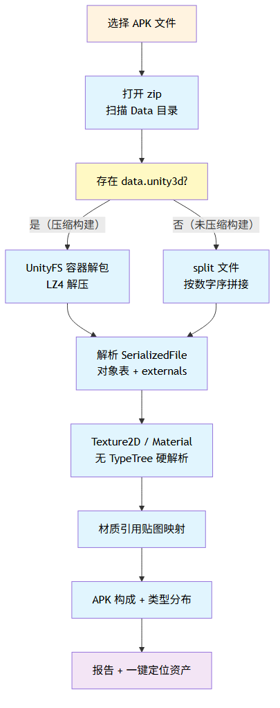
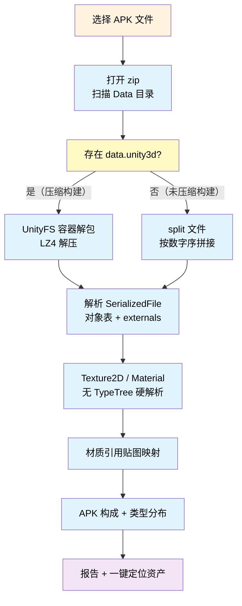
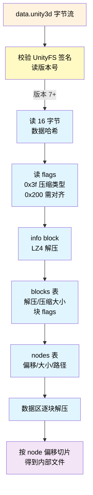
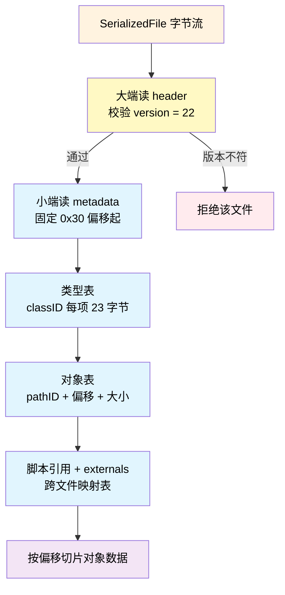
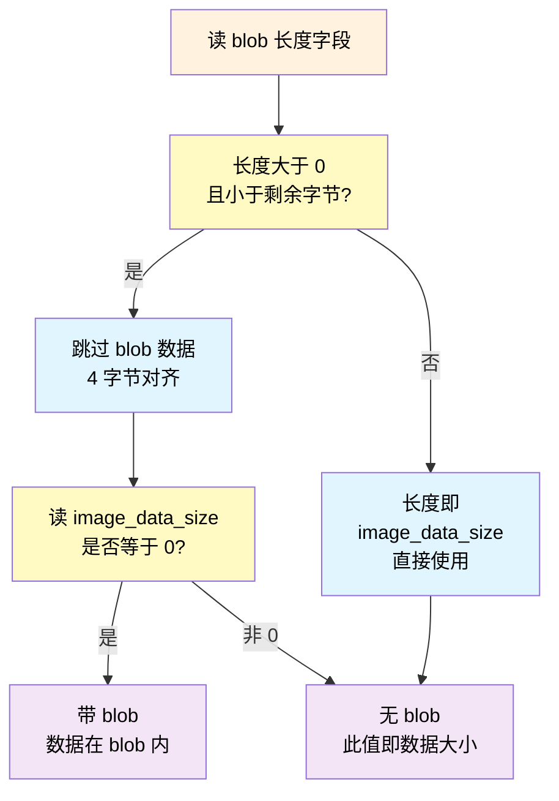
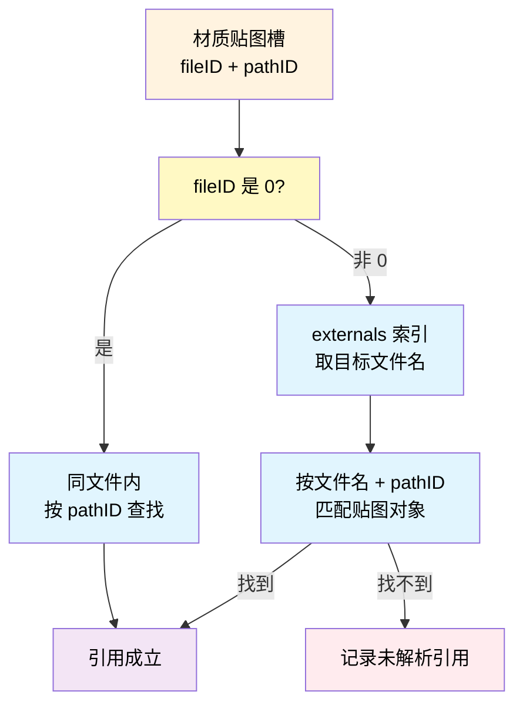
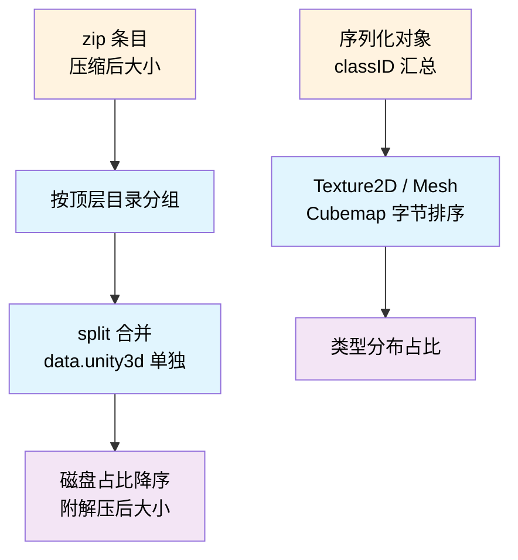

+++
date = '2026-08-28T10:00:00+08:00'
draft = false
title = 'Unity APK 打包数据逆向：无 TypeTree 硬解析工具实录'
tags = ['Unity', 'APK', '逆向', '打包', '工具']
categories = ['工具']
+++

> 一个 60 MB 的 Android 包，data 部分到底装了什么？每张贴图占多大？材质引用了哪些贴图？Unity 官方工具解不了打包后的数据（Player 内容没有 TypeTree），我干脆从二进制层面硬解析，写了一个编辑器内工具。这篇文章完整记录 Unity 2021.3.45f1 Android 打包数据的格式逆向过程——全部为实测结论。

## 背景：包为什么这么大

接到一个 Android 包的体积优化任务，初始 **107 MB**（Debug + 双 ABI）。经过一轮常规优化降到 **40 MB**：ARM64-only、Release 构建、Managed Stripping、清理 Always Included Shaders、贴图 Android 平台压缩成 ASTC。

优化完后有个问题一直没答案：**"明明场景里引用东西很少，为什么包还是这么大？没用到的东西会不会也打进去了？"** Unity 自己的 Build Report 只能看到资源级别的估算，拆开 APK 看实际内容才是硬道理。

尝试了现成工具，两条路都走不通：

| 工具 | 结果 |
|---|---|
| AssetStudio CLI | 无 TypeTree 时导出全部类型，直接吃掉 **30 GB 内存**被系统杀 |
| UnityDataTools（官方） | 靠 TypeTree 提字段，Player 打包内容 `enableTypeTree=false`，只能给对象级信息（"这里有 111 个 Texture2D"），拿不到尺寸/格式/引用 |

所以决定自己写：**二进制层面硬解析 SerializedFile，不依赖 TypeTree**。这就是本文要讲的格式逆向过程。

## 工具概览

最终交付是一个 Unity 编辑器窗口（菜单 `TA/APK 资源分析`，Odin UI），功能：

- **APK 构成**：按 zip 条目压缩后大小分组（lib 每个 .so 单独、data.unity3d、split 合并），能凑出整包大小
- **类型分布**：所有序列化对象按 classID 汇总字节数排序（Cubemap / Texture2D / Mesh / Shader…）
- **贴图清单**：名字、像素尺寸、GPU 格式、数据大小、所在文件，**未引用的标红**
- **材质清单**：每个材质引用哪些贴图（跨文件引用解析）
- **一键定位**：点击任意贴图/材质，在项目里 Ping 到对应资产
- 报告可导出文本

先理解打包产物的整体结构，再逐层拆格式。

## Unity Android 打包数据布局

Android 包本质是一个 zip，Unity 内容全部在 `assets/bin/Data/` 下：

| 文件 | 内容 |
|---|---|
| `globalgamemanagers` | 全局管理器（GraphicsSettings 等） |
| `globalgamemanagers.assets` | 全局共享资源（默认材质、shader 等） |
| `level0` / `level1`… | 每个场景一个 |
| `sharedassets0.assets` | 场景引用的资源集合 |
| `*.resS` | 贴图/网格的原始数据（StreamData 外部文件） |
| `unity default resources` | 引擎内置资源（水印、滚动条、**UnitySplash-cube**） |
| `data.unity3d` | **压缩构建**才有：UnityFS 容器，上面所有文件打包在内部 |
| `*.assets.splitN` | **未压缩构建**才有：超大文件按 1 MB 切块 |

这里出现第一个关键分叉：**同一个内容有两种物理形态**，取决于构建时是否启用 Compression（`data.unity3d`）。工具必须两种都支持。

## 数据获取：split 拼接与 UnityFS 容器

### 未压缩构建：split 切块

未压缩构建下，超过 1 MB 的文件会切成 `xxx.assets.split0`、`split1`…`split9`、`split10`…。拼接时有个隐蔽的坑：

> ⚠️ **必须按数字大小排序，不能按字符串排序**——字符串序会把 `split10` 排在 `split9` 前面，数据直接错乱。用 `int.Parse` 提取序号再排序。

### 压缩构建：UnityFS 容器（data.unity3d）

压缩构建把所有文件包进一个 `data.unity3d`，格式是 UnityFS Archive（Unity 的通用容器，AssetBundle 同款）。**Player 数据统一大端序**（和 AssetBundle 的字段序规则一致）。

容器头部（大端）：

| 字段 | 说明 |
|---|---|
| `"UnityFS"` 签名 | 8 字节 |
| `version` | u32，本项目 8 |
| `unityVersion` / `unityRevision` | NUL 结尾字符串（**不是**长度前缀） |
| `size` | i64 |
| `compressedBlockSize` / `uncompressedBlockSize` | 解压 info block 用 |
| `flags` | 0x3f=压缩类型（2/3=LZ4 block）、0x40=BlocksAndDirectoryInfoCombined、0x200=需要 16 字节对齐 |

info block（压缩的目录信息，解压后）：16 字节数据哈希 → blocks 表（每条 `uncomp u32 + comp u32 + flags u16`）→ nodes 表（每条 `offset i64 + size i64 + flags u32 + 路径 NUL 串`）。

> ⚠️ **对齐是双向的**：flags 带 0x200 时，info block 前和数据块区前都要 16 字节对齐（`pos = (pos+15) & ~15`），漏一个数据全是乱的。
>
> ⚠️ blocks 字段顺序是 **uncomp 在前、comp 在后**，解压时要按 comp 长度读、解到 uncomp 长度——写反了读出来的全是错位数据。

LZ4 是 block 格式，Unity 没有公开 API，自己实现了 ~30 行的 LZ4 block 解压（token 高 4 位字面量长度、低 4 位匹配长度 + 255 扩展字节）。

## SerializedFile v22：大端头 + 小端元数据

从容器/拼接拿到的每个文件（`sharedassets0.assets`、`level0`、`globalgamemanagers.assets`…）都是 **SerializedFile**。这是 Unity 的核心序列化格式，也是整个逆向的重点。

最反直觉的一点：**header 和 metadata 是不同字节序**——header 固定大端，metadata 和对象数据按 `m_FileEndianess` 标志（本项目 0 = 小端）。

### Header（大端）

| 偏移 | 字段 |
|---|---|
| 0x08 | `version` = 22（2021.3） |
| 0x18 | `fileSize` i64（用于完整性校验） |
| 0x20 | `dataOffset` i64（对象数据起始，通常 4096） |
| 0x30 | metadata 起点 |

### Metadata（小端）

从 0x30 开始：`unityVersion` NUL 串 → `targetPlatform` u32 → `enableTypeTree` 1 字节（Player 里为 false）→ `typeCount` → 类型表 → `objectCount` → 对象表 → 脚本引用 → externals。

类型表每项 23 字节：`classID i32 + IsStripped 1B + ScriptTypeIndex i16 (+ classID==114 时 16 字节 scriptID) + 16 字节 OldTypeHash`。

对象表每项 24 字节：

| 字段 | 类型 |
|---|---|
| `pathID` | i64 |
| `byteStart` | i64，**相对 dataOffset 的偏移**（实测 0xA0 → 绝对 0x10A0） |
| `byteSize` | u32 |
| `typeID` | i32，**指向类型表的索引**，不是 classID |

> ⚠️ `typeID` 是类型表的**下标**，要用它去类型表查真正的 classID（21=Material、28=Texture2D、43=Mesh、47/48=Shader…）。直接当 classID 用会解出完全错误的对象。
>
> ⚠️ `byteStart` 是相对偏移，必须加 `dataOffset` 才是文件绝对位置。

### Externals：跨文件引用

文件末尾是 externals 表——每个条目：`临时空串 + 16 字节 guid + 类型 u32 + pathName NUL 串`。**这就是跨文件引用的钥匙**：对象里的 PPtr `fileID` 从 1 开始计数，`fileID = externals 索引 + 1`（实测 `level0` 的 fileID=2 → externals[1] = `sharedassets0.assets`）。

## Texture2D 对象布局：从名字到数据大小

拿到对象原始字节后，没有 TypeTree 就要**按固定偏移硬读**。Texture2D（classID 28）在 2021.3 的字段顺序（实测 + AssetStudio 源码对照）：

| 字段 | 读取 |
|---|---|
| `m_Name` | AlignedString（长度前缀 + 4 字节对齐） |
| `m_ForcedFallbackFormat` | i32（Texture 基类） |
| `m_DownscaleFallback` | 1 字节 |
| `m_IsAlphaChannelOptional` | 1 字节（2020.2+）→ 对齐 |
| `m_Width` / `m_Height` | i32 × 2 |
| `m_CompleteImageSize` | i32 —— **完整数据大小（含全部 mip）** |
| `m_MipsStripped` | i32 |
| `m_TextureFormat` | i32（见枚举） |
| `m_MipCount` | i32 |
| `m_IsReadable` 等 | 4 字节 → 对齐 |
| `m_StreamingMipmapsPriority` / `m_ImageCount` / `m_TextureDimension` | i32 × 3 |
| `m_TextureSettings` | 6 字段（filterMode/aniso/mipBias/wrapU/V/W） |
| `m_LightmapFormat` / `m_ColorSpace` | i32 × 2 |
| `m_PlatformBlob` | u32 长度 + 数据（可选） |
| `m_Image_data_size` | i32 |
| `m_StreamData` | offset + size + path（条件性存在） |

这里藏着三个关键坑，每一个都让贴图解析失败过：

### 坑 1：`m_PlatformBlob` 判定（带 blob 时 image_data_size 必为 0）

`m_PlatformBlob` 是 2020.2+ 的多平台压缩数据数组。它的长度字段和 `m_Image_data_size` 共用同一个位置——**要么是 blob 长度，要么直接是数据大小**，怎么区分？

实测规则：**先读 v，若 v 有效则跳过 v 字节 + 对齐，再读下一个 i32；非 0 就回退**（说明 v 是 image_data_size）。之前误写"跳过 blob 后无条件读"导致 67 张带平台压缩的贴图全丢——回归验证立刻暴露。

### 坑 2：`m_StreamData` 只在 image_data_size == 0 时存在

贴图数据可能**内联在对象里**（`image_data_size > 0`），也可能**外置在 `.resS` 文件**（`image_data_size == 0`，此时读 StreamingInfo）。内联时**根本没有 StreamingInfo**，无脑去读会把数据开头当字段——之前 Watermark 贴图能解析成功纯属侥幸（数据开头碰巧是零）。

另外 **2020+ 的 StreamingInfo.offset 是 Int64**（不是 u32）——少读 4 字节，外置贴图全部错位失败。

### 坑 3：数据大小用 `m_CompleteImageSize`

用户要"每张贴图多大"——内联时是 `image_data_size`，外置时是 `StreamingInfo.size`，两者实测都和 **`m_CompleteImageSize`** 相等（Unity 报告的最终平台格式完整数据大小）。统一读它，一条路径覆盖两种情况。

TextureFormat 枚举（2021.3，数字对不上网上旧表）：50 = ASTC_RGBA_5x5、49 = ASTC_RGBA_4x4、47 = ETC2_RGBA8…ASTC 编号从 48 开始，之前的映射表整体偏了 14 位。

## 材质与跨文件引用

Material（classID 21）2021.3 布局：`m_Name` → `m_Shader` PPtr → `m_ValidKeywords`/`m_InvalidKeywords` StringArray → `m_LightmapFlags` → `m_EnableInstancingVariants` → `m_CustomRenderQueue` → `m_StringTagMap` → `m_DisabledShaderPasses` → `m_SavedProperties.m_TexEnvs`（每个槽：键 + 贴图 PPtr + scale/offset）。

**材质↔贴图引用解析**就是拿 TexEnv 里的 PPtr 去查：

externals 文件名要**去掉 `Library/` 前缀**再匹配（路径在打包时被改写）。实测 `Crystal_Clean` 材质 6 张贴图全部命中（MetallicSmoothness / Normal / Ramp21 / NoiseLava / Mask / CombinedVolumeNoise）——这就是"哪些贴图被用到了"的答案。

## 踩坑实录

| 坑 | 现象 | 对策 |
|---|---|---|
| split 字符串序拼接 | `split10` 排在 `split9` 前，数据错乱 | `int.Parse` 数字排序 |
| UnityFS blocks 字段序 | uncomp/comp 写反，解压全错 | 按 comp 读、解到 uncomp |
| 0x200 对齐标志 | 漏对齐，容器内文件全是垃圾 | info 块前、数据区前各对齐 16 |
| version 串是 NUL 结尾 | 当长度前缀读直接爆炸 | `StrToNull` |
| typeID 是类型表下标 | 当 classID 用全错 | `GetClassID(typeID)` 查表 |
| byteStart 相对偏移 | 对象从错误位置解析 | 加 `dataOffset` |
| AlignedString 对齐 | 长度 8 的字符串碰巧对，别的全歪 | 读后 4 字节对齐 |
| Material 2021.3 无 `m_ShaderKeywords` | 单字符串读法错位 | ValidKeywords/InvalidKeywords StringArray |
| PlatformBlob 判定 | 67 张贴图静默丢失 | 跳过 blob 后 image_data_size 非 0 即回退 |
| StreamingInfo 只在 size==0 时存在 | 内联贴图读数据开头当字段 | 条件读取 |
| StreamingInfo.offset 2020+ 是 Int64 | 外置贴图全部错位 | 读 8 字节 |
| TextureFormat 枚举偏移 | ASTC_5x5 显示成 ASTC_10x10 | 按 2021.3 枚举重写 |
| `Material.GetTexture` 缺属性会 LogError | Eval 探测时污染 Console | 先 `HasProperty` |

几个共通的调试方法：**用 Python 写一次性 probe 脚本**（读 zip → 拆容器 → 逐字段 hexdump），在 C# 实现之前先验证字节布局；每修一个坑必须**双样本回归**（压缩构建 + split 构建各跑一遍），单样本通过经常是侥幸。

## 凑出整包：文件级构成 + 类型分布

工具最终要回答"包怎么这么大"。两层对账：

**文件级**：zip 条目压缩后大小（= 磁盘占用），分组降序——`折射优化.apk`（60 MB）实测：

| 组 | 磁盘大小 | 占比 |
|---|---|---|
| `data.unity3d` | 36.2 MB | 63.2% |
| `libunity.so` | 11.0 MB | 19.2% |
| `libil2cpp.so` | 8.1 MB | 14.1% |
| assets 其他 | 1.9 MB | 3.3% |
| classes*.dex / META-INF / arsc… | < 0.1 MB | 合计 < 0.4% |

**所有条目压缩和 ≈ APK 实际大小**（差 8 KB 是 zip 中心目录元数据）——整包可对账，一眼看出大头。

**对象级**：所有序列化对象按 classID 汇总字节数（解压后序列化大小）：

| 类型 | 对象数 | 大小 |
|---|---|---|
| Cubemap（烘焙光探针） | 2 | 33.5 MB |
| Mesh | 17 | 3.2 MB |
| Texture2D | 111 | 3.1 MB |
| Shader | 85 | 2.2 MB |
| 其余（MonoBehaviour/材质/字体…） | — | < 1 MB |

**Cubemap 只 2 个却占了 33.5 MB**——烘焙场景光探针的 LDR_LLL1 是体积大头，这比"贴图 100 张"直观得多。

注意两个口径：**文件级是 zip 压缩后磁盘大小，对象级是解压后序列化大小**——前者对账 APK，后者看内容占比，不能混用。

## 实战：UnitySplash-cube 从包里消失

工具上线后立刻抓到一只"鬼"：贴图清单里 `UnitySplash-cube`，2048×1024 ETC2_RGBA8 **2.7 MB**，标记 `[未引用]`——没有任何材质引用它，却躺在包里。

排查：它不是项目资产，是 **Unity 引擎内置的启动画面（Splash Screen）立方体贴图**，来自引擎安装目录的 `unity_builtin_extra`（内置资源库，每个 Player 都会打包一部分）。项目设置 `m_ShowUnitySplashScreen: 1` 导致它被强制携带。

改 `ProjectSettings.asset` 关掉启动画面（`m_ShowUnitySplashScreen: 0`），下次打包这张贴图就从包里消失了。工具能证明"它没被引用 + 它在哪 + 多大"，决策就有依据。

类似地，`AreaTex`、`LDR_LLL1` 这些"不在 Assets 里却打进包"的资源，都能在清单里直接看到来源文件。

## 参考来源与开发流程

格式逆向过程中对照了两个公开仓库（**按需 clone 到临时目录，用完删除**，不常驻）：

| 参考 | 地址 | 看什么 |
|---|---|---|
| AssetStudio | github.com/Razviar/assetstudio | `SerializedFile.cs`（header/metadata/对象表/externals）、`Classes/Texture2D.cs`（2021.3 完整布局 + StreamingInfo + PlatformBlob）、`Classes/Material.cs`、`BundleFile.cs`（UnityFS flags/blocks/nodes） |
| UnityDataTools | github.com/Unity-Technologies/UnityDataTools | 官方解析实现对照；`Documentation/unity-content-format.md` 格式总览 |

验证流程固定两条：对**压缩构建**（折射优化.apk）和**未压缩构建**（analysis4.apk）各跑一次分析，贴图数/材质数/引用结果必须一致——单样本通过不可信，双样本才是格式解析的及格线。

## 总结

从"包为什么这么大"出发，最终得到的是一个能回答"包里每一部分装了什么、谁引用了谁、多大"的编辑器工具。核心收获：

- **Unity 打包数据是可以无 TypeTree 硬解析的**——SerializedFile v22 的对象布局是稳定的，字节序规则（大端头 + 小端数据）和字段顺序都可实测确定
- **Player 内容和 AssetBundle 是两套东西**：官方工具（UnityDataTools）和通用逆向工具（AssetStudio）都假设 TypeTree 存在，Player 内容的空白地带只能自己填
- **格式逆向的正确姿势是双样本验证**：任何布局结论必须同时通过压缩/未压缩两种构建的回归，单样本通过的解析大多是侥幸
