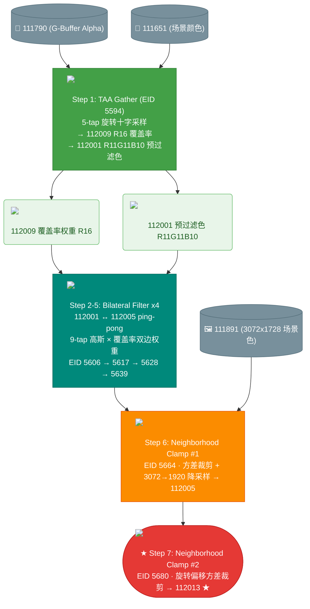
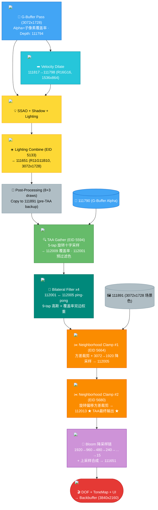
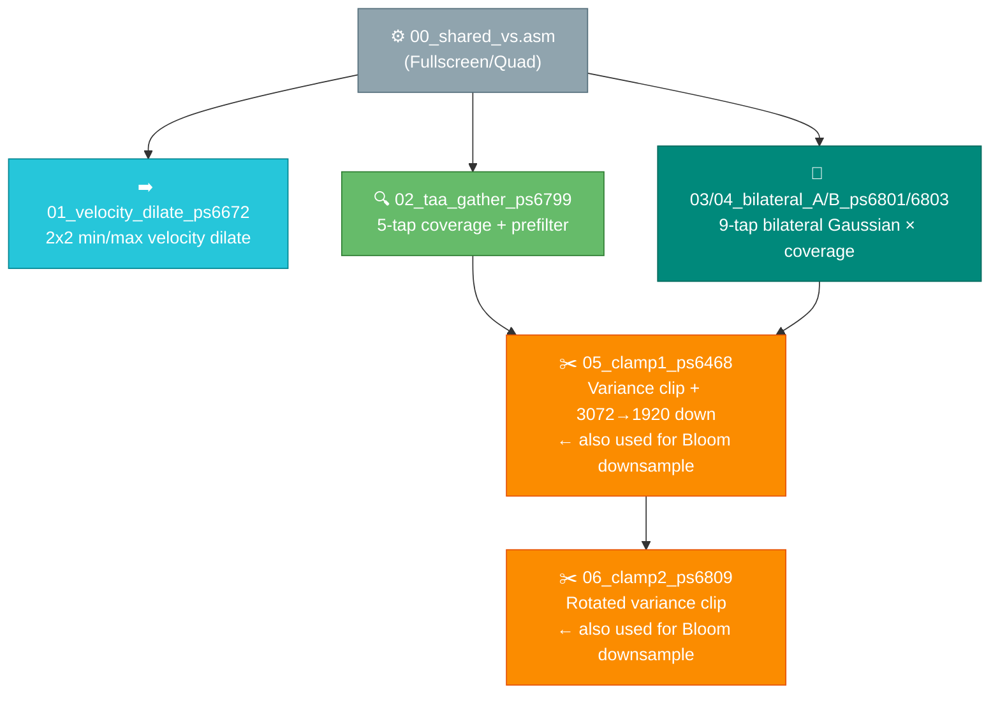

+++
date = '2026-04-24T10:30:00+08:00'
draft = false
title = '绝区零 TAA 流程详细分析'
tags = ['TAA', 'RenderDoc', '后处理']
categories = ['图形渲染']
+++

# 绝区零 (Zenless Zone Zero) TAA 流程详细分析

> Capture: `ZenlessZoneZero_2026.04.22_00.45_frame15282.rdc`
> API: D3D11 | 渲染分辨率: 3072x1728 | 输出分辨率: 1920x1080

---

## 目录

1. [整体管线概览](#1-整体管线概览)
2. [G-Buffer 渲染](#2-g-buffer-渲染)
3. [Velocity Buffer 生成](#3-velocity-buffer-生成)
4. [场景光照合成](#4-场景光照合成)
5. [TAA 核心管线](#5-taa-核心管线)
   - 5.1 [Step 1: TAA Gather](#51-step-1-taa-gather)
   - 5.2 [Step 2-5: 双边滤波](#52-step-2-5-双边滤波)
   - 5.3 [Step 6: Neighborhood Clamp #1](#53-step-6-neighborhood-clamp-1)
   - 5.4 [Step 7: Neighborhood Clamp #2](#54-step-7-neighborhood-clamp-2)
6. [Bloom 降采样链](#6-bloom-降采样链)
7. [最终合成](#7-最终合成)
8. [完整管线流程图](#8-完整管线流程图)
9. [关键特征总结](#9-关键特征总结)
10. [附录：Shader 反编译源码](#附录shader-反编译源码)

---

## 1. 整体管线概览

绝区零使用了一套**非传统的 TAA 方案**，核心特点：
- 不依赖 History Buffer 重投影，而是基于 G-Buffer Alpha 通道的**子像素覆盖率**进行空间重建
- 场景以 3072x1728 (1.6x) 超采样渲染，TAA resolve 时降采样到 1920x1080
- 4-pass 双边滤波 + 2-pass 方差裁剪，共 7 个 compute pass
- Bloom 降采样链复用 TAA 方差裁剪 shader

| 阶段 | 分辨率 | 格式 | Event Range |
|---|---|---|---|
| G-Buffer | 3072x1728 | 4xMRT | 2850-4138 |
| Velocity | 1536x864 | R16G16 | 4162-4174 |
| 场景合成 | 3072x1728 | R11G11B10_FLOAT | 5133-5579 |
| TAA Gather | 1920x1080 | R16 + R11G11B10 | 5594 |
| 双边滤波 x4 | 1920x1080 | R11G11B10 | 5606-5639 |
| 方差裁剪 x2 | 3072→1920 / 1920 | R11G11B10 | 5664-5680 |
| Bloom 降采样 | 960→15 | R11G11B10 | 5698-5782 |
| 最终合成 | 3072x1728 | R8G8B8A8 | 6127-8230 |

---

## 2. G-Buffer 渲染

**Event Range**: 2850-4138 (91 draws, pass index 38)

场景以 3072x1728 超采样分辨率渲染，输出 4 个 MRT：

| RT | Resource ID | 格式 | 推测用途 |
|---|---|---|---|
| RT0 | 111778 | R16G16B16A16_TYPELESS | 世界空间法线 + 材质参数 |
| RT1 | 111782 | R8G8B8A8_TYPELESS | BaseColor + Metallic/Alpha |
| RT2 | 111786 | R10G10B10A2_TYPELESS | 自定义数据 A |
| RT3 | 111790 | R10G10B10A2_TYPELESS | 自定义数据 B + **Alpha=子像素覆盖率** |

> **RT3 (111790)** 的 Alpha 通道是 TAA 的关键输入。R10G10B10A2 格式中 A2 只有 2 bit (4 级)，TAA Gather shader 通过 `alpha < 0.5` 判断像素是否为有效覆盖。

### G-Buffer 输出截图

| RT0 - 法线/材质 | RT1 - BaseColor |
|---|---|
|  |  |

| RT2 - 自定义数据A | RT3 - 自定义数据B (Alpha=覆盖率) |
|---|---|
|  |  |

### 深度缓冲


> D32S8 格式，3072x1728。深度缓冲在后续 DOF、运动模糊、速度提取等 pass 中均被读取。

---

## 3. Velocity Buffer 生成

**Event**: 4174 (pass index 40)

### Velocity Dilate Pass

- **输入**: `111817` (R16G16, 1536x864) — 原始 motion vector
- **输出**: `111798` (R16G16, 1536x864) — 膨胀后的 velocity

#### Shader 算法 (PS 6672)

```
对 2x2 邻域读取 4 个 velocity 值:
  o0.x = max(v0.x, v1.x, v2.x, v3.x)  // 水平最大速度
  o0.y = min(v0.y, v1.y, v2.y, v3.y)  // 垂直最小速度
```

这是一个 **速度膨胀** pass：取水平方向最大速度和垂直方向最小速度，确保运动物体的速度信息传播到邻近像素，避免运动物体边缘出现速度空洞。

### Velocity 输出截图


> R16G16 格式，1536x864（半分辨率）。R 通道=水平速度，G 通道=垂直速度。

<details>
<summary>📜 Shader 反编译: Velocity Dilate (PS 6672 + VS 6671)</summary>

[📄 shaders/01_velocity_dilate_ps6672.asm](shaders/01_velocity_dilate_ps6672.asm)

```asm
ps_4_0
      dcl_constantbuffer cb0[163], immediateIndexed
      dcl_resource_texture2d (float,float,float,float) t0
      dcl_input_ps_siv linear noperspective v0.xy, position
      dcl_output o0.xy
      dcl_temps 3
   0: mad r0.xyzw, v0.xyxy, l(2.0, 2.0, 2.0, 2.0), l(0.0, 0.0, 1.0, 1.0)
   1: add r1.xyzw, cb0[162].zwzw, l(-1.0, -1.0, -1.0, -1.0)
   2: min r0.xyzw, r0.xyzw, r1.xyzw
   3: ftoi r1.xyzw, r0.zwxw           // pixel coords set 1
   4: ftoi r0.xyzw, r0.xyzy           // pixel coords set 2
   5: mov r2.xy, r1.zwzz
   6: mov r2.zw, l(0,0,0,0)
   7: ld_indexable r2.xyzw, r2.xyzw, t0.xyzw   // load vel[0]
   8: mov r1.zw, l(0,0,0,0)
   9: ld_indexable r1.xyzw, r1.xyzw, t0.xyzw   // load vel[1]
  10: max r1.x, r1.x, r2.x           // max(Vx)
  11: min r1.y, r1.y, r2.y           // min(Vy)
  12: mov r2.xy, r0.zwzz
  13: mov r2.zw, l(0,0,0,0)
  14: ld_indexable r2.xyzw, r2.xyzw, t0.xyzw   // load vel[2]
  15: max r1.x, r1.x, r2.x
  16: min r1.y, r1.y, r2.y
  17: mov r0.zw, l(0,0,0,0)
  18: ld_indexable r0.xyzw, r0.xyzw, t0.xyzw   // load vel[3]
  19: max o0.x, r1.x, r0.x           // output: max Vx
  20: min o0.y, r1.y, r0.y           // output: min Vy
  21: ret
```

[📄 shaders/01_velocity_dilate_vs6671.asm](shaders/01_velocity_dilate_vs6671.asm)

</details>

### Velocity 下游消费者

| Event | 用途 |
|---|---|
| 4855 | 速度感知的 Bloom/ToneMap 混合 |
| 4882 | Motion vector + Depth 提取 (R32G32B32A32, 用于 DOF) |
| 4910 | 基于速度的遮罩生成 (R8, 用于动态模糊) |

### Motion + Depth 提取 (Event 4882)


> 从 velocity + 深度提取的高精度缓冲 (R32G32B32A32, 1536x864)，供 DOF 和运动模糊使用。

---

## 4. 场景光照合成

### SSAO (Events 4683-4760)


> R8G8B8A8 格式，3072x1728。先在 768x432 (R8) 计算，再上采样到全分辨率。

### Lighting Combine (Event 5133)

**核心 pass**：将 G-Buffer 的全部 4 个 RT + SSAO + 阴影 + IBL + 速度遮罩等共 11 个 texture 合成为最终场景颜色。

| 输入 | 格式 | 用途 |
|---|---|---|
| texture0: 111790 | R10G10B10A2 | G-Buffer RT3 |
| texture1: 111846 | R8G8B8A8 | SSAO |
| texture2: 111895 | R11G11B10 | 低分辨率光照 |
| texture3: 5976 | R16G16B16A16 | 预计算 LUT |
| texture4: 111794 | D32S8 | 深度缓冲 |
| texture5: 111879 | R8 | 速度遮罩 |
| texture6: 111858 | R8 | 低分辨率遮罩 |
| texture7: 10601 | R16G16B16A16 | 光照数据 |
| texture8: 111782 | R8G8B8A8 | G-Buffer RT1 |
| texture9: 111786 | R10G10B10A2 | G-Buffer RT2 |
| texture10: 111883 | R11G11B10 | 反射/高光 |

**输出**: `111651` (R11G11B10_FLOAT, 3072x1728) — 合成场景颜色

### 场景颜色 (TAA 前输入)

| 场景颜色 111651 (后处理后) | 场景颜色 111891 (TAA前备份) |
|---|---|
|  |  |

> `111651` 经过多个后处理 pass（event 5143-5277 的 8 draws + event 5537-5559 的 3 draws），然后在 event 5579 被复制到 `111891`。TAA neighborhood clamp 直接读取 `111891` 全分辨率场景色。

---

## 5. TAA 核心管线

TAA 核心管线包含 7 个 pass，event range 5594-5680：



---

### 5.1 Step 1: TAA Gather — 子像素覆盖率提取 + 颜色预过滤

**Event**: 5594 | **Shader**: PS 6799 | **Topology**: 3 verts (fullscreen triangle)

#### 输入输出

| 方向 | Resource | 格式 | 分辨率 | 说明 |
|---|---|---|---|---|
| 输入 t0 | 111790 | R10G10B10A2 | 3072x1728 | G-Buffer RT3 (Alpha=子像素覆盖) |
| 输入 t1 | 111651 | R11G11B10_FLOAT | 3072x1728 | 场景颜色 |
| **输出 o0** | **112009** | **R16** | **1920x1080** | **覆盖率权重 (0.0~1.0)** |
| **输出 o1** | **112001** | **R11G11B10_FLOAT** | **1920x1080** | **预过滤颜色** |

#### 输出截图

| 覆盖率权重 112009 (R16) | 预过滤颜色 112001 |
|---|---|
|  |  |

> 覆盖率图：亮=高覆盖(物体内部)，暗=低覆盖(边缘/背景交界)

#### Shader 算法详解 (PS 6799)

```
1. 5-tap 旋转十字采样 (Halton-sequence 风格偏移):

   采样位置 = uv + cb0[163].xy × offset
   偏移量:
     Center:  (0, 0)
     Tap 1:   (+1.35, -0.60)
     Tap 2:   (-1.35, +0.60)
     Tap 3:   (+0.60, +1.35)
     Tap 4:   (-0.60, -1.35)

2. 对每个采样点，检查 G-Buffer alpha:
   valid = (alpha < 0.5)   // A2 格式下 0~0.33 = 有效, 0.67~1.0 = 无效

3. 输出 R16 (覆盖率权重):
   coverage = valid_count / 5.0    // 范围 0.0 ~ 1.0

4. 输出 R11G11B10 (预过滤颜色):
   color = Σ(valid_sample_color) × (1/valid_count)
   // 仅累加有效采样的颜色，按有效采样数归一化
```

> **注**: 本帧 cb0[163] = (0,0,0,0)，jitter offset 为零。实际游戏中 jitter 在 G-Buffer 渲染时通过投影矩阵偏移施加，TAA resolve 阶段不需要显式知道 jitter 值。

<details>
<summary>📜 Shader 反编译: TAA Gather (PS 6799 + VS 6798)</summary>

[📄 shaders/02_taa_gather_ps6799.asm](shaders/02_taa_gather_ps6799.asm)

```asm
ps_4_0
      dcl_constantbuffer cb0[164], immediateIndexed
      dcl_sampler s0, mode_default
      dcl_resource_texture2d (float,float,float,float) t0   // G-Buffer (alpha=coverage)
      dcl_resource_texture2d (float,float,float,float) t1   // Scene color
      dcl_input_ps linear v1.xy
      dcl_output o0.xyzw    // R16 coverage weight
      dcl_output o1.xyzw    // R11G11B10 prefiltered color
      dcl_temps 6

   // --- Phase 1: 5-tap coverage sampling from G-Buffer alpha ---
   0: sample_indexable r0.xyzw, v1.xyxx, t0.xyzw, s0      // center
   1: ge r0.x, l(0.500000), r0.w                            // center valid?
   2: mad r1.xyzw, cb0[163].xyxy, l(1.35,-0.6,-1.35,0.6), v1.xyxy  // tap1+2 offset
   3: sample_indexable r2.xyzw, r1.xyxx, t0.xyzw, s0       // tap1
   4: ge r0.y, l(0.500000), r2.w                            // tap1 valid?
   5: and r0.xy, r0.xyxx, l(1,1,0,0)                        // → bool
   6: add r0.z, r0.y, r0.x                                  // count
   7: sample_indexable r2.xyzw, r1.zwzz, t0.xyzw, s0       // tap2
   8: ge r0.w, l(0.500000), r2.w                            // tap2 valid?
   9: and r0.w, r0.w, l(1)
  10: add r0.z, r0.w, r0.z                                  // count
  11: mad r2.xyzw, cb0[163].xyxy, l(0.6,1.35,-0.6,-1.35), v1.xyxy  // tap3+4 offset
  12: sample_indexable r3.xyzw, r2.xyxx, t0.xyzw, s0       // tap3
  13: ge r3.x, l(0.500000), r3.w                            // tap3 valid?
  14: and r3.x, r3.x, l(1)
  15: add r0.z, r0.z, r3.x                                  // count
  16: sample_indexable r4.xyzw, r2.zwzz, t0.xyzw, s0       // tap4
  17: ge r3.y, l(0.500000), r4.w                            // tap4 valid?
  18: and r3.y, r3.y, l(1)
  19: add r0.z, r0.z, r3.y                                  // total valid count

  // --- Phase 2: Output coverage weight ---
  20: mul o0.x, r0.z, l(0.200000)                           // coverage = count/5
  21: mov o0.yzw, l(0,0,0,0)

  // --- Phase 3: Weighted color accumulation from scene color ---
  22: sample_indexable r4.xyzw, r1.xyxx, t1.xyzw, s0       // tap1 color
  23: sample_indexable r1.xyzw, r1.zwzz, t1.xyzw, s0       // tap2 color
  24: mul r4.xyz, r0.yyyy, r4.xyzx                          // × tap1_valid
  25: sample_indexable r5.xyzw, v1.xyxx, t1.xyzw, s0       // center color
  26: mad r0.xyz, r5.xyzx, r0.xxxx, r4.xyzx                // + center×valid
  27: mad r0.xyz, r1.xyzx, r0.wwww, r0.xyzx                // + tap2×valid
  28: sample_indexable r1.xyzw, r2.xyxx, t1.xyzw, s0       // tap3 color
  29: sample_indexable r2.xyzw, r2.zwzz, t1.xyzw, s0       // tap4 color
  30: mad r0.xyz, r1.xyzx, r3.xxxx, r0.xyzx                // + tap3×valid
  31: mad r0.xyz, r2.xyzx, r3.yyyy, r0.xyzx                // + tap4×valid
  32: mul o1.xyz, r0.xyzx, l(0.2,0.2,0.2,0)                // × 1/5
  33: mov o1.w, l(0)
  34: ret
```

[📄 shaders/02_taa_gather_vs6798.asm](shaders/02_taa_gather_vs6798.asm)

</details>

---

### 5.2 Step 2-5: 双边滤波 (Bilateral Filter) ×4

4 个 pass 在 `112001` ↔ `112005` 之间 ping-pong，2 次完整迭代：

| Event | Shader PS | 输入 t0 | 输入 t1 | 输出 | 迭代 |
|---|---|---|---|---|---|
| 5606 | 6801 | 112001 (预过滤色) | 112009 (覆盖率) | **112005** | 迭代1-A |
| 5617 | 6803 | 112005 | 112009 | **112001** | 迭代1-B |
| 5628 | 6801 | 112001 | 112009 | **112005** | 迭代2-A |
| 5639 | 6803 | 112005 | 112009 | **112001** | 迭代2-B |

#### 中间结果截图

| Pass 1 输出 (112005) | Pass 2 输出 (112001) | Pass 4 最终 (112001) |
|---|---|---|
|  |  |  |

> 可以观察到每轮双边滤波后图像逐渐平滑，但边缘被覆盖率权重保护。

#### Shader 6801 (双边滤波 A) 算法详解

**9-tap 交叉双边高斯滤波器**，使用覆盖率缓冲作为双边 range kernel：

```
1. 读取中心像素覆盖率:
   center_cov = t1.Load(int2(px)).x     // R16 覆盖率值

2. 计算速度/覆盖率缩放的采样偏移:
   scale = cb0[163].x × center_cov
   offsets (× scale):
     (-4.5, -3.0), (-6.0, +1.5), (-1.5, +3.0),  // 左侧3点
     ( 0.0,  0.0),                               // 中心
     (+4.5, +6.0), (+1.5, -3.0), (+6.0, -1.5),  // 右侧3点
     (-3.0, +4.5), (+3.0, -4.5)                  // 交叉2点

3. 对每个采样点:
   a. 采样覆盖率: sample_cov = t1.Sample(offset_uv).yzwx.w
      // yzwx swizzle 将 R 通道移到 .w 位置
   b. 计算双边权重:
      diff = center_cov - sample_cov
      bilateral_w = saturate(1.0 - diff)
      // 覆盖率相似 → 同表面 → 高权重
      // 覆盖率不同 → 边缘 → 低权重
   c. 采样颜色: sample_color = t0.Sample(offset_uv)
   d. 累加: accum += bilateral_w × gaussian_w × sample_color

4. 高斯权重 (9-tap):
   [0.016216, 0.054054, 0.121622, 0.194595, 0.227027,
    0.194595, 0.121622, 0.054054, 0.016216]
                    ↑ 中心

5. 归一化:
   result = accum / (total_weight + 0.0001)
   result *= center_velocity_magnitude   // 6801 特有: 速度缩放
```

#### Shader 6803 (双边滤波 B) 与 6801 的差异

| 特性 | 6801 | 6803 |
|---|---|---|
| 中心覆盖率读取 | `t1.Load(int2(px))` | `t1.Load(int2(px))` 后乘以固定值 |
| 采样偏移计算 | `cb0[163].x × velocity × 常数` | 类似但常数值和计算顺序不同 |
| 最终输出 | `result × r6.x` (速度缩放) | `result / total_weight` (仅归一化) |
| 用途 | 迭代 A 步 | 迭代 B 步 (修正/锐化) |

**设计意图**: A 步执行宽度较大的平滑，B 步进行修正和轻微微锐化。两步交替迭代类似于 Jacobi 迭代求解，收敛速度比单 pass 更快。

<details>
<summary>📜 Shader 反编译: Bilateral Filter A (PS 6801)</summary>

[📄 shaders/03_bilateral_A_ps6801.asm](shaders/03_bilateral_A_ps6801.asm)

```asm
ps_4_0
      dcl_constantbuffer cb0[164], immediateIndexed
      dcl_sampler s0, mode_default
      dcl_resource_texture2d (float,float,float,float) t0   // color
      dcl_resource_texture2d (float,float,float,float) t1   // coverage (R16)
      dcl_input_ps linear v1.xy
      dcl_output o0.xyzw
      dcl_temps 7

   // Read center coverage
   1: mov r1.x, cb0[163].x
   2: mul r1.yz, v1.xxyx, cb0[163].zzwz  // pixel coords
   3: ftoi r2.xy, r1.yzyy
   5: ld_indexable r2.xyzw, r2.xyzw, t1.xyzw  // center_coverage = r2.x
   6: mul r1.x, r1.x, r2.x               // scale = cb0[163].x × coverage

   // 9-tap bilateral sampling with Gaussian weights:
   //   [0.016216, 0.054054, 0.121622, 0.194595, 0.227027,
   //    0.194595, 0.121622, 0.054054, 0.016216]
   // Offsets (× scale):
   //   (-4.5,-3.0), (-6.0,+1.5), (-1.5,+3.0),
   //   center,
   //   (+4.5,+6.0), (+1.5,-3.0), (+6.0,-1.5),
   //   (-3.0,+4.5), (+3.0,-4.5)
   //
   // For each tap:
   //   sample_cov = t1.Sample(offset).yzwx.w   // R→.w via swizzle
   //   bilateral_w = saturate(1 - abs(center_cov - sample_cov))
   //   accum += bilateral_w × gaussian_w × color
   //
   // Final:
   81: add r0.w, r0.w, l(0.0001)          // avoid div-by-zero
   82: div r0.xyz, r0.xyzx, r0.wwww       // normalize
   83: mul o0.xyz, r6.xxxx, r0.xyzx       // × center_velocity  ← unique to 6801
   84: mov o0.w, l(1.0)
   85: ret
```

</details>

<details>
<summary>📜 Shader 反编译: Bilateral Filter B (PS 6803)</summary>

[📄 shaders/04_bilateral_B_ps6803.asm](shaders/04_bilateral_B_ps6803.asm)

```asm
ps_4_0
      dcl_constantbuffer cb0[164], immediateIndexed
      dcl_sampler s0, mode_default
      dcl_resource_texture2d (float,float,float,float) t0   // color
      dcl_resource_texture2d (float,float,float,float) t1   // coverage (R16)
      dcl_input_ps linear v1.xy
      dcl_output o0.xyzw
      dcl_temps 7

   // Same 9-tap structure as 6801 but:
   // 1. Coverage × cb0[163].y (not .x) for offset scaling
   // 2. NO final velocity magnitude multiplication
   // 3. Pure normalized output: accum / total_weight
   //
   // Key difference at the end:
   75: add r0.w, r0.w, l(0.0001)
   76: div o0.xyz, r0.xyzx, r0.wwww       // just normalize, no velocity scale
   77: mov o0.w, l(1.0)
   78: ret
```

</details>

<details>
<summary>📜 Shader 反编译: Shared Fullscreen Triangle VS (VS 6798/6800/6802)</summary>

[📄 shaders/00_shared_vertex_shaders.asm](shaders/00_shared_vertex_shaders.asm)

```asm
vs_4_0
      dcl_input_sgv v0.x, vertexid
      dcl_output_siv o0.xyzw, position
      dcl_output o1.xy
      dcl_temps 1
   0: ishl r0.x, v0.x, l(1)
   1: and r0.x, r0.x, l(2)
   2: and r0.w, v0.x, l(2)
   3: utof r0.xy, r0.xwxx
   4: mad o0.xy, r0.xyxx, l(2,2,0,0), l(-1,-1,0,0)   // fullscreen clip coords
   5: add r0.z, -r0.y, l(1.0)                          // flip Y for UV
   6: mov o1.xy, r0.xzxx                               // texcoord
   7: mov o0.zw, l(0,0,1,1)                            // depth = 1
   8: ret
```

</details>

---

### 5.3 Step 6: Neighborhood Clamp #1 — 方差裁剪降采样

**Event**: 5664 | **Shader**: PS 6468 | **DrawIndexed** (6 verts, quad)

#### 输入输出

| 方向 | Resource | 格式 | 分辨率 | 说明 |
|---|---|---|---|---|
| 输入 t0 | 111891 | R11G11B10_FLOAT | **3072x1728** | 全分辨率场景颜色 |
| **输出** | **112005** | **R11G11B10_FLOAT** | **1920x1080** | **方差裁剪 + 降采样** |

> 关键：此 pass 同时完成 **TAA 方差裁剪** 和 **3072→1920 降采样**，是一体化操作。

#### 输出截图


#### Shader 算法详解 (PS 6468)

```
1. 5-tap 旋转十字采样 (邻域分析):
   offsets = cb0[164].xy × (0.4, 1.273) 像素距离
   采样位置:
     Tap1: (+0.4, +1.273)
     Tap2: (+1.273, -0.4)
     Tap3: (-0.4, -1.273)
     Tap4: (-1.273, +0.4)
     + Center

2. 计算邻域统计量:
   neighborhood_max = max(tap1, tap2, tap3, tap4, center).rgb
   neighborhood_sum = tap1 + tap2 + tap3 + tap4
   neighborhood_avg = (neighborhood_sum + center) × 0.2

3. 计算方差指标:
   max_luminance  = dot(neighborhood_max, (1,1,1))
   avg_luminance  = dot(neighborhood_avg, (1,1,1))
   variance = max(max_luminance - avg_luminance, 0) / max(avg_luminance, 1.0)

4. 自适应混合因子:
   blend = max(1.0 - variance, 0.1)
   // 方差大 → blend 小 → 保留细节 (高频区域)
   // 方差小 → blend 大 → 平滑抗锯齿 (低频区域)

5. 邻域裁剪 + 锐化:
   if (center == neighborhood_max):
       // 中心已在邻域范围内，保持原值
       result_clamped = neighborhood_sum
   else:
       // 中心超出邻域，进行裁剪 + 锐化
       deviation = neighborhood_sum - neighborhood_max × (1 - blend)
       result_clamped = (4 / (blend + 3)) × deviation

6. 加权中心混合:
   center_weighted = neighborhood_avg × 0.25 + center × (1 - 0.25)
   center_blended  = lerp(center_weighted, center, blend)

7. 最终输出:
   result = result_clamped × 0.21 + center_blended × 0.16
   // 0.21 + 0.16 = 0.37, 未完全归一化 → 略暗于原始值
```

<details>
<summary>📜 Shader 反编译: Neighborhood Clamp #1 (PS 6468)</summary>

[📄 shaders/05_neighborhood_clamp1_ps6468.asm](shaders/05_neighborhood_clamp1_ps6468.asm)

```asm
ps_4_0
      dcl_constantbuffer cb0[165], immediateIndexed
      dcl_sampler s0, mode_default
      dcl_resource_texture2d (float,float,float,float) t0
      dcl_input_ps linear v1.xy
      dcl_output o0.xyzw
      dcl_temps 5

   // Phase 1: 5-tap neighborhood sampling (offsets × 0.4 / 1.273)
   0: mad r0.xyzw, cb0[164].xyxy, l(0.4, 1.273, 1.273, -0.4), v1.xyxy
   1: sample_indexable r1.xyzw, r0.xyxx, t0.xyzw, s0     // tap1
   2: sample_indexable r0.xyzw, r0.zwzz, t0.xyzw, s0     // tap2
   4: mad r3.xyzw, -cb0[164].xyxy, l(0.4, 1.273, 1.273, -0.4), v1.xyxy
   5: sample_indexable r4.xyzw, r3.xyxx, t0.xyzw, s0     // tap3
   6: sample_indexable r3.xyzw, r3.zwzz, t0.xyzw, s0     // tap4
  13: sample_indexable r2.xyzw, v1.xyxx, t0.xyzw, s0     // center

   // Phase 2: Neighborhood max & sum
   7-12: max/accumulate → neighborhood_max (r0), neighborhood_sum (r1)

   // Phase 3: Variance metric
  15: dp3 r0.w, r0.xyzx, l(1,1,1,0)           // max_luminance
  18: dp3 r1.w, r3.xyzx, l(1,1,1,0)           // avg_luminance
  19-22: variance = max(max_lum - avg_lum, 0) / max(avg_lum, 1)

   // Phase 4: Adaptive blend factor
  23-24: blend = max(1.0 - variance, 0.1)

   // Phase 5: Neighborhood clamp + sharpen
  26: mad r3.xyz, -r0.xyzx, r1.wwww, r1.xyzx  // deviation
  27: eq r0.xyz, r0.xyzx, r2.xyzx              // is center == max?
  28-30: sharpened = (4/(blend+3)) × deviation
  31: movc r3.xyz, r0.xyzx, r1.xyzx, r3.xyzx   // select based on equality

   // Phase 6: Center blend
  32-35: center_blended = lerp(avg×0.25 + center×0.75, center, blend)

   // Phase 7: Final weighted output
  36: mul r0.xyz, r0.xyzx, l(0.16)             // center weight
  37: mad o0.xyz, r3.xyzx, l(0.21), r0.xyzx    // + clamped weight
  38: mov o0.w, l(0)
  39: ret
```

[📄 shaders/00_shared_vertex_shaders.asm](shaders/00_shared_vertex_shaders.asm) — Quad VS (VS 6467)

</details>

---

### 5.4 Step 7: Neighborhood Clamp #2 — 旋转偏移方差裁剪

**Event**: 5680 | **Shader**: PS 6809 | **DrawIndexed** (6 verts, quad)

#### 输入输出

| 方向 | Resource | 格式 | 分辨率 | 说明 |
|---|---|---|---|---|
| 输入 t0 | 112005 | R11G11B10_FLOAT | 1920x1080 | Clamp #1 输出 |
| **输出** | **112013** | **R11G11B10_FLOAT** | **1920x1080** | **★ TAA 最终输出 ★** |

#### 输出截图


#### 与 Clamp #1 的差异

| 特性 | Clamp #1 (6468) | Clamp #2 (6809) |
|---|---|---|
| 采样偏移 | (0.4, 1.273) | **(1.273, 0.4)** — 旋转 90° |
| 输入分辨率 | 3072x1728 | 1920x1080 |
| 输出分辨率 | 1920x1080 (降采样) | 1920x1080 (同分辨率) |
| 算法 | 完全相同 | 完全相同 |

> 两次方差裁剪使用**不同旋转角度**的采样偏移，类似于 TAA 中不同帧使用不同 jitter pattern 的思路，两次空间滤波的采样模式互补，减少混叠模式。

<details>
<summary>📜 Shader 反编译: Neighborhood Clamp #2 (PS 6809)</summary>

[📄 shaders/06_neighborhood_clamp2_ps6809.asm](shaders/06_neighborhood_clamp2_ps6809.asm)

```asm
ps_4_0
      dcl_constantbuffer cb0[165], immediateIndexed
      dcl_sampler s0, mode_default
      dcl_resource_texture2d (float,float,float,float) t0
      dcl_input_ps linear v1.xy
      dcl_output o0.xyzw
      dcl_temps 5

   // IDENTICAL algorithm to Clamp #1 (PS 6468)
   // Only difference: rotated sampling offsets
   //
   // Clamp #1 offsets: (+0.4, +1.273), (+1.273, -0.4), ...
   // Clamp #2 offsets: (+1.273, +0.4), (+0.4, -1.273), ...  ← 90° rotation
   0: mad r0.xyzw, cb0[164].xyxy, l(1.273, 0.4, 0.4, -1.273), v1.xyxy
   // ... rest is identical to 6468 ...
  38: mov o0.w, l(0)
  39: ret
```

[📄 shaders/00_shared_vertex_shaders.asm](shaders/00_shared_vertex_shaders.asm) — Quad VS (VS 6808)

</details>

---

## 6. Bloom 降采样链

TAA 输出 `112013` 直接进入 Bloom 降采样链。**每级降采样复用相同的方差裁剪 shader (6468/6809)**，确保 bloom 采样也经过 TAA 感知处理。

### 降采样层级

| Event | 输入 | 输出 | 分辨率 | Shader |
|---|---|---|---|---|
| 5698 | 112013 | 112017 | 960x540 | 6468 |
| 5714 | 112017 | 112021 | 960x540 | 6809 |
| 5732 | 112021 | 112025 | 480x270 | 6468 |
| 5748 | 112025 | 112029 | 480x270 | 6809 |
| 5766 | 112029 | 112033 | 240x135 | 6468 |
| 5782 | 112033 | 112037 | 240x135 | 6809 |

> 每级分辨率执行 2 次（6468 + 6809 交替），共 12 pass 降到 240x135。

### 降采样截图

| 960x540 | 480x270 | 240x135 |
|---|---|---|
|  |  |  |

### Bloom 上采样 + 合成

降采样到最低级后，逐级双线性上采样并累加 bloom 贡献，最终在 event 5842 写回 `111651` (3072x1728)。

| Bloom 合成后 (111651) |
|---|
|  |

---

## 7. 最终合成

### 7.1 DOF / 后处理合成 (Event 5914)

- **输入**: 深度 + 反射遮罩 + 场景颜色 + bloom 结果 + DOF 遮罩
- **输出**: `111639` (R11G11B10_FLOAT, 3072x1728) + `111647` (R8, DOF alpha)

| DOF 合成结果 |
|---|
|  |

### 7.2 Tone Mapping (Events 6097-6108)

1. **Event 6097**: `111639` → `112141` (R16G16B16A16, 1536x864) — 提取亮度信息
2. **Event 6108**: (112141 HDR + 112133) → (112145 LDR + 112149 bloom mask)

| Tone Mapped LDR (112145) |
|---|
|  |

### 7.3 UI 叠加 (Event 6127-6152)

1. **Event 6127**: (111639 HDR + 112145 LDR + 112149 bloom) → `112053` (R11G11B10, 3072x1728)
2. **Event 6152**: 112053 + UI 元素 → `112077` (R8G8B8A8, 3072x1728)

| HDR+LDR 合成 | 最终输出 (含 UI) |
|---|---|
|  |  |

### 7.4 Backbuffer 呈现 (Event 8230)

最终 `112077` 被复制到 3840x2160 的 backbuffer (`8070`, R8G8B8A8_UNORM) 并 Present。

---

## 8. 完整管线流程图



---

## 9. 关键特征总结

### 与传统 TAA 的对比

| 特征 | 传统 UE4 TAA | 绝区零 TAA |
|---|---|---|
| History Buffer | 有 (时域累积) | **无** (纯空间) |
| Jitter 施加方式 | 投影矩阵偏移 | 投影矩阵偏移 (相同) |
| 边缘保护 | Velocity-based reprojection | **覆盖率双边滤波** |
| 邻域裁剪 | Variance clip (AABB/clamp) | Variance clip (相同原理) |
| 迭代次数 | 1 pass | **4 pass 双边 + 2 pass 方差裁剪** |
| 超采样 | 无 (原生分辨率) | **1.6x 超采样 (3072/1920)** |

### 关键设计决策

1. **覆盖率驱动而非速度驱动**: 使用 G-Buffer Alpha (A2, 2-bit) 作为双边滤波的 range kernel，而非传统的 motion vector。这使得边缘保护更精确但依赖 G-Buffer 质量。

2. **多轮迭代双边滤波**: 4 pass 双边滤波比单 pass 更强地平滑锯齿。交替使用两个不同 shader (6801/6803) 类似于 Jacobi 迭代，收敛更快。

3. **方差裁剪 + 降采样一体化**: Neighborhood Clamp #1 同时完成 TAA 裁剪和 3072→1920 降采样，避免了先降采样再裁剪可能引入的额外锯齿。

4. **Bloom 继承 TAA**: 降采样链复用方差裁剪 shader，确保 bloom 采样也经过 AA 处理，避免在 bloom 中放大锯齿。

5. **两轮互补方差裁剪**: Clamp #1 和 #2 使用旋转 90° 的采样偏移，两次空间滤波的采样模式互补。

### 潜在问题

- **Ghosting**: 由于没有 History Buffer，纯空间方案在物体快速移动时无法利用时域信息，可能产生比传统 TAA 更多的 temporal aliasing
- **A2 精度限制**: Alpha 通道仅 2 bit (4 级)，覆盖率判断精度有限，可能导致边缘锯齿不够精细
- **计算成本**: 7 pass TAA (1 gather + 4 bilateral + 2 clamp) 比传统 1 pass TAA 显著更贵

---

*文档生成于 2026-04-24，基于 RenderDoc capture frame15282 分析*

---

## 附录：Shader 反编译源码

所有 shader 以 DXBC bytecode 反编译，带注释说明。文件位于 `shaders/` 子目录。

| 文件 | Shader | Event | 用途 |
|---|---|---|---|
| [00_shared_vertex_shaders.asm](shaders/00_shared_vertex_shaders.asm) | VS 6798/6800/6802/6467/6808 | 多处 | Fullscreen Triangle VS + Quad VS |
| [01_velocity_dilate_vs6671.asm](shaders/01_velocity_dilate_vs6671.asm) | VS 6671 | 4174 | Velocity Dilate 顶点着色器 |
| [01_velocity_dilate_ps6672.asm](shaders/01_velocity_dilate_ps6672.asm) | PS 6672 | 4174 | 2x2 Velocity 膨胀像素着色器 |
| [02_taa_gather_vs6798.asm](shaders/02_taa_gather_vs6798.asm) | VS 6798 | 5594 | TAA Gather 顶点着色器 |
| [02_taa_gather_ps6799.asm](shaders/02_taa_gather_ps6799.asm) | PS 6799 | 5594 | 5-tap 覆盖率提取 + 颜色预过滤 |
| [03_bilateral_A_ps6801.asm](shaders/03_bilateral_A_ps6801.asm) | PS 6801 | 5606, 5628 | 9-tap 双边滤波 A (含速度缩放) |
| [04_bilateral_B_ps6803.asm](shaders/04_bilateral_B_ps6803.asm) | PS 6803 | 5617, 5639 | 9-tap 双边滤波 B (纯归一化) |
| [05_neighborhood_clamp1_ps6468.asm](shaders/05_neighborhood_clamp1_ps6468.asm) | PS 6468 | 5664, 5698, 5732, 5766 | 方差裁剪 + 降采样 (偏移 0.4/1.273) |
| [06_neighborhood_clamp2_ps6809.asm](shaders/06_neighborhood_clamp2_ps6809.asm) | PS 6809 | 5680, 5714, 5748, 5782 | 旋转偏移方差裁剪 (偏移 1.273/0.4) |

### Shader 依赖关系图



