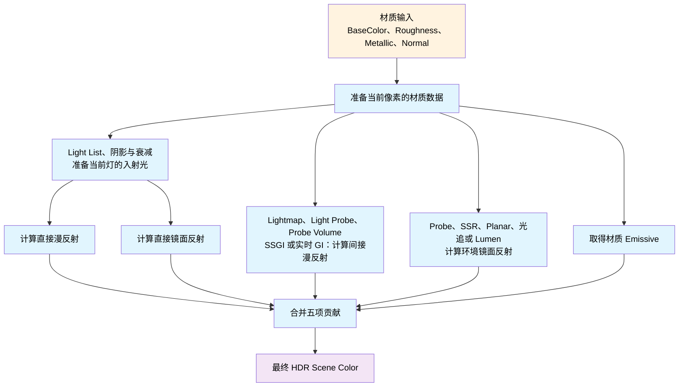
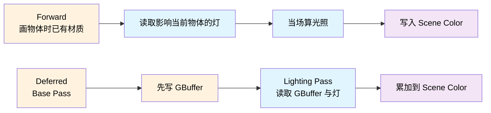
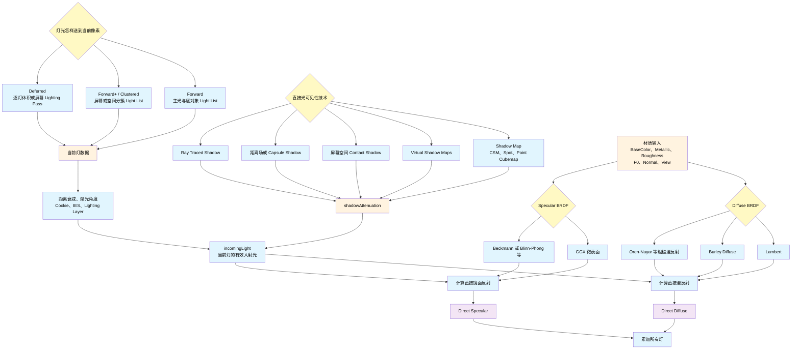
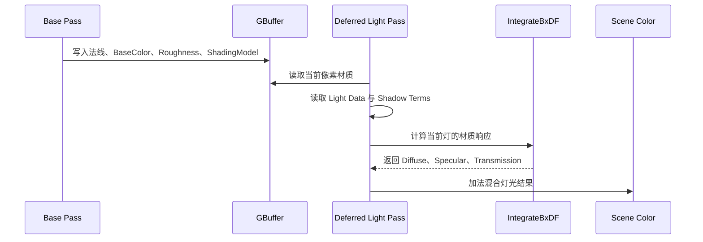
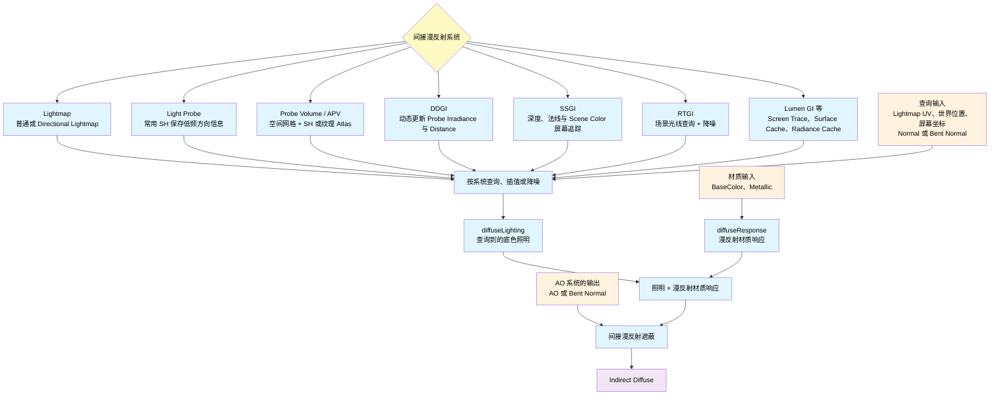
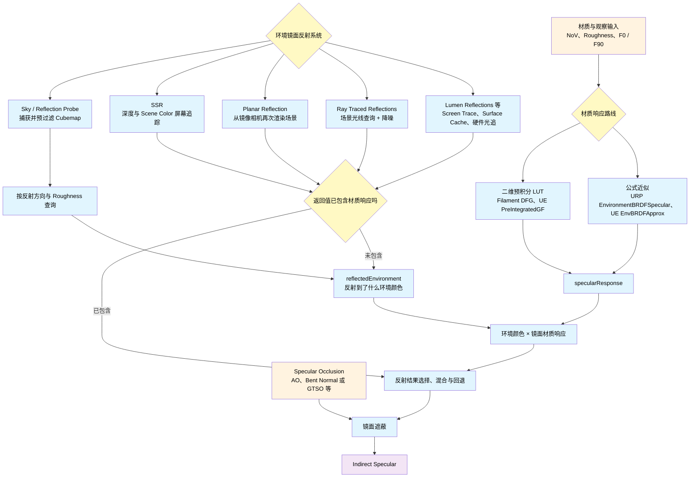
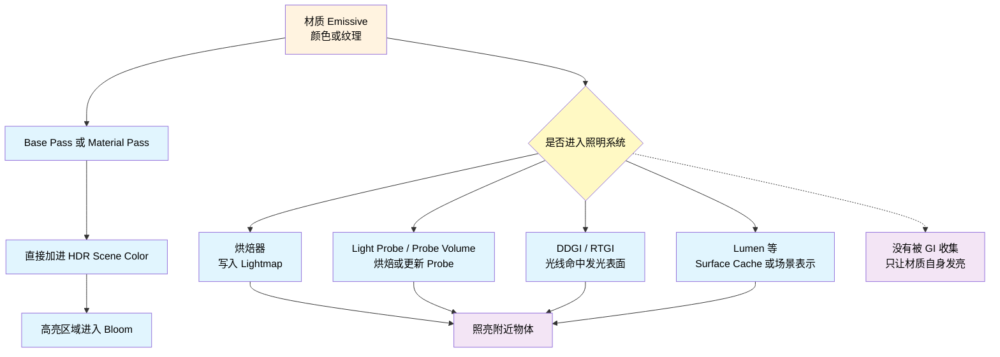
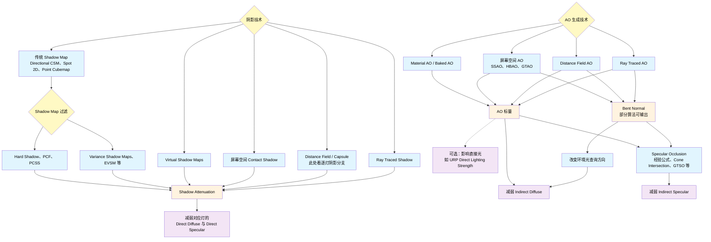
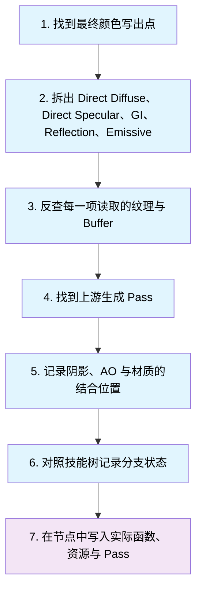

+++
date = '2026-09-28T22:55:04+08:00'
draft = true
title = '游戏光照统一框架：从光传输方程到实时实现'
tags = ['GPU', 'Shader', 'UE', 'Unity', '光照', 'PBR', 'BRDF', 'BSDF']
categories = ['图形渲染']
+++

## 这篇笔记怎么读

这篇笔记不准备从一串光照公式开始，而是顺着一帧画面去找答案：**数据是谁准备的、放在哪里、Shader 怎样取出来、最后加到了哪一项上。**

以后不管看 Filament、Frostbite、Unity URP、UE，还是具体游戏，都按下面五个问题追：

1. 这一项想解决什么画面问题？
2. 它需要哪些输入？
3. 输入由哪个 Pass 或 CPU 代码准备？
4. Shader 在哪里读取并计算？
5. 结果写到临时纹理、GBuffer，还是直接加进 Scene Color？

[PBRT 的光传输方程](https://www.pbr-book.org/4ed/Light_Transport_I_Surface_Reflection/The_Light_Transport_Equation)可以先理解成一句话：**你看到的表面颜色，来自它自己发出的光，以及它把周围的光反射到眼睛里的结果。** 游戏会把这份工作拆给不同系统：逐盏算灯光、读取 Lightmap 或 Probe、查询反射，最后合在一起。本文就沿着这些数据往下追，重点讨论普通不透明材质；玻璃透射、皮肤内部散射和体积雾需要另外展开。

## 一帧里的光照总账

### 先看数据流，不急着背名词



读 Shader 时，先把颜色分成五项：逐灯算出的漫反射和高光、从烘焙或环境系统取来的漫反射和倒影，再加上自发光。代码里常把后两项叫作 `indirectDiffuse` 和 `indirectSpecular`，本文沿用这些名字：

```hlsl
float3 color = emission;
color += directDiffuse;
color += directSpecular;
color += indirectDiffuse;
color += indirectSpecular;
```

这是一张读代码用的清单，五项不一定分别存放，也不代表执行顺序。**这里按“引擎从哪里取光”记账，不能只看通道名就判断光反弹了几次。** 例如 Lightmap 和 Light Probe 可以同时存着烘焙灯的直接照明与反弹光，天空也可以直接照亮表面；它们仍可能走名为 `GI` 或 `indirect` 的入口。具体装了什么，要看烘焙设置和上游生成过程。[Unity 的灯光模式说明](https://docs.unity3d.com/6000.0/Documentation/Manual/LightModes-introduction.html)明确区分了这些情况。

| 光照项 | 常见输入数据 | 常见计算位置 | 常见输出位置 |
|---|---|---|---|
| 直接漫反射 | Light Buffer、Light List、阴影、BaseColor、Normal | Forward 材质 Pass 或 Deferred Lighting Pass | Direct Diffuse 或已合并的 Direct Lighting |
| 直接镜面反射 | Light Buffer、Light List、阴影、Roughness、F0、Normal、View | Forward 材质 Pass 或 Deferred Lighting Pass | Direct Specular 或已合并的 Direct Lighting |
| 间接漫反射 | Lightmap、Light Probe / Probe Volume（常用 SH 编码）、DDGI、SSGI、RTGI、Lumen GI | Base Pass、GI Pass 或 Composite Pass | GBuffer 相关通道、GI 纹理或 Scene Color |
| 间接镜面反射 | Sky / Reflection Probe、SSR、Planar、Ray Traced Reflections、Lumen Reflections | 材质 Pass 或 Reflection Composite | Scene Color |
| 自发光 | 材质常量或 Emissive 纹理 | Base Pass / Material Pass | Scene Color；也可能被 GI 系统再次收集 |

### Forward 和 Deferred：先找到光照在哪儿算



所以分析一个游戏时，不要先问“它用了哪个 BRDF”，而应先确认它是在哪个 Pass 拿到材质和灯光的。入口找对以后，BRDF、阴影和 AO 才容易顺藤摸瓜。

## 直接光：同一盏灯怎样产生漫反射和高光

这一节看逐灯计算：拿到一盏灯的方向、颜色与阴影后，分别计算它照出的底色和高光。同一盏灯可以同时产生：

- **直接漫反射**：主要形成物体被照亮的底色，常受 BaseColor、Metallic 和法线影响。
- **直接镜面反射**：主要形成灯光高光，常受 Roughness、F0、法线和观察方向影响。

两项各占多少由材质决定，例如理想金属基本没有漫反射。Clear Coat 还会增加一层高光，这里先看基础材质。

### 通用实现流程



工程上，一盏灯通常会被整理成类似这样的数据：颜色、方向或位置、距离衰减、聚光角度、阴影衰减和所属 Lighting Layer。Shader 不需要知道灯是如何被编辑器摆进场景的，只需要消费这份已经整理好的结构。

一次直接光计算可以记成：**组织灯光 → 取灯 → 算衰减 → 查阴影 → 分别选择漫反射和镜面反射模型 → 累加。** 同一盏灯的距离衰减和普通阴影通常会同时作用于两项；区别主要来自后面的材质响应。图里的技术节点并不要求全部同时出现，例如一个 Deferred 游戏不会因此再走一遍 Forward+，一个使用 GGX 的材质也不会同时使用 Blinn-Phong。

阴影节点的分类可对照 [Epic 的 Shadowing 官方总览](https://dev.epicgames.com/documentation/unreal-engine/shadowing-in-unreal-engine)；这里关注它们最后怎样变成当前灯的可见性衰减，不在本篇继续展开每种阴影的采样公式。

### URP 17.3.0 的实际入口

URP 的总入口在 `ShaderLibrary/Lighting.hlsl`。下面是按数据流缩短后的代码，函数名保持与源码一致：

```hlsl
half4 shadowMask = CalculateShadowMask(inputData);
AmbientOcclusionFactor aoFactor = CreateAmbientOcclusionFactor(inputData, surfaceData);

Light mainLight = GetMainLight(inputData, shadowMask, aoFactor);
lightingData.mainLightColor = LightingPhysicallyBased(
    brdfData, brdfDataClearCoat, mainLight,
    inputData.normalWS, inputData.viewDirectionWS,
    surfaceData.clearCoatMask, specularHighlightsOff);

LIGHT_LOOP_BEGIN(pixelLightCount)
    Light light = GetAdditionalLight(lightIndex, inputData, shadowMask, aoFactor);
    lightingData.additionalLightsColor += LightingPhysicallyBased(
        brdfData, brdfDataClearCoat, light,
        inputData.normalWS, inputData.viewDirectionWS,
        surfaceData.clearCoatMask, specularHighlightsOff);
LIGHT_LOOP_END
```

外层代码看起来只返回一个颜色，但 `LightingPhysicallyBased()` 内部确实先拆了直接漫反射和直接镜面反射。按源码数据流缩短后，大致是：

```hlsl
half NdotL = saturate(dot(normalWS, lightDirectionWS));                  // 几何：表面越正对光源，接到的光越多；背对光源时为 0
half3 incomingLight = lightColor * lightAttenuation;                    // 光：灯本身的颜色和强度，经过距离、阴影等衰减后还剩多少

half3 diffuseResponse = brdfData.diffuse;                               // 材质：有多少底色留给漫反射；金属通常接近 0，非金属保留较多
half specularShape = DirectBRDFSpecular(                                // 高光形状：由粗糙度、法线、灯光方向和观察方向共同决定
    brdfData, normalWS, lightDirectionWS, viewDirectionWS);
half3 specularResponse = brdfData.specular * specularShape;             // 材质的 F0 颜色 × 当前方向上高光有多强

half3 directDiffuse = incomingLight * NdotL * diffuseResponse;          // 直接光漫反射 = 到达表面的光 × 表面朝向 × 漫反射材质响应
half3 directSpecular = incomingLight * NdotL * specularResponse;        // 直接光镜面反射 = 到达表面的光 × 表面朝向 × 镜面材质响应

return directDiffuse + directSpecular;                                  // 一盏灯对当前像素的完整直接光贡献
```

这段伪代码最好记成一句话：**直接光结果 = 到达表面的光 × 几何关系 × 材质响应**。

这里还要把“材质响应”和“最终光照结果”分清：

- `incomingLight` 回答“有多少光到达这里”，`NdotL` 回答“表面有没有朝着光”。后者才是漫反射中最直观的几何关系。
- `diffuseResponse` 更接近“经过金属度和反射率修正后，有多少底色留给漫反射”。它本身不表示表面朝向，也不是把所有项都写全的严格数学 BRDF。
- `specularShape` 回答“从当前观察方向看，高光落不落在这里”；`specularResponse` 再把这个形状染上材质的 F0 颜色。
- `directDiffuse` 与 `directSpecular` 才是材质接收这盏灯之后得到的两个最终光照结果。

URP 实际源码为了少用临时变量，先用一个 `brdf` 变量装 `brdfData.diffuse`，再把镜面部分加进去，最后统一乘包含 `NdotL` 的 `radiance`。这里故意拆成上面的写法，是为了把灯光、几何关系、材质响应和最终结果分别摆出来，而不是逐字复制源码。

这里值得记的职责分工是：

- `RealtimeLights.hlsl` 的 `GetMainLight()` 和 `GetAdditionalLight()` 负责把灯光、距离衰减、阴影等数据装进 `Light`。
- `LightingPhysicallyBased()` 同时计算直接漫反射和直接镜面反射，然后把两者合成一个颜色返回。
- `lightingData.mainLightColor` 与 `additionalLightsColor` 按“主光/附加光”分类，而不是按“漫反射/镜面反射”分类，最后由 `CalculateFinalColor()` 合并。

### UE 5.8 的 Deferred 路线

UE 的延迟渲染先在 Base Pass 把材质数据写入 GBuffer，之后再为灯光执行 Lighting Pass。`DeferredLightPixelShaders.usf` 中的 `GetDynamicLighting()` 读取 `FGBufferData` 和光源数据，继续进入 `DeferredLightingCommon.ush` 的 `IntegrateBxDF()`。

UE 在 `ShadingModels.ush` 中把返回值写得很直白：`FDirectLighting` 分别保存 `Diffuse`、`Specular` 和 `Transmission`。`IntegrateBxDF()` 再根据 `ShadingModelID` 选择 Default Lit、Subsurface、Clear Coat、Cloth 等具体实现。



URP Forward 是“画物体时循环灯”，UE Deferred 是“画完材质后再逐灯照亮屏幕”。URP 较早把直接漫反射和直接镜面反射加成一个颜色，UE 的 `FDirectLighting` 则把字段保留得更久，但两者都实际计算了这两项。

## 间接漫反射：先生成一份照明，再让材质来取

### 同一个 Shader 入口可以接很多来源

这一项给表面提供逐灯计算之外的底色照明：阴影里还能看见物体、白墙染上附近红墙的颜色、角色从室外走进室内时逐渐变暗。Lightmap 和 Probe 可以提前存好照明，SSGI、DDGI、Lumen 等系统则可以在运行时更新。**先问这份数据已经包含哪些灯、哪些反弹光，再决定还要加什么，避免把同一份光算两遍。**



这里特意没有把 SH 与 Light Probe、Probe Volume 并列：**Light Probe 和 Probe Volume 是照明系统，SH 是它们经常使用的数据编码方式。** [Unity 的 Light Probe 数据说明](https://docs.unity3d.com/Manual/LightProbes-TechnicalInformation.html)明确记录了其 SH 系数布局；[NVIDIA RTXGI 的 DDGI 算法说明](https://github.com/NVIDIAGameWorks/RTXGI-DDGI/blob/main/docs/Algorithms.md)则展示了动态 Probe 的 irradiance、distance、更新与可见性用途。SSGI 走的是另一条路，它依赖屏幕上已有的深度、法线和颜色。

因此，看到 `bakedGI` 时，先追宏和 Shader Variant：它可能接 Lightmap、Light Probe、Probe Volume 或实时 GI。变量名既不能证明数据来自烘焙，也不能证明里面只有反弹光。

### 一个游戏的环境漫反射通常怎样算

最常见的工程版本可以用这条链路概括：

1. 上游通过 Lightmap、Light Probe、Probe Volume、SSGI 或实时 GI 生成间接照明；其中 Probe 可能使用 SH 编码方向信息。
2. Shader 用 Lightmap UV、世界位置、屏幕坐标和表面方向查询。
3. 查询结果与材质的漫反射颜色结合。
4. AO 或 Bent Normal 用来减弱凹槽里不合理的环境亮度。
5. 结果放进 `indirectDiffuse`，而不是与某一盏实时灯混在一起。

这里所谓“环境光”在工程里往往就是某种间接照明输入，不一定存在一个叫 `AmbientLight()` 的独立函数。

### URP 17.3.0：`SAMPLE_GI` 抹平数据来源差异

在 URP 的 `GlobalIllumination.hlsl` 中，`SAMPLE_GI` 会根据编译配置展开到不同实现：

- 开启 Lightmap 时走 `SampleLightmap()`。
- 使用 Probe Volume 时走 `SampleProbeVolumePixel()`。
- 普通探针路线走 `SampleSHPixel()`。
- 开启屏幕空间 GI 时可以走 `SampleScreenSpaceGI()`。

材质 Pass 先把结果写进 `inputData.bakedGI`。随后 `Lighting.hlsl` 调用 `GlobalIllumination()`。源码在这里把 `bakedGI` 临时命名为 `indirectDiffuse`，但它还没有乘 `brdfData.diffuse`；从职责上看，此时更接近“查询到的间接照明”。真正的间接漫反射是在 `EnvironmentBRDF()` 内将它与材质的漫反射响应相乘后得到的，最后还会乘间接 AO。

把 `EnvironmentBRDF()` 也展开，并暂时忽略 Clear Coat 后，可以更直白地写成：

```hlsl
half3 diffuseLighting = bakedGI;                                        // 光：从当前 GI 路线查询到的底色照明
half3 diffuseResponse = brdfData.diffuse;                                // 材质：有多少底色留给漫反射，这是漫反射 BRDF 的材质响应部分
half3 indirectDiffuse = diffuseLighting * diffuseResponse;              // 查询到的照明 × 材质底色响应

half3 indirectSpecular = GlossyEnvironmentReflection(...);              // 光：从反射方向查询到的环境镜面照明
half3 specularResponse = EnvironmentBRDFSpecular(brdfData, fresnelTerm); // 材质：粗糙度、F0 和观察角度形成的环境高光响应
half3 indirectSpecularResult = indirectSpecular * specularResponse;      // 间接镜面反射 = 环境反射 × 镜面材质响应

half3 color = indirectDiffuse + indirectSpecularResult;                  // 合并两种间接反射
return color * occlusion;                                                // AO：减弱凹槽等难以接收环境光的位置
```

这条路线把工作拆成两段：上游和查询函数先算好“这个朝向的表面能接到多少照明”，当前 Shader 再用材质底色给它着色。表面朝向和亮度换算已经有各自的处理位置，不能在这里再随手乘一次 `NdotL` 或除一次 `π`。这种写法适合本例的漫反射近似；换材质模型时，要重新确认哪些计算已经做过。

### UE 5.8：预计算 GI 与 Lumen GI 走不同阶段

UE 的预计算间接光在 `BasePassPixelShader.usf` 中通过 `GetPrecomputedIndirectLightingAndSkyLight()` 取得，结果进入 `DiffuseIndirectLighting`，再与材质漫反射颜色以及 `AOMultiBounce()` 结合。

Lumen 和 SSGI 则不是简单塞进同一个 Base Pass 函数。`IndirectLightRendering.cpp` 的 `RenderDiffuseIndirectAndAmbientOcclusion()` 选择间接光方法、准备降噪结果与 AO 纹理，再通过 `DiffuseIndirectComposite.usf` 合成到 Scene Color。换句话说：**预计算间接光偏向在 Base Pass 消费，动态 GI 偏向独立生成纹理后再合成。**

Frostbite 的公开课程资料也采用类似的工程拆分思路：漫反射 GI、Reflection Probe、SSR 和天空反射分别准备，再在合适的位置组合，而不是让一个像素 Shader 临时追完整条光路。

## 环境镜面反射：先找倒影，再看材质怎样参与

逐灯高光回答“这盏灯在表面哪里亮”，环境镜面反射回答“表面映出了什么天空、房间和物体”。先看 Reflection Probe 最常见的做法：取一份按粗糙度预先过滤好的环境颜色，再乘材质响应，得到本文里的 `indirectSpecular`：

```hlsl
float3 indirectSpecular = reflectedEnvironment * specularResponse;      // 环境中反射到了什么 × 当前材质允许它显示多强
```

这条 Probe 路线里，光滑表面取清晰的环境 Mip，粗糙表面取更模糊的 Mip；材质响应决定倒影的颜色和强弱。SSR、光追和 Lumen 则可能在追踪、采样时就把材质响应算进去，输出已经着色的反射结果。读代码时要先认清拿到的是哪一种，避免再乘一遍材质响应。



图里按返回值把路线分开：拿到环境颜色，就继续算材质响应；拿到已经着色的反射结果，就进入合成。图中的混合和遮蔽表示需要追查的步骤，具体引擎可能提前在各来源内处理。[Epic 的 Reflection Environment 总览](https://dev.epicgames.com/documentation/unreal-engine/reflections-environment-in-unreal-engine)列出了这些反射系统。

### 先认清反射结果算到了哪一步

Probe 常把“环境颜色”和“材质响应”分开准备，最后相乘；追踪路线可以边采样边计算材质响应，直接累计成反射结果。[Filament 的反射源码](https://github.com/google/filament/blob/main/shaders/src/surface_light_indirect.fs)就同时包含这两种做法。后续合成还要看清各来源怎样接替：例如 SSR 命中时用屏幕结果，缺失处回退到 Probe，不能把几份完整倒影直接相加。

### 路线一：二维预积分 BRDF LUT（Filament、UE）

经典 Split-Sum 专门用来近似环境镜面反射的昂贵积分。它把原本纠缠在一起的计算拆成两部分：

```text
环境部分：预过滤环境 Cubemap —— 反射方向上有什么颜色
材质部分：二维 BRDF LUT       —— 当前角度和粗糙度下，反射应该有多强
```

所以要区分两个阶段的“输出”：

- **预处理阶段**准备预过滤环境 Cubemap 和 BRDF LUT。
- **当前像素阶段**查询两者并相乘，最终得到 `indirectSpecular`。

本文把这条路线落实为两个具体案例：Filament 的 DFG LUT，以及 UE 5.8 的 `PreIntegratedGF`。它们都用观察角度和粗糙度查询两个预积分权重，但坐标约定、通道名称和重建公式以各自实现为准，下面分别展开。

Roughness 在这里出现了两次，但职责不同：采样环境时，它决定倒影有多模糊；计算材质响应时，它决定镜面反射能量怎样分布。最好记成：**Cubemap 负责“反射到了什么”，BRDF LUT 或公式负责“这份反射显示多强”。**

这种预积分主要用于 Reflection Probe、Sky Light 和环境 Cubemap 等 IBL 路线。阴影由可见性查询处理；逐灯直接高光拥有明确的灯光方向，可以针对当前灯现场计算镜面 BRDF。

#### Filament：预过滤环境图 + DFG LUT

[Filament 的官方实现说明](https://google.github.io/filament/main/filament.html)使用典型的 Split-Sum 路线。`DFG` 的名字来自镜面微表面 BRDF 中的三个部分：

- **D（Distribution）**：有多少微表面朝向能把光反射进相机。
- **F（Fresnel）**：正面与掠射角观察时，反射强度怎样变化。
- **G（Geometry）**：有多少微表面没有被其他微表面挡住。

DFG LUT 把一大批方向上的材质计算提前做完，存成两个权重。这里按 Filament 当前公开源码的常规材质路线来读：R 存一份权重，G 存另一份，运行时用 F0 在两者之间插值。**LUT 的生成方式和读取公式必须配套，不能看见 RG 两个通道就套用别的引擎的公式。**

```glsl
float NoV = saturate(dot(normalWS, viewDirectionWS));                         // X：观察角度
vec2 dfg = textureLod(
    dfgLut, vec2(NoV, perceptualRoughness), 0.0).rg;                          // Y：感知粗糙度；读取配套的两个权重

float lod = computeLODFromRoughness(perceptualRoughness);                    // 粗糙度决定环境图的模糊 Mip
vec3 reflectedEnvironment = textureLod(
    prefilteredEnvMap, reflectionDirection, lod).rgb;                        // 第一部分：环境颜色

vec3 specularResponse = mix(dfg.xxx, dfg.yyy, f0);                           // 第二部分：用 F0 在两份权重间插值
vec3 indirectSpecular = reflectedEnvironment * specularResponse;             // 两部分合成最终环境镜面反射
```

上面只展开环境查询与 DFG 响应的组合，省略了能量补偿、遮蔽和额外材质层。[Filament 文档](https://google.github.io/filament/main/filament.html)把这套通道约定放在多次散射 LUT 小节中说明；实际消费端是 `specularDFG()`。

#### UE 5.8：反射来源 + `PreIntegratedGF`

UE 的环境颜色可能来自 Reflection Environment、Ambient Cubemap、SSR 或 Lumen Reflections。经典 Reflection Environment 路线中的 `PreIntegratedGF` 就是二维 BRDF LUT；`BRDF.ush` 使用 `float2(NoV, Roughness)` 采样 RG，再与材质的 F0/F90 组合：

```hlsl
half NoV = saturate(dot(normalWS, viewDirectionWS));                     // X：观察角度
half2 AB = PreIntegratedGF.SampleLevel(
    PreIntegratedGFSampler, float2(NoV, roughness), 0).rg;              // Y：粗糙度；返回 R=A、G=B

half3 specularResponse = F0 * AB.x + F90 * AB.y;                        // PreIntegratedGF 只提供权重，材质颜色在这里参与
half3 indirectSpecular = reflectedEnvironment * specularResponse;       // 反射来源颜色 × UE 的环境镜面材质响应
```

UE 的 LUT 重载还会使用 `SpecularColor * AB.x + saturate(50 * SpecularColor.g) * AB.y` 组合两个权重。SSR、Lumen 和光追反射则可能把采样、BRDF、降噪与合成分散到多个 Pass 中。分析这些路径时仍然追问两件事：**反射颜色从哪里来，材质响应在哪里乘进去。**

### 路线二：公式近似

这条路线用一小段公式直接计算 `specularResponse`，省去二维纹理采样。URP 17.3 的 `EnvironmentBRDFSpecular()` 是本文的主要案例；UE 的 `EnvBRDFApprox()` 也属于同一条路线。

#### URP 17.3：Reflection Probe + `EnvironmentBRDFSpecular()`

URP 的 `GlossyEnvironmentReflection()` 根据反射方向和 Perceptual Roughness 采样 Reflection Probe 等环境来源。随后 `EnvironmentBRDFSpecular()` 直接用公式近似材质响应：

```hlsl
half3 reflectedEnvironment = GlossyEnvironmentReflection(...);         // 环境部分：根据反射方向和粗糙度取得 Probe 颜色

half NoV = saturate(dot(normalWS, viewDirectionWS));                    // 观察角度：越接近 0，越靠近物体轮廓
half fresnelTerm = Pow4(1.0 - NoV);                                    // 掠射角权重：正面接近 0，轮廓附近接近 1
float surfaceReduction = 1.0 / (brdfData.roughness2 + 1.0);            // URP 这条近似中随粗糙度变化的缩放项
half3 specularResponse = surfaceReduction * lerp(
    brdfData.specular, brdfData.grazingTerm, fresnelTerm);             // 在 F0 颜色和掠射角响应之间插值

half3 indirectSpecular = reflectedEnvironment * specularResponse;      // Probe 环境颜色 × URP 的公式近似响应
```

`brdfData.specular` 相当于材质的 F0，`grazingTerm` 是 URP 根据 Smoothness 和 Reflectivity 提前准备的掠射角近似值。URP 选择公式来完成 LUT 所承担的职责，工程主线仍然是：**先取得经过粗糙度过滤的环境颜色，再算材质响应，最后相乘。**

### 对照总结

| 实现 | 环境颜色从哪里来 | 材质响应怎样得到 | 共同输出 |
|---|---|---|---|
| Filament | 预过滤环境 Cubemap | DFG LUT | `indirectSpecular` |
| UE 5.8 | Reflection Environment、Ambient Cubemap 等 | `PreIntegratedGF` 或公式近似 | 环境镜面反射结果 |
| URP 17.3 | `GlossyEnvironmentReflection()` 查询 Probe 等来源 | `EnvironmentBRDFSpecular()` 公式 | `indirectSpecular` |

以后分析实际游戏时，这一节只需要追三件事：**环境颜色从哪里来、Roughness 怎样参与过滤、材质响应通过 LUT 还是公式得到。**

## 自发光：写亮当前像素和照亮周围是两条路



这三件事要分开看：

- **自身发亮**：材质把 Emissive 加进当前像素。
- **出现光晕**：Bloom 读取高亮的 Scene Color，是后处理现象。
- **照亮周围**：烘焙器或实时 GI 系统必须把 Emissive 当成光能来源再次处理。

因此，霓虹灯牌自身很亮并带 Bloom，不代表它一定照亮了旁边的墙。工程上要继续确认 GI 输入里有没有这块 Emissive。

## 阴影和 AO 应该乘在哪里

阴影和 AO 都会让画面变暗，但查的东西不同。逐灯阴影检查“这盏灯有没有被挡住”；AO 估计“附近几何把周围多少方向堵住了”，常用来压住墙角、缝隙里的漏亮。AO 主要用于环境照明，一些引擎也让它影响直接光：URP 的 `Direct Lighting Strength` 就控制这部分效果。**最终影响哪一项，要沿代码看乘法发生在哪里。**



图里把容易混淆的名字拆成了“技术”和“输出”：SSAO、HBAO、GTAO、DFAO、RTAO 等技术生成 AO；Shadow Map、Virtual Shadow Maps、Contact Shadow、光追阴影等技术生成某盏灯的 `Shadow Attenuation`。[Unity URP 的 SSAO 文档](https://docs.unity3d.com/6000.0/Documentation/Manual/urp/ssao-renderer-feature-reference.html)、[NVIDIA 的 HBAO+ 说明](https://developer.nvidia.com/rendering-technologies/horizon-based-ambient-occlusion-plus)、[Intel 的 XeGTAO 实现](https://github.com/GameTechDev/XeGTAO)、[Epic 的 DFAO 文档](https://dev.epicgames.com/documentation/unreal-engine/distance-field-ambient-occlusion-in-unreal-engine)和 [Unity HDRP 的 RTAO 文档](https://docs.unity3d.com/Packages/com.unity.render-pipelines.high-definition@10.1/manual/Ray-Traced-Ambient-Occlusion.html)分别给出了这些路线的实际例子。其中 **VSM 这个缩写可能指 Variance Shadow Maps，也可能指 UE 的 Virtual Shadow Maps**，记录案例时应写全名。

因此，不能拿到 AO 就随手乘整个最终颜色：这会连自发光一起压黑，也绕过了引擎对直接光影响程度的控制。如果 GI 已经算过附近的遮挡，还要确认额外 AO 是补细节还是把同一处又压暗一次。

## 光照技能树：所有案例共用的一张总图

前面的章节最后都可以收回到这棵树里。它不是某个引擎的执行顺序，而是一张分析清单：树上列出一个常规 PBR 游戏可能用到的光照技能点，具体案例负责说明哪些节点真的出现、实际叫什么、数据从哪个 Pass 来。

```mermaid
flowchart TD
    ROOT["材质、场景与相机数据"] --> SPLIT{"反射光照"}
    SPLIT --> DIRECT
    SPLIT --> INDIRECT

    subgraph DIRECT["左：逐灯光照"]
        direction TD
        DR{"直接光"} --> DO{"灯光组织"}
        DO --> DO1["Forward Light List"]
        DO --> DO2["Forward+ / Clustered"]
        DO --> DO3["Deferred Lighting"]
        DO1 --> LD["灯光数据"]
        DO2 --> LD
        DO3 --> LD
        LD --> ATT["距离、角度、Cookie<br/>IES、Lighting Layer"]

        DR --> SV{"阴影技术"}
        SV --> SM["传统 Shadow Map<br/>CSM、Spot、Point Cubemap"]
        SM --> SF{"Shadow Map 过滤"}
        SF --> SF1["Hard、PCF、PCSS"]
        SF --> SF2["Variance Shadow Maps、EVSM"]
        SV --> BSH["烘焙阴影 / Shadow Mask"]
        SV --> CSH["云影调制"]
        BSH --> SAT
        CSH --> SAT
        SV --> SX{"其他实时阴影"}
        SX --> VS["Virtual Shadow Maps"]
        SX --> CS["屏幕空间 Contact Shadow"]
        SX --> DFS["Distance Field / Capsule<br/>逐灯阴影分支"]
        SX --> RTS["Ray Traced Shadow"]
        SF1 --> SAT["Shadow Attenuation"]
        SF2 --> SAT
        VS --> SAT
        CS --> SAT
        DFS --> SAT
        RTS --> SAT
        ATT --> IL["incomingLight"]
        SAT --> IL

        DR --> DM["材质输入<br/>BaseColor、Metallic、Roughness<br/>F0、Normal、View"]
        DM --> DB{"Diffuse BRDF"}
        DB --> DB1["Lambert"]
        DB --> DB2["Burley Diffuse"]
        DB --> DB3["Oren-Nayar 等"]
        DM --> SB{"Specular BRDF"}
        SB --> SB1["GGX 微表面"]
        SB1 --> GGF["解析或简化公式计算"]
        SB --> SB2["Beckmann、Blinn-Phong 等"]
        IL --> DDC["计算直接漫反射"]
        DB1 --> DDC
        DB2 --> DDC
        DB3 --> DDC
        IL --> DSC["计算直接镜面反射"]
        SB1 --> DSC
        SB2 --> DSC
        DDC --> DDO["Direct Diffuse"]
        DSC --> DSO["Direct Specular"]
        DR --> NEG["负光 / 艺术化压暗<br/>分别调节漫反射与镜面反射"]
        DDO --> DOUT["直接光输出"]
        DSO --> DOUT
    end

    subgraph INDIRECT["右：烘焙与环境光照"]
        direction TD
        IR{"GI 与环境反射入口"} --> AOR{"环境遮蔽"}
        AOR --> AOS{"屏幕空间 AO"}
        AOS --> AO2["SSAO、HBAO、GTAO"]
        AOR --> AOG{"材质或场景空间 AO"}
        AOG --> AO1["Material AO / Baked AO"]
        AOG --> AO3["Distance Field AO"]
        AOG --> AO4["Ray Traced AO"]
        AO1 --> AOV["AO"]
        AO2 --> AOV
        AO3 --> AOV
        AO4 --> AOV
        AO2 --> BN["Bent Normal<br/>部分算法可输出"]
        AO3 --> BN
        AO4 --> BN
        AOV --> SO["Specular Occlusion<br/>经验公式、Cone、GTSO 等"]
        AOV --> AOM["直接乘 AO 的镜面遮蔽"]
        AOM --> ISOC
        AOV --> AOC["可选：乘已有 Scene Color<br/>影响范围取决于当时已合成的内容"]
        AOV -.-> AOD["可选：影响逐灯光照<br/>如 URP 的直接光 AO"]
        BN --> SO

        IR --> IB{"照明来源"}
        IB --> GIR{"间接漫反射"}
        GIR --> GIB{"烘焙与低频 Probe"}
        GIB --> GI1["Lightmap<br/>普通或 Directional"]
        GIB --> GI2["Light Probe<br/>常用 SH 编码"]
        GIB --> ASH["环境 SH<br/>按表面朝向公式求值"]
        ASH --> GIQ
        GIB --> GI3["Probe Volume / APV<br/>网格 + SH 或纹理 Atlas"]
        GIR --> GID{"动态 Probe"}
        GID --> GI4["DDGI<br/>Probe Irradiance + Distance"]
        GID --> DSH["动态 SH 光照体积<br/>采样三维纹理后按方向求值"]
        DSH --> GIQ
        GIR --> GIT{"屏幕、光追与场景缓存"}
        GIT --> GI5["SSGI<br/>屏幕空间追踪"]
        GIT --> GI6["RTGI<br/>光线查询 + 降噪"]
        GIT --> GI7["Lumen GI 等<br/>Screen Trace + 场景缓存"]
        GI1 --> GIQ["查询、插值、时域积累或降噪"]
        GI2 --> GIQ
        GI3 --> GIQ
        GI4 --> GIQ
        GI5 --> GIQ
        GI6 --> GIQ
        GI7 --> GIQ
        GIR --> GIC["查询输入<br/>UV、位置、屏幕坐标<br/>Normal 或 Bent Normal"]
        GIC --> GIQ
        BN --> GIQ
        GIQ --> IRR["diffuseLighting<br/>查询到的底色照明"]
        GIR --> GIM["材质输入<br/>BaseColor、Metallic"]
        GIM --> IDR["diffuseResponse"]
        IRR --> IDM["照明 × 漫反射材质响应"]
        IDR --> IDM
        AOV --> IDAO["间接漫反射遮蔽"]
        IDM --> IDAO
        IDAO --> IDO["Indirect Diffuse"]

        IB --> ISR{"环境镜面反射"}
        ISR --> BGS["烘焙方向估算高光<br/>方向数据 + 高光公式 + GI 颜色"]
        BGS --> ISO
        ISR --> ISC{"捕获或重新渲染"}
        ISC --> IS1["Sky / Reflection Probe<br/>预过滤 Cubemap"]
        ISC --> IS3["Planar Reflection<br/>镜像相机再次渲染"]
        ISR --> IST{"动态追踪"}
        IST --> IS2["SSR<br/>屏幕空间追踪"]
        IST --> IS4["Ray Traced Reflections<br/>光线查询 + 降噪"]
        IST --> IS5["Lumen Reflections 等<br/>Screen Trace + 场景缓存"]
        IS1 --> RF["反射方向 + Roughness 查询"]
        IS2 --> RT{"返回值已包含材质响应吗"}
        IS3 --> RT
        IS4 --> RT
        IS5 --> RT
        RT -->|未包含| REC
        RT -->|已包含| RM["反射结果选择、混合与回退"]
        RF --> REC["reflectedEnvironment"]
        ISR --> ISMAT["材质与观察输入<br/>NoV、Roughness、F0 / F90"]
        ISMAT --> SRC{"环境镜面材质响应"}
        SRC --> LUT["二维 BRDF / DFG LUT"]
        SRC --> APX["公式近似"]
        LUT --> SR["specularResponse"]
        APX --> SR
        REC --> ISM["环境颜色 × 镜面材质响应"]
        SR --> ISM
        SO --> ISOC["镜面遮蔽"]
        ISM --> RM
        RM --> ISOC
        ISOC --> ISO["Indirect Specular"]
        IDO --> IOUT["间接光输出"]
        ISO --> IOUT
    end

    subgraph EMISSION["独立：自发光"]
        direction TD
        ER{"自发光"} --> EM["材质 Emissive"]
        EM --> EMS["贴图采样 / 顶点色 / 材质常量"]
        ER --> EFX["借用发光通道的效果<br/>透光、视角边缘光等"]
        EFX --> ESC
        EM --> ESC["写入 Scene Color"]
        ESC --> BLOOM["Bloom"]
        EM --> EDEC{"是否进入照明系统"}
        EDEC --> E1["烘焙进 Lightmap"]
        EDEC --> E2["更新 Light Probe / Probe Volume"]
        EDEC --> E3["进入 DDGI / RTGI"]
        EDEC --> E4["进入 Lumen Surface Cache 等"]
        EDEC --> EVX["体素化收集发光"]
        EVX --> EGI
        EDEC -.-> ENO["只让材质自身发亮"]
        E1 --> EGI["成为间接光系统的输入"]
        E2 --> EGI
        E3 --> EGI
        E4 --> EGI
    end

    DIRECT --> REFLECTSUM["Direct Diffuse + Direct Specular<br/>+ Indirect Diffuse + Indirect Specular"]
    INDIRECT --> REFLECTSUM
    REFLECTSUM ~~~ EMISSION
    REFLECTSUM --> SUM["四个反射光照桶 + Emissive"]
    EMISSION --> SUM
    SUM --> FINAL["最终 HDR Scene Color"]

    classDef root fill:#fff8e1,stroke:#f9a825,color:#000,stroke-width:3px
    classDef direct fill:#fbe9e7,stroke:#ff8a65,color:#000
    classDef occlusion fill:#eeeeee,stroke:#9e9e9e,color:#000
    classDef diffuse fill:#e8f5e9,stroke:#66bb6a,color:#000
    classDef specular fill:#e3f2fd,stroke:#42a5f5,color:#000
    classDef emission fill:#f3e5f5,stroke:#ab47bc,color:#000
    classDef result fill:#fff3e0,stroke:#ef6c00,color:#000,stroke-width:3px
    class GGF,BSH,CSH,NEG direct
    class AOM,AOC occlusion
    class ASH,DSH diffuse
    class BGS specular
    class EMS,EFX,EVX emission
    class ROOT,SPLIT root
    class DR,DO,DO1,DO2,DO3,LD,ATT,SV,SM,SF,SF1,SF2,SX,VS,CS,DFS,RTS,SAT,IL,DM,DB,DB1,DB2,DB3,SB,SB1,SB2,DDC,DSC,DDO,DSO,DOUT direct
    class IR,IB,AOR,AOS,AOG,AO1,AO2,AO3,AO4,AOV,AOD,BN,SO occlusion
    class GIR,GIB,GID,GIT,GI1,GI2,GI3,GI4,GI5,GI6,GI7,GIC,GIQ,IRR,GIM,IDR,IDM,IDAO,IDO diffuse
    class ISR,ISC,IST,IS1,IS2,IS3,IS4,IS5,RT,RM,RF,REC,ISMAT,SRC,LUT,APX,SR,ISM,ISOC,ISO,IOUT specular
    class ER,EM,ESC,BLOOM,EDEC,E1,E2,E3,E4,ENO,EGI emission
    class REFLECTSUM,SUM,FINAL result
```



读这棵树时只需要抓住五个最终光照桶：`Direct Diffuse`、`Direct Specular`、`Indirect Diffuse`、`Indirect Specular` 和 `Emissive`。阴影、AO、LUT、Probe、SSR 等名字都不是第六个光照桶，而是其中某条路径上的数据来源、查询方法或修正步骤。

总树左边追逐灯计算，右边追烘焙、GI 和环境反射，沿用前文按入口记账的方式。它展示各项怎样归类，不规定 Pass 顺序；例如屏幕追踪需要先有可用的深度和颜色，实际依赖要回到案例里确认。自发光单独成支，最后与四个反射光照项一起进入 HDR Scene Color。

总树用颜色区分光照类别，**这些颜色不表示某个案例已经启用它们**。每篇光照模型分析文章都在开头复制这张完整 Mermaid 总树，保留节点 ID 和分支结构，用状态色高亮该案例的实际实现：

- **绿色实线节点**：源码已确认的实现，节点内注明实际公式、纹理或函数。
- **蓝色虚线节点**：源码存在，但取决于平台、关键字或运行时开关；注明启用条件。
- **黄色节点**：只确认了部分数据流，具体算法或上游尚待确认。
- **浅灰节点**：本次没有点亮的公共技术，不能据此断言项目不支持。
- 发现实际技术在总树中没有对应节点时，先给公共总树补上通用技术分类，再同步案例树；内部项目名称和资源路径只写进本地案例。

案例保留总树全貌，后面的局部图再展开具体数据流。高亮表示源码证据；要断言某一帧确实启用，还需要材质、关键字或抓帧证据。

## 以后分析引擎或游戏时的固定模板

后续每个实际案例都放回同一套模板，而不是单独罗列零散函数：



每个案例最终至少回答这些问题：

| 要回答的问题 | 期望记录的内容 |
|---|---|
| 直接光从哪里来 | Light Buffer / Light List 的结构，主光和附加光循环入口 |
| 直接漫反射怎么算 | 使用了哪种 Diffuse BRDF，BaseColor、Metallic 与法线怎样参与 |
| 直接镜面反射怎么算 | 使用了哪种 Specular BRDF，Roughness、F0 与观察方向怎样参与 |
| 阴影从哪里来 | 阴影纹理或查询方法，在哪一步变成衰减值 |
| 环境漫反射怎么算 | Lightmap、Light Probe / Probe Volume、DDGI、SSGI、RTGI 或 Lumen GI 的生成与采样位置；Probe 是否使用 SH 等编码 |
| 环境镜面反射怎么算 | Sky / Reflection Probe、SSR、Planar、光追或 Lumen Reflections 怎样选择、混合与回退 |
| AO 怎样生成并乘到哪里 | Material AO、SSAO/HBAO/GTAO、DFAO 或 RTAO 生成了 AO、Bent Normal 还是 Specular Occlusion；最终影响哪些光照桶 |
| 自发光是否照亮别人 | 仅写 Scene Color，还是继续进入烘焙或实时 GI |
| 最后怎样合成 | Forward 材质 Pass、Deferred Lighting Pass 或独立 Composite Pass |
| 技能树点亮了什么 | 开头复制公共 Mermaid 总树并高亮实际分支，区分已确认、条件启用与待确认；局部图展开实际函数、资源与 Pass |
| 有没有重复计算 | 纹理里是否已经包含材质响应、遮蔽或某盏灯；多个 GI、反射来源是相加、混合还是回退 |

Filament、Frostbite、URP 17.3.0 和 UE 5.8.3 先作为参照。分项章节保留短例子，具体游戏的完整案例独立成节：从最终颜色往上追到生成 Pass，让同一帧的数据流连贯地放在一起。

## 参考

- [PBRT 4e：The Light Transport Equation](https://www.pbr-book.org/4ed/Light_Transport_I_Surface_Reflection/The_Light_Transport_Equation)
- [PBRT 4e：BSDF Representation](https://pbr-book.org/4ed/Reflection_Models/BSDF_Representation)
- [PBRT 4e：Infinite Area Lights](https://www.pbr-book.org/4ed/Light_Sources/Infinite_Area_Lights)
- [Google Filament：Physically Based Rendering in Filament](https://google.github.io/filament/Filament.md.html)
- [EA Frostbite：Moving Frostbite to Physically Based Rendering 2.0](https://media.contentapi.ea.com/content/dam/eacom/frostbite/files/course-notes-moving-frostbite-to-pbr-v2.pdf)
- [Khronos：Physically Based Rendering in glTF](https://www.khronos.org/gltf/pbr)
- [Unity 6.3：Introduction to Lighting](https://docs.unity3d.com/6000.3/Documentation/Manual/LightingInUnity.html)
- [Unity 6.3：Universal Render Pipeline](https://docs.unity3d.com/6000.3/Documentation/Manual/com.unity.render-pipelines.universal.html)
- [Unity：Light Probe 数据中的 SH 编码](https://docs.unity3d.com/Manual/LightProbes-TechnicalInformation.html)
- [Unity URP：Screen Space Ambient Occlusion](https://docs.unity3d.com/6000.0/Documentation/Manual/urp/ssao-renderer-feature-reference.html)
- [Unity HDRP：Ray-Traced Ambient Occlusion](https://docs.unity3d.com/Packages/com.unity.render-pipelines.high-definition@10.1/manual/Ray-Traced-Ambient-Occlusion.html)
- [Epic Games：Lighting the Environment](https://dev.epicgames.com/documentation/en-us/unreal-engine/lighting-the-environment-in-unreal-engine)
- [Epic Games：Shadowing](https://dev.epicgames.com/documentation/unreal-engine/shadowing-in-unreal-engine)
- [Epic Games：Reflection Environment](https://dev.epicgames.com/documentation/unreal-engine/reflections-environment-in-unreal-engine)
- [Epic Games：Distance Field Ambient Occlusion](https://dev.epicgames.com/documentation/unreal-engine/distance-field-ambient-occlusion-in-unreal-engine)
- [NVIDIA RTXGI：DDGI Algorithms](https://github.com/NVIDIAGameWorks/RTXGI-DDGI/blob/main/docs/Algorithms.md)
- [NVIDIA：Horizon-Based Ambient Occlusion Plus](https://developer.nvidia.com/rendering-technologies/horizon-based-ambient-occlusion-plus)
- [Intel GameTechDev：XeGTAO](https://github.com/GameTechDev/XeGTAO)
