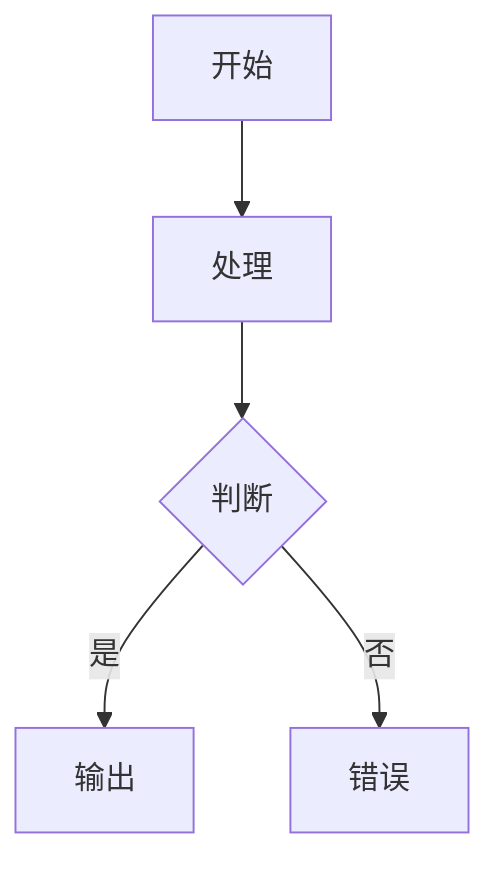
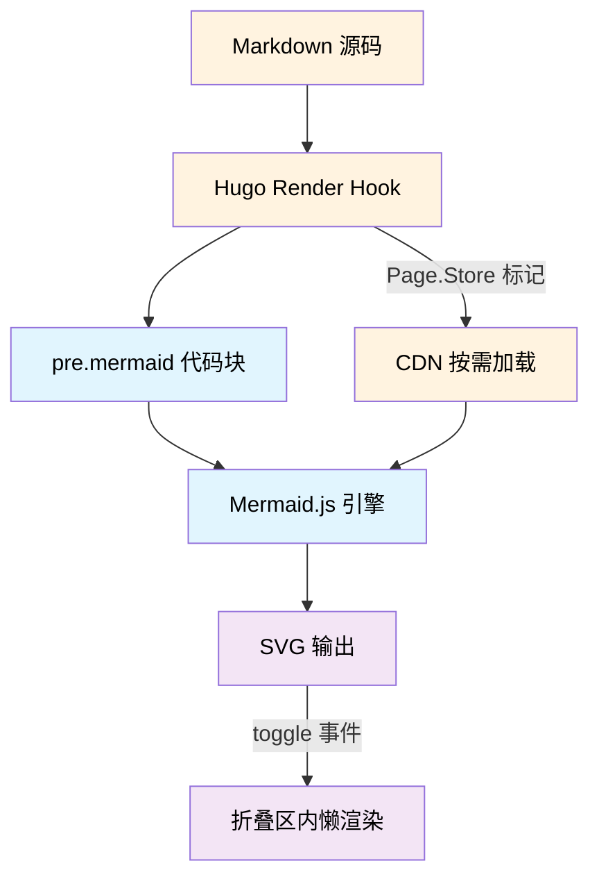
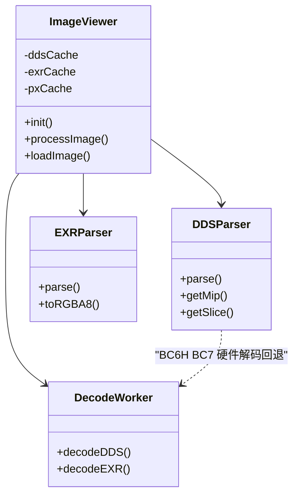

+++
date = '2026-07-19T00:00:00+08:00'
draft = false
title = '网站能力展示'
tags = ['Hugo', 'PaperMod', '网站功能', 'LLM参考']
categories = ['工具']
+++

> 本文档是本站所有技术能力的完整目录，既是向读者展示的"功能展示页"，也是供 LLM 写新文章时查阅的**功能参考手册**。列出的每项能力均已实装可用，写文章时可按需组合使用。

---

## 图片与纹理查看器

在文章中以标准 Markdown 语法 `` 或 `` 引用图片，页面会自动将其替换为**交互式纹理查看器**，支持通道检查、像素探针、Mip/Array 滑杆和范围重映射。

### DDS 纹理解码

浏览器端纯 JavaScript 解码 DDS 文件，无需预转 PNG。

- **压缩格式**：BC1（DXT1）、BC2（DXT3）、BC3（DXT5）、BC4（ATI1）、BC5（ATI2）、BC6H（HDR）、BC7
- **未压缩格式**：RGBA8、BGRA8、R8、R16、R16G16、RGBA16、R16F、R32F、R16G16F、R32G32F、RGBA16F、RGBA32F、RGBA64F、RGB96F、R11G11B10F、RGB9E5 等全部 DXGI 格式
- **特殊格式**：SNORM（R8S/R8G8S/RGBA8S 等）、深度格式（D32S8/D24S8）
- **解码架构**：BC1-5 + 未压缩在 Web Worker 中 CPU 解码；BC6H/BC7 主线程 WebGL2 硬件解码。Worker 池（4 个 Worker，round-robin 调度）避免阻塞主线程
- **相关文件**：`static/js/worker-shared.js` `static/js/dds-parser.js` `static/js/decode-worker.js`

**格式演示**（右键拖拽查看像素值，工具栏切换 R/G/B/A 通道）：

| 纹理 | 格式 | 说明 |
|------|------|------|
|  | R8G8B8A8_UNORM | 256×1 头发渐变 LUT（未压缩 RGBA） |
|  | BC7_UNORM | 256×256 IBL 漫反射 LUT（BC7 压缩） |
|  | BC7_SRGB | 256×256 角色眼部高光 MatCap（BC7 sRGB） |
|  | BC7_SRGB | 1024×32 皮肤阴影 LUT（异形 BC7） |
|  | BC6_UFLOAT | 128×128 IBL CubeMap（BC6H HDR + 8 Mip + 6 面） |
|  | R16G16_UNORM | 256×256 阴影贴图（16-bit 双通道） |

> 💡 ResourceId-16061 是 BC6H HDR CubeMap，试试 Mip 滑杆和 Array 滑杆切换不同面和 mip 级别。

### EXR（OpenEXR）解码

浏览器端解码 OpenEXR 文件（uncompressed，float32/half16）。

- **像素类型**：FLOAT（float32）、HALF（float16）
- **Tone Mapping**：线性到 sRGB 映射，支持自定义曝光
- **相关文件**：`static/js/exr-parser.js`

**格式演示**（拖拽黑/白点滑条查看 HDR 范围）：

| 纹理 | 格式 | 说明 |
|------|------|------|
|  | R11G11B10_FLOAT | 32×32 高光 LUT（HDR 浮点） |
|  | R11G11B10_FLOAT | 256×64 颜色渐变 LUT（HDR 浮点） |

### 通道查看器

每张 DDS/EXR 图片自动附带工具栏，可单独查看 R / G / B / A / RGB / RGBA 通道。

- 点击按钮切换通道，当前通道按钮高亮
- 适用于调试纹理各通道数据（如法线贴图的 XY 存 RG、粗糙度存 G 等）
- **相关文件**：`static/js/image-viewer.js` `assets/css/extended/channel-viewer.css`

### 像素探针

- **中键点击**：固定像素窗口，显示当前鼠标位置像素的 RGBA 值
- **右键拖拽**：浮动像素窗口，跟随鼠标实时显示像素值
- 支持 DDS 和 EXR 格式
- **相关文件**：`static/js/image-viewer.js`

### Mip Level / Array Slice / Volume Depth 滑杆

对于含多级 Mipmap、多层 Array 或 3D 体积的 DDS 文件，查看器自动显示对应滑杆切换层级。

- Mip slider：切换到不同 mipmap 级别，标签 `Lv.X / N`
- Array slider：切换到不同 array slice（cubemap 6 面 / texture array），标签 `F.X / N`
- Volume depth slider：3D 纹理深度切片切换，标签 `D.X / N`，范围随 mip 变化动态更新
- 从 DDS header 和 JSON sidecar 读取元数据
- **相关文件**：`static/js/image-viewer.js`

### 颜色范围重映射

所有 DDS/EXR 图片均提供黑点/白点范围滑条，支持浮点格式的 HDR 范围实时重映射。

- **浮点格式**：基于 min/max 自动归一化，滑条反向重映射
- **SNORM 格式**：[-1,1] 范围归一化后重映射
- **深度格式**：D32S8/D24S8 范围重映射
- **EXR AutoFit**：扫描原始浮点值范围后自动适配
- **相关文件**：`static/js/color-remap.js`

### 采样模式切换

查看器工具栏提供点采样 / 线性采样切换按钮。

- **点采样**（Point / Nearest）：整数格式（UINT/INT/SINT）自动启用，像素精确显示
- **线性采样**（Linear / Bilinear）：默认模式，放大时平滑插值

### 图片元数据叠加层

通过 JSON sidecar（与图片同名 `.json`）可为图片附加元数据覆盖层，显示：

- 文件名、Event ID（RenderDoc）、资源名
- 格式、尺寸、Mip 详情（每级尺寸和大小）
- Alpha 模式、Array 大小、1D 纹理标记
- 解码耗时（ms，左下角）、显示分辨率 / 原始分辨率（右下角）
- 浏览器 URL 和本地文件路径复制按钮

### 图片 Worker 池与缓存

- **Worker 池**：4 个 Web Worker，round-robin 调度，避免阻塞主线程
- **Transferable 对象**：像素缓冲区零拷贝传回主线程
- **大图子采样**：超过 1024px 的图片支持步进采样加速解码
- **四级缓存**：`ddsCache` / `exrCache` / `pxCache`（RGBA8 像素） / `jsonCache`

### 竖翻转支持

通过 JSON sidecar（与图片同名 `.json`）添加 `{"flip_y": true}` 可自动竖翻转图片。常用于 RenderDoc 导出的纹理（DX/GL 坐标系差异）。

### 图片懒加载

IntersectionObserver 监听视口（800px rootMargin），仅在图片即将可见时才触发解码，节省带宽和 CPU。

- **相关文件**：`static/js/image-viewer.js`

---

## 图表与流程图

### Draw.io 交互式图表

通过 `drawio` 短代码嵌入 `.drawio` XML 文件，渲染为可交互的内嵌图表。

- 支持缩放、平移、点击节点
- 自动检测页面亮/暗主题，同步设置 draw.io 暗色模式
- 自动解析图表内容边界，动态调整容器宽高比
- 内置深色/浅色边框自适应（亮色主题 `#e5e7eb`，暗色主题 `#333`）
- 无 JavaScript 时显示回退链接（在 draw.io 中打开）

**用法**：

```go



```

- **参数**：`src`（必填，图片文件名）、`ratio`（宽高比，默认 `3/1`）、`height`（固定高度 px，与 ratio 互斥）
- **位置**：`.drawio` 文件放在文章 Page Bundle 目录中
- **相关文件**：`layouts/shortcodes/drawio.html`

**效果演示**（微服务架构图）：



### Mermaid 图表

使用 `` ```mermaid `` 代码块直接编写流程图、类图、时序图、状态图等，页面自动渲染为 SVG。

- Mermaid 11.x 引擎，支持 flowchart / classDiagram / sequenceDiagram / stateDiagram 等
- `<<interface>>` `<<abstract>>` 等 UML stereotype 语法自动修复（HTML 解析器转义问题）
- `<br/>` 换行符自动保留
- 暗色模式自动切换主题
- 节点文字强制黑色 fill（`!important`），阻止 Dark Reader 插件覆盖
- 折叠区块内懒渲染（toggle 事件触发重新渲染）
- **flowchart** 用 `classDef` 定义配色（`proc`/`dec`/`io`/`ok`/`err`/`result`），**classDiagram 不支持 `classDef`**
- 标准配色方案（六种：`proc`/`dec`/`io`/`ok`/`err`/`result`，均含显式 `fill` 和 `color`）

**用法**：

````text

````

- **相关文件**：`layouts/_markup/render-codeblock-mermaid.html`

**效果演示**（flowchart 流程图）：



**效果演示**（classDiagram 类图）：



---

## GPU 可视化

### GPU 资源依赖图（gpugraph）

嵌入 GPU 渲染管线的资源依赖关系图，展示 DrawCall / Dispatch / UAV / RT / Shader 之间的依赖链。

- 基于 vis-network 库的交互式网络图
- 节点可拖拽、缩放、点击高亮上下游依赖
- 五种节点类型自动着色：DrawCall（蓝）、Dispatch（绿）、UAV（橙）、RT（红）、Shader（紫）
- 工具栏：启用/禁用物理布局、自适应缩放、节点信息提示
- 亮/暗主题自适应

**用法**：

```go

```

- **参数**：`src`（必填，JSON 数据文件）、`height`（画布高度 px，默认 520）
- **位置**：JSON 文件放在文章 Page Bundle 目录中
- **相关文件**：`layouts/shortcodes/gpugraph.html` `static/js/gpu-graph.js` `assets/css/extended/gpu-graph.css`

**效果演示**（Nanite VisBuffer 依赖图——拖拽节点、点击高亮上下游）：



> 💡 点击 "启用物理" 按钮让节点动起来，滚轮缩放，拖拽平移。

### GPU Trace 查看器（gputrace）

嵌入 RenderDoc 导出的 GPU 事件追踪 HTML 文件，以 iframe 渲染完整 GPU 时间线。

- 读取本地 HTML 文件内容，通过 `Blob URL` 加载为 iframe
- 工具栏：显示文件名、在新窗口打开、在资源管理器中定位源文件
- 容器可垂直拖拽调整高度

**用法**：

```go

```

- **参数**：`src`（必填，HTML 文件）、`height`（iframe 高度 px，默认 700）
- **位置**：HTML 文件放在文章 Page Bundle 目录中
- **相关文件**：`layouts/shortcodes/gputrace.html`

**效果演示**（NaniteBasePass GPU Trace）：



---

## 数学公式

### KaTeX 数学渲染

基于 KaTeX 0.16.11 的公式渲染，支持行内和显示模式。

- `$...$` 或 `\(...\)`：行内公式
- `$$...$$` 或 `\[...\]`：块级显示公式
- 自动渲染，无需手动调用
- 错误时降级显示（`throwOnError: false`），不阻断页面

**用法**：

```text
行内：$E = mc^2$

块级：
$$
\int_0^\infty e^{-x^2} dx = \frac{\sqrt{\pi}}{2}
$$
```

- **相关文件**：`layouts/_partials/extend_head.html`

---

## 文章阅读体验

### 标题自动折叠

所有 `##` 标题自动包裹为可折叠 `<details>` 区块，默认展开。`###` 和 `####` 标题也自动包裹为嵌套子折叠区块。

- 折叠/展开状态自动持久化到 `sessionStorage`（按页面路径索引）
- 刷新页面后恢复之前的折叠状态
- **折叠/展开全部**按钮：导航栏右侧按钮，一键切换所有折叠区块
- 点击 TOC 链接时自动展开被折叠的祖先区块，然后平滑滚动到目标
- **注意**：禁止在 `##` 外手动添加 `<details>` 标签；禁止在同一 `##` 内的 `###` 之间放 `---` 分隔线

- **相关文件**：`layouts/_partials/extend_footer.html` `assets/css/extended/collapsible.css`

### TOC 自动高亮与滚动

右侧目录自动跟踪当前阅读位置，高亮对应标题。

- 滚动时实时计算当前激活标题
- TOC 内容超过可见区域时自动滚动到激活项
- 过滤掉被隐藏的深层标题
- 清理空 `ul` 嵌套

- **相关文件**：`layouts/_partials/extend_footer.html`

### 文章宽度拖拽调节

点击导航栏宽度图标，弹出滑条面板：

- **文章宽度**：400–3000px 可调，默认 2000px
- **TOC 宽度**：80–600px 可调，默认 400px
- 文章左边距自动跟随 TOC 宽度调整
- 设置持久化到 `sessionStorage`

- **相关文件**：`layouts/_partials/extend_footer.html` `layouts/_partials/header.html`

### 平滑滚动

全局启用 CSS `scroll-behavior: smooth`，锚点跳转带平滑动画。

- **相关文件**：`assets/css/extended/scroll-indicator.css`

### 阅读进度与统计

导航栏实时显示当前文章的字数（含千字数格式化，如 "12.5k字"）和图片数量。

- **相关文件**：`layouts/_partials/header.html` `assets/css/extended/nav-stats.css`

---

## 列表与导航

### 树形列表视图

`/posts/` 和 `/local/` 页面使用递归 Partial 渲染文件夹层级，类似文件资源管理器。

- 文件夹节点可展开/折叠（前两层默认展开）
- 每个文章节点显示标题、日期、字数、缩略图
- 草稿文章显示橙色 DRAFT 徽标
- 空文件夹自动隐藏
- Blueprint 风格点阵网格背景（亮/暗自适应）

- **要求**：分组文件夹需添加 `_index.md`（含 `title` front matter）使其成为 Hugo section
- **相关文件**：`layouts/_partials/post_tree.html` `layouts/list.html` `layouts/section/local.html` `assets/css/extended/post-tree.css`

### 排序功能

列表页顶部排序工具栏，支持三种排序模式：

- **按日期 ↓**（默认）：按文章发布时间降序
- **按修改日期 ↓**：按文件修改时间降序
- **按名称 ↑**：按标题字母升序

再次点击当前排序按钮可切换升序/降序。排序选择持久化到 `sessionStorage`。树形视图和扁平视图均支持。

- **相关文件**：`layouts/list.html` `assets/css/extended/sort-bar.css`

### 首页滚动导航

首页（`/`）向下滚动一次，页面淡出（opacity 0，300ms 过渡）并自动导航到 `/posts/` 列表页。提供类似单页应用的平滑过渡体验。

- **相关文件**：`layouts/index.html`

### 缩略图自动提取

树形视图中自动提取每篇文章首张图片作为缩略图。

- 匹配正则为 ``
- 相对路径自动补全为文章 Page Bundle 绝对路径
- DDS/EXR 浏览器端转为 canvas 缩略图显示
- 无图文章显示圆点 bullet
- **建议**：在文章开头放一张有代表性的截图

- **相关文件**：`layouts/_partials/post_tree.html` `static/js/image-viewer.js`

---

## 开发者工具

### VS Code 快速打开

导航栏按钮一键在 VS Code 中打开当前文章的源文件。通过 `vscode://file/` 协议实现。

- **相关文件**：`layouts/_partials/header.html`

### 资源管理器定位

导航栏按钮一键在 Windows 资源管理器中定位当前文件或目录。通过自定义 `winfs:` 协议实现。

- **相关文件**：`layouts/_partials/header.html` `layouts/_partials/extend_footer.html`

### 路径复制

导航栏按钮一键复制当前文件的绝对路径到剪贴板，点击后显示"已复制!"反馈。

- **相关文件**：`layouts/_partials/header.html`

### Claude Code 集成

两个 Claude Code 快捷按钮：

- **启动 Claude Code**（`cc:` 协议）：在项目根目录启动 Claude Code
- **问答当前文章**（`cca:` 协议）：以当前文章为上下文启动 Claude Code

- **相关文件**：`layouts/_partials/header.html`

### GPU Trace 资源管理器定位

`gputrace` 短代码工具栏中的文件夹按钮可定位到源 HTML 文件。

- **相关文件**：`layouts/shortcodes/gputrace.html`

---

## 内容管理

### TOML Front Matter

所有文章使用 TOML 格式（`+++` 分隔），支持字段：`date`（ISO 8601 +08:00）、`draft`、`title`、`tags`、`categories`。

### Page Bundle 架构

每篇文章是一个独立目录，包含 `index.md`、图片资源和 `context.json`。

```
content/posts/{文章名}/
  index.md        ← 正文
  context.json    ← AI 参考资料索引
  image.webp      ← 文章图片
```

### Context JSON（AI 参考索引）

每篇文章的 `context.json` 记录续写或修改该文章时 AI 应优先查阅的参考资料：

```json
{
  "rdc_files": [
    {"path": "D:/Captures/nanite_cull.rdc", "note": "RenderDoc 抓帧描述"}
  ],
  "code_refs": [
    {"path": "D:/UE5/Engine/Source/Runtime/Renderer/Private/Nanite/NaniteCullRaster.cpp", "note": "源码描述"}
  ],
  "notes": "自由文本：引擎版本、抓帧条件、关键 Pass 名称等"
}
```

- 路径为本地绝对路径（换机器失效），但文件名和 note 仍有参考价值
- LLM 处理文章前应先读取 `context.json`（若存在）

### 图片自动整理

`organize_post_images.py` 脚本自动整理文章图片：PNG → WebP 压缩、超过 1920px 缩放、原图保留为 `.bak` 手动确认后删除。

### 新建文章工具

`new-post.py` 交互式创建新文章（Page Bundle），自动扫描已有文章建议标签/分类复用。

### 事实核查集成

部分文章末尾带有事实核查签章，由 `fact-check-report` 技能自动执行：

```text
> 📋 事实核查：本文于 2026-06-17 经 fact-check-report 核查，
> 共 64 条陈述（✅ 48 正确 / ❌ 16 有误 / ❓ 0 无法核实，已修正16处）。
```

- 通过文章的 `context.json` 读取源码引用清单
- 并行派发核查 Agent 阅读本地源码验证每条技术陈述
- 发现错误后同步修正文章内容和 context.json
- 适用于有本地源码引用的深度技术文章

---

## ASCII 结构图

大量文章使用 Unicode box-drawing 字符（`┌─┐│└─┘├─┤┬┴┼` 等）绘制数据结构和内存布局图，适合展示比特位编码、层级嵌套关系和内存排布。

- 比特位布局（如 VisBuffer 64-bit 编码、FeedbackBuffer uint32 布局）
- 数据结构层级（如 Landscape 组件层级、VRAM 缓存层级）
- 管线阶段流程（如 Nanite VisBuffer 数据流管道）
- 直接写在 Markdown 代码块中，无需任何外部依赖，Git diff 友好

---

## 主题与外观

### 暗色/亮色主题切换

PaperMod 主题的暗色/亮色模式切换按钮（导航栏月亮/太阳图标），通过 `document.documentElement.dataset.theme` 标记当前主题。

- Draw.io 图表自动跟随主题设置 `dark=1` 参数
- Mermaid 图表自动切换 `dark` / `default` 主题
- GPU Graph 自动切换节点/边颜色
- 代码块字体自动适配

### Blueprint 风格列表页

树形视图使用点阵网格背景（radial-gradient），暗色模式下自动降低透明度，营造技术图纸（blueprint）的视觉风格。

- **相关文件**：`assets/css/extended/post-tree.css`

### 代码块等宽字体

代码块使用自定义等宽字体栈，确保 CJK 字符与英文代码对齐良好。

- **相关文件**：`assets/css/extended/code-font.css`

### 条件资源加载

为避免所有页面都加载大型 JS 库，采用 Hugo Page Store 按需加载：

- **vis-network**（~200KB）：仅当页面含 `gpugraph` 短代码时从 CDN 加载
- **Mermaid.js**（~1MB）：仅当页面含 `mermaid` 代码块时从 CDN 加载
- **KaTeX**：所有页面均加载（轻量 CDN）
- **DDS/EXR 查看器 JS**：所有文章页加载，但解码仅在图片进入视口时触发（懒加载）

---

## 短代码速查

| 短代码 | 用途 | 必填参数 | 可选参数 |
|--------|------|----------|----------|
| `drawio` | 嵌入交互式 draw.io 图表 | `src` | `ratio`（默认 `3/1`）、`height` |
| `gpugraph` | 嵌入 GPU 资源依赖图 | `src` | `height`（默认 `520`） |
| `gputrace` | 嵌入 GPU Trace HTML | `src` | `height`（默认 `700`） |

---

## 代码块语言支持

所有 Hugo Chroma 支持的语言均可用。本站常用语言及代码块写法：

````text
```cpp       // C++ 源码
```hlsl      // HLSL Shader
```glsl      // GLSL Shader
```python    // Python 脚本
```bash      // Shell / Bash
```ini       // INI / CVar 配置
```json      // JSON 数据
```go        // Go（Hugo 模板短代码示例）
```toml      // TOML 配置
```
````

---

## 给 LLM 写文章时的提示

1. **图片**：把图片放在文章 Page Bundle 目录，用 `` 引用。DDS/EXR 会自动获得交互式查看器。建议文章开头放一张代表性截图（列表页缩略图用）
2. **图表**：架构图/流程图优先用 `` ```mermaid ``（语法简洁、维护方便）；复杂图表用 `drawio` 短代码（更专业、支持交互）
3. **GPU 依赖图**：有 RenderDoc 抓帧数据时可用 `gpugraph` 短代码展示依赖关系
4. **GPU Trace**：有 RenderDoc 导出的 trace HTML 用 `gputrace` 短代码嵌入
5. **数学公式**：用 `$...$` 或 `$$...$$` 包裹，KaTeX 自动渲染
6. **标题**：用 `##` → `###` → `####` 逐级递减，不要跳级。所有 `##` 自动成为可折叠区块
7. **分隔线**：`---` 只能放在 `##` 章节之间，不要在同一 `##` 内的 `###` 之间使用
8. **TOML**：front matter 必须用 `+++` 分隔，不要用 `---`
9. **分组**：多篇相关文章放入子文件夹，每个文件夹添加 `_index.md`（含 `title`）
10. **空行**：中文与英文/数字之间加空格
11. **事实核查**：涉及技术细节、硬件规格等非通用知识时，必须搜索验证并标注来源
12. **Mermaid 注意事项**：
    - 节点标签含 `()` `,` `:` `@` `→` 等特殊字符必须用 `["..."]` 包裹
    - **禁止在标签中用 HTML 实体**（`&lt;` `&gt;` 等）——会被浏览器 HTML 解析器吃掉
    - **`classDef` 仅 flowchart 可用**，classDiagram 不支持，加上会 Syntax error
    - 类名避免 `data`/`out`（Mermaid 11.16.0 保留字风险），用 `io`/`result` 替代
    - 关系标签避免 `/`（被解析为换行）
    - 验证：`npx --yes @mermaid-js/mermaid-cli@11.16.0 -i file.mmd -o out.png`
